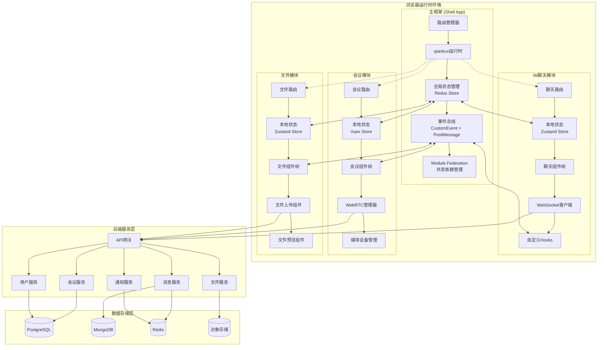
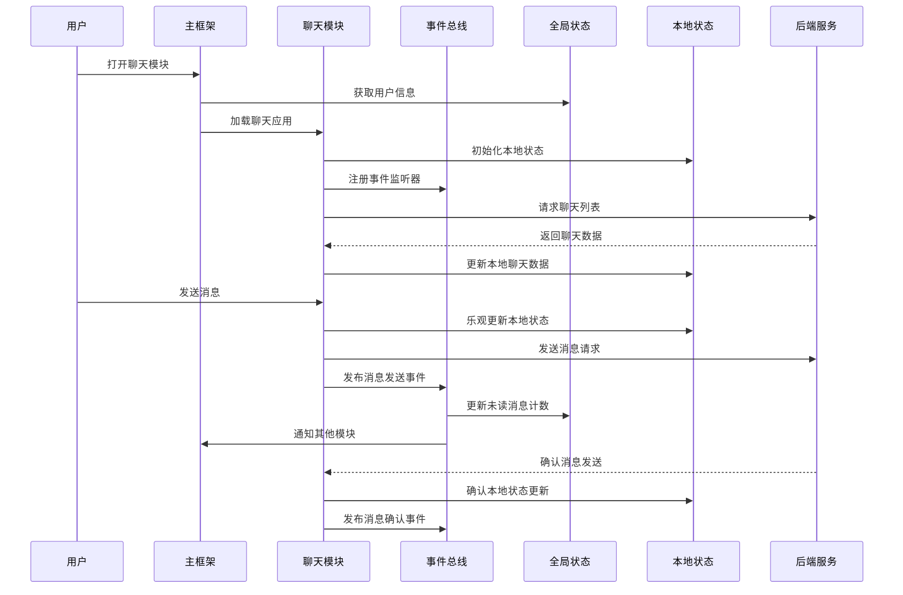
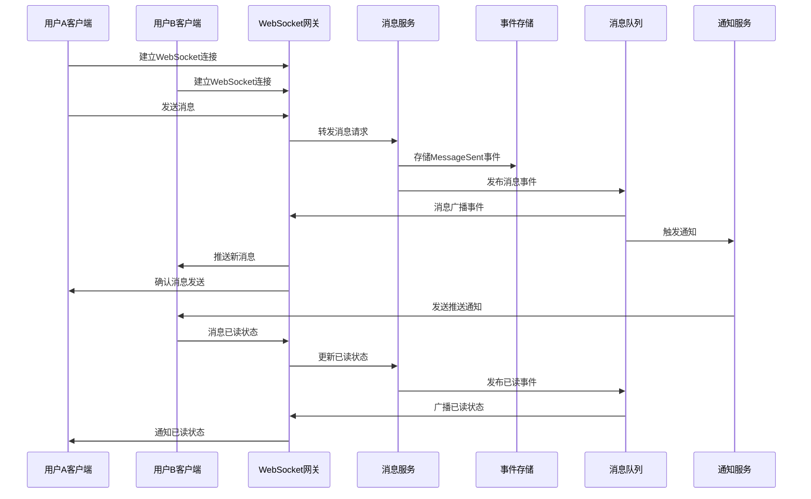
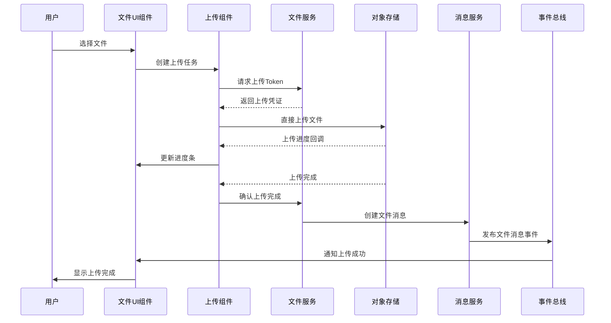
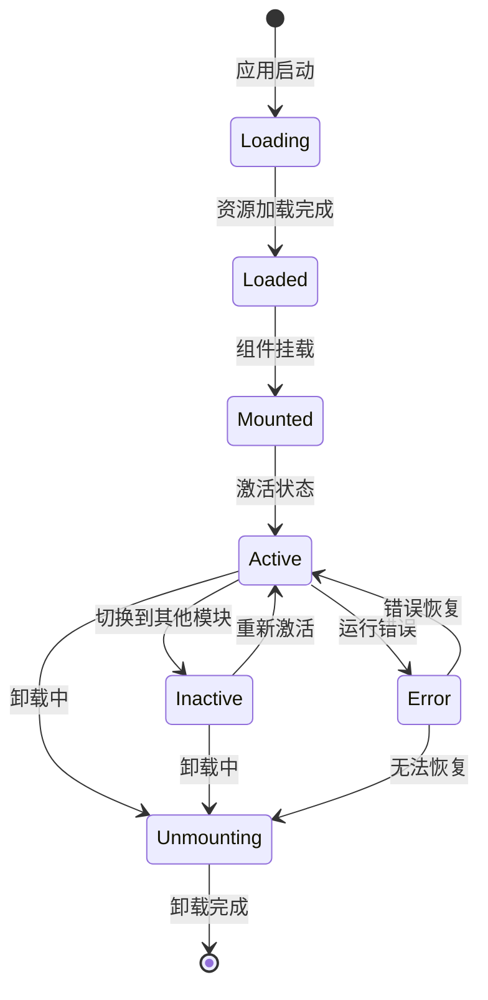

# 组件交互设计图

## 1. 微前端组件交互图



## 2. 状态流转交互图



## 3. 实时通信交互图



## 4. 文件上传交互图



## 5. 跨应用通信机制

### 5.1 事件总线实现

```typescript
// 全局事件总线
class GlobalEventBus {
  private eventTarget: EventTarget = new EventTarget()
  
  // 发布事件
  emit<T = any>(eventType: string, data: T) {
    const event = new CustomEvent(eventType, { 
      detail: { data, timestamp: Date.now() }
    })
    this.eventTarget.dispatchEvent(event)
  }
  
  // 订阅事件
  on<T = any>(eventType: string, handler: (data: T) => void) {
    const listener = (event: CustomEvent) => {
      handler(event.detail.data)
    }
    this.eventTarget.addEventListener(eventType, listener)
    
    // 返回取消订阅函数
    return () => {
      this.eventTarget.removeEventListener(eventType, listener)
    }
  }
}

// 使用示例
const eventBus = new GlobalEventBus()

// 聊天模块发布消息事件
eventBus.emit('message:sent', {
  id: 'msg_123',
  content: 'Hello World',
  conversationId: 'conv_456'
})

// 主框架订阅消息事件更新未读数
eventBus.on('message:sent', (data) => {
  updateUnreadCount(data.conversationId)
})
```

### 5.2 共享状态管理

```typescript
// 跨应用共享状态
interface SharedState {
  user: UserInfo
  unreadCounts: Record<string, number>
  onlineUsers: string[]
  systemNotifications: Notification[]
}

class SharedStateManager {
  private store: SharedState
  private subscribers: Set<(state: SharedState) => void> = new Set()
  
  // 获取状态
  getState(): SharedState {
    return { ...this.store }
  }
  
  // 更新状态
  setState(updater: (state: SharedState) => SharedState) {
    this.store = updater(this.store)
    this.notifySubscribers()
  }
  
  // 订阅状态变化
  subscribe(callback: (state: SharedState) => void) {
    this.subscribers.add(callback)
    return () => this.subscribers.delete(callback)
  }
  
  private notifySubscribers() {
    this.subscribers.forEach(callback => callback(this.store))
  }
}
```

### 5.3 PostMessage 通信

```typescript
// 跨iframe通信 (如果使用iframe隔离)
class PostMessageBridge {
  private targetWindow: Window
  private messageHandlers: Map<string, Function[]> = new Map()
  
  constructor(targetWindow: Window) {
    this.targetWindow = targetWindow
    window.addEventListener('message', this.handleMessage.bind(this))
  }
  
  // 发送消息
  send(type: string, data: any) {
    this.targetWindow.postMessage({
      type,
      data,
      source: window.location.origin,
      timestamp: Date.now()
    }, '*')
  }
  
  // 接收消息
  on(type: string, handler: (data: any) => void) {
    const handlers = this.messageHandlers.get(type) || []
    handlers.push(handler)
    this.messageHandlers.set(type, handlers)
  }
  
  private handleMessage(event: MessageEvent) {
    const { type, data } = event.data
    const handlers = this.messageHandlers.get(type) || []
    handlers.forEach(handler => handler(data))
  }
}
```

## 6. 组件生命周期管理



## 7. 错误处理和降级策略

```typescript
// 错误边界组件
class MicroAppErrorBoundary extends React.Component {
  state = { hasError: false, error: null }
  
  static getDerivedStateFromError(error: Error) {
    return { hasError: true, error }
  }
  
  componentDidCatch(error: Error, errorInfo: any) {
    // 上报错误
    this.reportError(error, errorInfo)
    
    // 尝试重新加载应用
    this.attemptRecovery()
  }
  
  private async attemptRecovery() {
    try {
      // 清除缓存
      await this.clearCache()
      
      // 重新加载微应用
      await qiankun.loadMicroApp({
        name: this.props.appName,
        entry: this.props.entry,
        container: this.props.container
      })
      
      this.setState({ hasError: false, error: null })
    } catch (error) {
      // 降级到备用UI
      this.setState({ hasError: true, error })
    }
  }
}
```

这个组件交互设计图详细展示了蒙层系统中各个组件之间的交互关系，包括：

1. **微前端架构下的组件层次结构**
2. **跨应用的状态管理和事件通信**
3. **实时通信的完整流程**
4. **文件上传的交互序列**
5. **跨应用通信的具体实现机制**
6. **组件生命周期管理**
7. **错误处理和降级策略**

这些设计确保了系统的可维护性、可扩展性和用户体验。