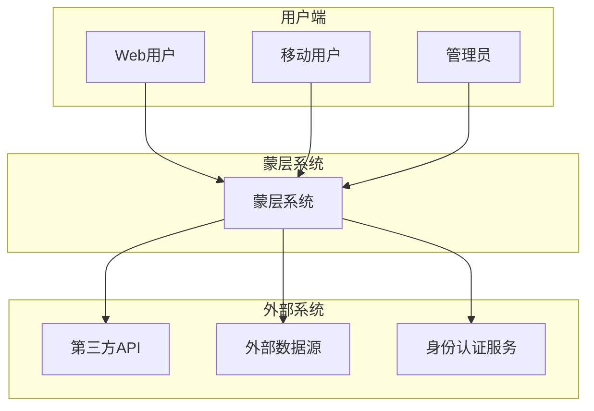
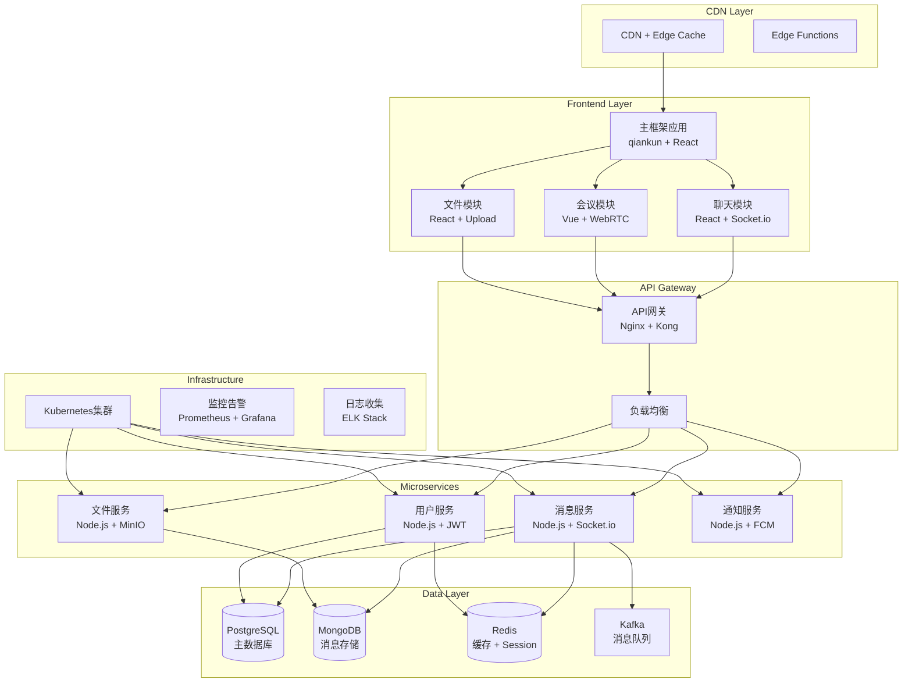
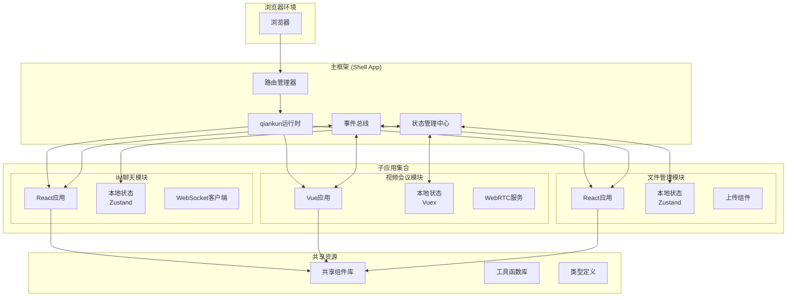
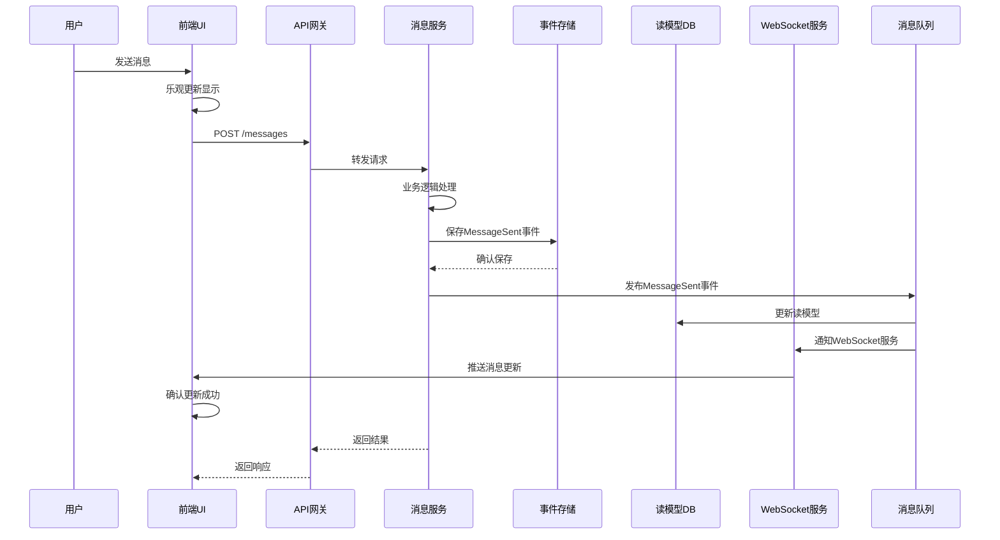
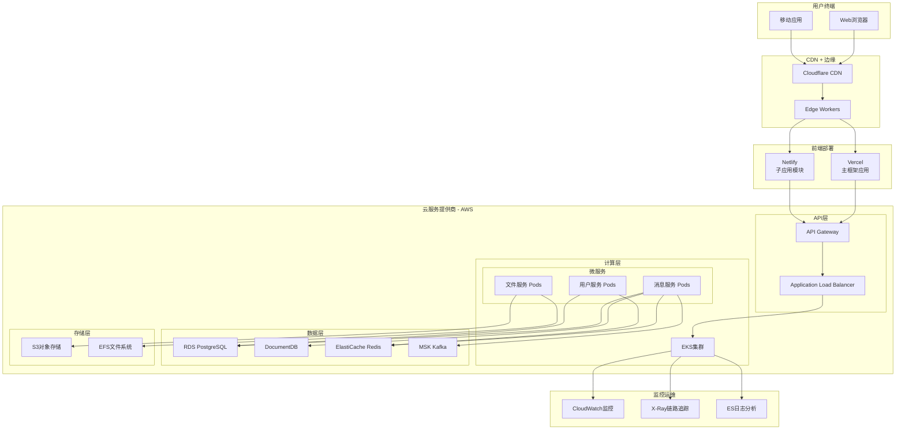
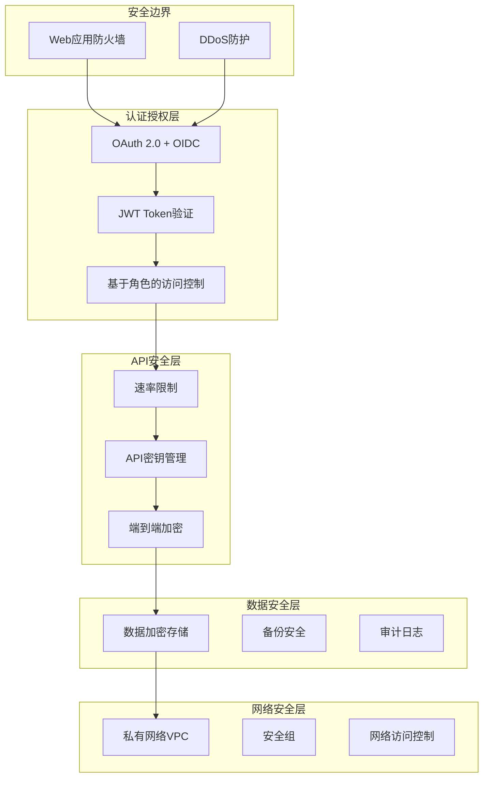

# 蒙层系统架构图

## 1. 总体系统架构 (C4 Context Diagram)

```mermaid
graph TB
    subgraph "外部系统"
        ExtAPI[第三方API]
        ExtDB[外部数据源]
        ExtAuth[身份认证服务]
    end
    
    subgraph "用户端"
        WebUser[Web用户]
        MobileUser[移动用户]
        AdminUser[管理员]
    end
    
    subgraph "蒙层系统"
        MaskSystem[蒙层系统]
    end
    
    WebUser --> MaskSystem
    MobileUser --> MaskSystem
    AdminUser --> MaskSystem
    
    MaskSystem --> ExtAPI
    MaskSystem --> ExtDB
    MaskSystem --> ExtAuth
```

## 2. 容器架构图 (C4 Container Diagram)

```mermaid
graph TB
    subgraph "CDN Layer"
        CDN[CDN + Edge Cache]
        EdgeFunc[Edge Functions]
    end
    
    subgraph "Frontend Layer"
        ShellApp[主框架应用<br/>qiankun + React]
        ChatModule[聊天模块<br/>React + Socket.io]
        MeetingModule[会议模块<br/>Vue + WebRTC]
        FileModule[文件模块<br/>React + Upload]
    end
    
    subgraph "API Gateway"
        Gateway[API网关<br/>Nginx + Kong]
        LoadBalancer[负载均衡]
    end
    
    subgraph "Microservices"
        MessageService[消息服务<br/>Node.js + Socket.io]
        UserService[用户服务<br/>Node.js + JWT]
        FileService[文件服务<br/>Node.js + MinIO]
        NotificationService[通知服务<br/>Node.js + FCM]
    end
    
    subgraph "Data Layer"
        PostgreSQL[(PostgreSQL<br/>主数据库)]
        MongoDB[(MongoDB<br/>消息存储)]
        Redis[(Redis<br/>缓存 + Session)]
        Kafka[Kafka<br/>消息队列]
    end
    
    subgraph "Infrastructure"
        K8s[Kubernetes集群]
        Monitor[监控告警<br/>Prometheus + Grafana]
        Logs[日志收集<br/>ELK Stack]
    end
    
    CDN --> ShellApp
    ShellApp --> ChatModule
    ShellApp --> MeetingModule
    ShellApp --> FileModule
    
    ChatModule --> Gateway
    MeetingModule --> Gateway
    FileModule --> Gateway
    
    Gateway --> LoadBalancer
    LoadBalancer --> MessageService
    LoadBalancer --> UserService
    LoadBalancer --> FileService
    LoadBalancer --> NotificationService
    
    MessageService --> PostgreSQL
    MessageService --> MongoDB
    MessageService --> Redis
    MessageService --> Kafka
    
    UserService --> PostgreSQL
    UserService --> Redis
    
    FileService --> MongoDB
    
    K8s --> MessageService
    K8s --> UserService
    K8s --> FileService
    K8s --> NotificationService
```

## 3. 微前端架构图

```mermaid
graph TB
    subgraph "浏览器环境"
        Browser[浏览器]
    end
    
    subgraph "主框架 (Shell App)"
        Router[路由管理器]
        StateManager[状态管理中心]
        EventBus[事件总线]
        qiankun[qiankun运行时]
    end
    
    subgraph "子应用集合"
        subgraph "IM聊天模块"
            ChatApp[React应用]
            ChatState[本地状态<br/>Zustand]
            ChatWS[WebSocket客户端]
        end
        
        subgraph "视频会议模块"
            MeetingApp[Vue应用]
            MeetingState[本地状态<br/>Vuex]
            WebRTC[WebRTC服务]
        end
        
        subgraph "文件管理模块"
            FileApp[React应用]
            FileState[本地状态<br/>Zustand]
            FileUpload[上传组件]
        end
    end
    
    subgraph "共享资源"
        SharedLib[共享组件库]
        SharedUtils[工具函数库]
        SharedTypes[类型定义]
    end
    
    Browser --> Router
    Router --> qiankun
    qiankun --> ChatApp
    qiankun --> MeetingApp
    qiankun --> FileApp
    
    StateManager <--> ChatState
    StateManager <--> MeetingState
    StateManager <--> FileState
    
    EventBus <--> ChatApp
    EventBus <--> MeetingApp
    EventBus <--> FileApp
    
    ChatApp --> SharedLib
    MeetingApp --> SharedLib
    FileApp --> SharedLib
```

## 4. 数据流架构图

```mermaid
sequenceDiagram
    participant User as 用户
    participant UI as 前端UI
    participant Gateway as API网关
    participant MsgSvc as 消息服务
    participant EventStore as 事件存储
    participant ReadDB as 读模型DB
    participant WS as WebSocket服务
    participant Queue as 消息队列
    
    User->>UI: 发送消息
    UI->>UI: 乐观更新显示
    UI->>Gateway: POST /messages
    Gateway->>MsgSvc: 转发请求
    
    MsgSvc->>MsgSvc: 业务逻辑处理
    MsgSvc->>EventStore: 保存MessageSent事件
    EventStore-->>MsgSvc: 确认保存
    
    MsgSvc->>Queue: 发布MessageSent事件
    Queue->>ReadDB: 更新读模型
    Queue->>WS: 通知WebSocket服务
    
    WS->>UI: 推送消息更新
    UI->>UI: 确认更新成功
    
    MsgSvc-->>Gateway: 返回结果
    Gateway-->>UI: 返回响应
```

## 5. 部署架构图

```mermaid
graph TB
    subgraph "用户终端"
        WebBrowser[Web浏览器]
        MobileApp[移动应用]
    end
    
    subgraph "CDN + 边缘"
        CloudflareCDN[Cloudflare CDN]
        EdgeWorkers[Edge Workers]
    end
    
    subgraph "前端部署"
        VercelApp[Vercel<br/>主框架应用]
        NetlifyModules[Netlify<br/>子应用模块]
    end
    
    subgraph "云服务提供商 - AWS"
        subgraph "API层"
            APIGateway[API Gateway]
            ALB[Application Load Balancer]
        end
        
        subgraph "计算层"
            EKS[EKS集群]
            subgraph "微服务"
                MessagePods[消息服务 Pods]
                UserPods[用户服务 Pods]
                FilePods[文件服务 Pods]
            end
        end
        
        subgraph "数据层"
            RDS[RDS PostgreSQL]
            DocumentDB[DocumentDB]
            ElastiCache[ElastiCache Redis]
            MSK[MSK Kafka]
        end
        
        subgraph "存储层"
            S3[S3对象存储]
            EFS[EFS文件系统]
        end
    end
    
    subgraph "监控运维"
        CloudWatch[CloudWatch监控]
        XRay[X-Ray链路追踪]
        ElasticSearch[ES日志分析]
    end
    
    WebBrowser --> CloudflareCDN
    MobileApp --> CloudflareCDN
    CloudflareCDN --> EdgeWorkers
    EdgeWorkers --> VercelApp
    EdgeWorkers --> NetlifyModules
    
    VercelApp --> APIGateway
    NetlifyModules --> APIGateway
    APIGateway --> ALB
    ALB --> EKS
    
    MessagePods --> RDS
    MessagePods --> DocumentDB
    MessagePods --> ElastiCache
    MessagePods --> MSK
    
    UserPods --> RDS
    UserPods --> ElastiCache
    
    FilePods --> S3
    FilePods --> EFS
    
    EKS --> CloudWatch
    EKS --> XRay
    EKS --> ElasticSearch
```

## 6. 安全架构图

```mermaid
graph TB
    subgraph "安全边界"
        WAF[Web应用防火墙]
        DDoSProtection[DDoS防护]
    end
    
    subgraph "认证授权层"
        OAuth[OAuth 2.0 + OIDC]
        JWT[JWT Token验证]
        RBAC[基于角色的访问控制]
    end
    
    subgraph "API安全层"
        RateLimit[速率限制]
        APIKey[API密钥管理]
        Encryption[端到端加密]
    end
    
    subgraph "数据安全层"
        DataEncryption[数据加密存储]
        BackupSecurity[备份安全]
        AuditLog[审计日志]
    end
    
    subgraph "网络安全层"
        VPC[私有网络VPC]
        SecurityGroup[安全组]
        NetworkACL[网络访问控制]
    end
    
    WAF --> OAuth
    DDoSProtection --> OAuth
    OAuth --> JWT
    JWT --> RBAC
    RBAC --> RateLimit
    RateLimit --> APIKey
    APIKey --> Encryption
    Encryption --> DataEncryption
    DataEncryption --> VPC
```