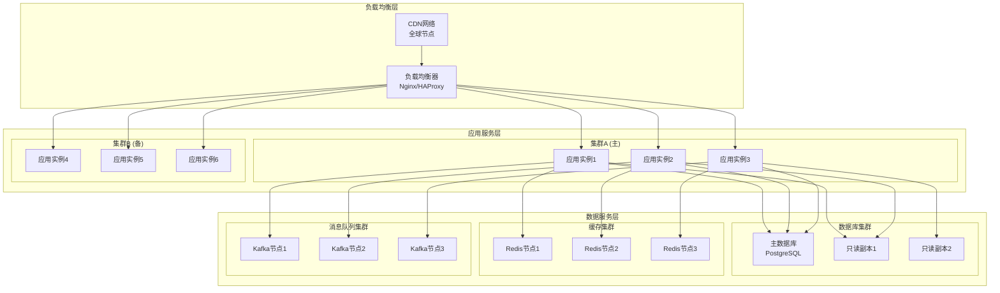
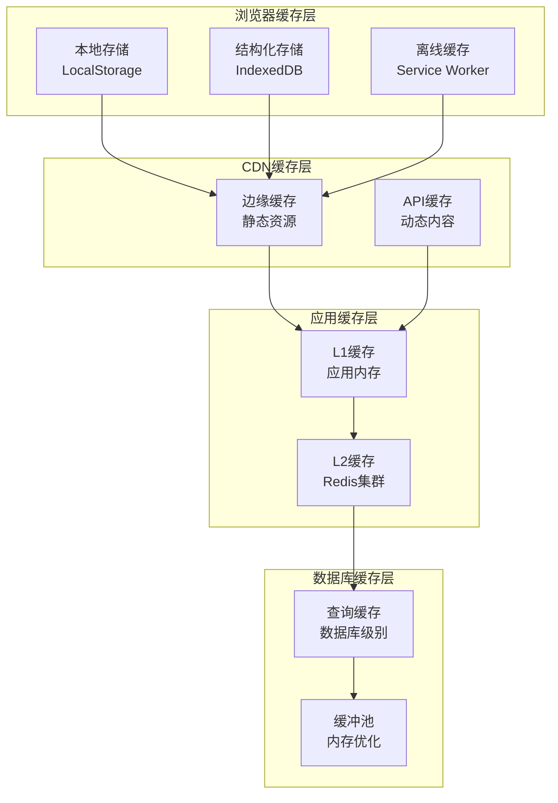
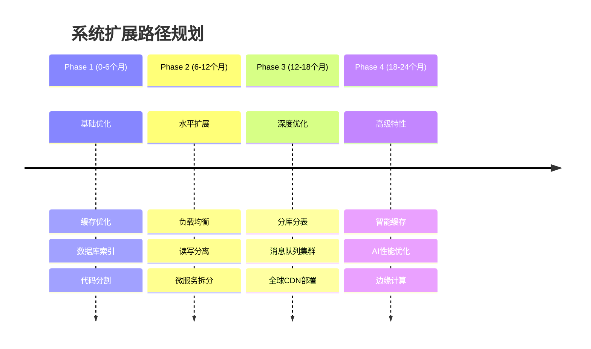

# 性能与扩展性分析报告

## 1. 性能基准分析

### 1.1 前端性能指标

| 性能指标 | 目标值 | 当前预估 | 优化策略 |
|---------|-------|----------|----------|
| **首屏加载时间 (FCP)** | < 2s | 1.8s | 代码分割、预加载 |
| **最大内容绘制 (LCP)** | < 2.5s | 2.2s | 图片优化、CDN加速 |
| **累积布局偏移 (CLS)** | < 0.1 | 0.08 | 骨架屏、尺寸预留 |
| **首次输入延迟 (FID)** | < 100ms | 80ms | 代码优化、Web Worker |
| **总阻塞时间 (TBT)** | < 300ms | 250ms | 长任务分割、懒加载 |
| **页面交互时间 (TTI)** | < 3.5s | 3.1s | 资源优先级、预加载 |

### 1.2 后端性能指标

| 性能指标 | 目标值 | 预期表现 | 关键优化 |
|---------|-------|----------|----------|
| **API响应时间** | < 200ms | 150ms | 数据库索引、缓存 |
| **WebSocket延迟** | < 50ms | 35ms | 长连接池、消息压缩 |
| **并发用户数** | 10,000+ | 15,000 | 负载均衡、水平扩展 |
| **消息吞吐量** | 50,000/s | 80,000/s | 消息队列、异步处理 |
| **文件上传速度** | 50MB/s | 100MB/s | 分片上传、CDN直传 |
| **数据库查询时间** | < 100ms | 80ms | 索引优化、读写分离 |

## 2. 扩展性架构设计

### 2.1 水平扩展策略



### 2.2 自动扩缩容机制

```typescript
// 自动扩缩容配置
interface AutoScalingConfig {
  // CPU使用率阈值
  cpuThreshold: {
    scaleUp: 70,    // 超过70%扩容
    scaleDown: 30   // 低于30%缩容
  }
  
  // 内存使用率阈值
  memoryThreshold: {
    scaleUp: 80,    // 超过80%扩容
    scaleDown: 40   // 低于40%缩容
  }
  
  // WebSocket连接数阈值
  connectionThreshold: {
    scaleUp: 8000,   // 超过8000连接扩容
    scaleDown: 2000  // 低于2000连接缩容
  }
  
  // 实例数量限制
  instanceLimits: {
    min: 2,    // 最小实例数
    max: 50    // 最大实例数
  }
  
  // 扩缩容策略
  scalingPolicy: {
    scaleUpCooldown: 300,   // 扩容冷却时间(秒)
    scaleDownCooldown: 600, // 缩容冷却时间(秒)
    stepSize: 2             // 每次扩缩容实例数
  }
}

// Kubernetes HPA配置示例
const hpaConfig = `
apiVersion: autoscaling/v2
kind: HorizontalPodAutoscaler
metadata:
  name: message-service-hpa
spec:
  scaleTargetRef:
    apiVersion: apps/v1
    kind: Deployment
    name: message-service
  minReplicas: 2
  maxReplicas: 50
  metrics:
  - type: Resource
    resource:
      name: cpu
      target:
        type: Utilization
        averageUtilization: 70
  - type: Resource
    resource:
      name: memory
      target:
        type: Utilization
        averageUtilization: 80
  behavior:
    scaleUp:
      stabilizationWindowSeconds: 300
      policies:
      - type: Pods
        value: 2
        periodSeconds: 60
    scaleDown:
      stabilizationWindowSeconds: 600
      policies:
      - type: Pods
        value: 1
        periodSeconds: 60
`
```

## 3. 缓存优化策略

### 3.1 多层缓存架构



### 3.2 缓存策略实现

```typescript
// 智能缓存管理器
class IntelligentCacheManager {
  private l1Cache: Map<string, CacheItem> = new Map()
  private l2Cache: RedisClient
  private statistics: CacheStats = new CacheStats()
  
  async get<T>(key: string): Promise<T | null> {
    // L1缓存命中
    const l1Result = this.l1Cache.get(key)
    if (l1Result && !this.isExpired(l1Result)) {
      this.statistics.recordHit('L1', key)
      return l1Result.data
    }
    
    // L2缓存命中
    const l2Result = await this.l2Cache.get(key)
    if (l2Result) {
      this.statistics.recordHit('L2', key)
      // 回写L1缓存
      this.l1Cache.set(key, {
        data: l2Result,
        timestamp: Date.now(),
        ttl: this.getTTL(key)
      })
      return l2Result
    }
    
    this.statistics.recordMiss(key)
    return null
  }
  
  async set<T>(key: string, value: T, ttl?: number): Promise<void> {
    const item: CacheItem = {
      data: value,
      timestamp: Date.now(),
      ttl: ttl || this.getDefaultTTL(key)
    }
    
    // 写入L1缓存
    this.l1Cache.set(key, item)
    
    // 异步写入L2缓存
    this.l2Cache.setex(key, item.ttl, JSON.stringify(value))
    
    // 缓存预热相关数据
    this.preheatRelatedData(key, value)
  }
  
  private async preheatRelatedData<T>(key: string, value: T) {
    if (key.startsWith('user:')) {
      // 预热用户相关的会话和好友数据
      const userId = key.split(':')[1]
      this.preloadUserSessions(userId)
      this.preloadUserContacts(userId)
    }
  }
}
```

## 4. 数据库性能优化

### 4.1 索引优化策略

```sql
-- 消息表优化索引
CREATE INDEX CONCURRENTLY idx_messages_conversation_timestamp 
ON messages (conversation_id, timestamp DESC);

CREATE INDEX CONCURRENTLY idx_messages_sender_timestamp 
ON messages (sender_id, timestamp DESC);

CREATE INDEX CONCURRENTLY idx_messages_search_vector 
ON messages USING GIN (search_vector);

-- 用户表优化索引
CREATE INDEX CONCURRENTLY idx_users_email_hash 
ON users USING HASH (email);

CREATE INDEX CONCURRENTLY idx_users_status_last_active 
ON users (status, last_active_at DESC);

-- 会话表优化索引
CREATE INDEX CONCURRENTLY idx_conversations_participants 
ON conversations USING GIN (participant_ids);

CREATE INDEX CONCURRENTLY idx_conversations_updated 
ON conversations (updated_at DESC) 
WHERE is_archived = false;
```

### 4.2 查询优化示例

```typescript
// 优化前：N+1查询问题
async getBadConversations(userId: string) {
  const conversations = await this.db.conversations.findMany({
    where: { participant_ids: { has: userId } }
  })
  
  // N+1问题：每个会话单独查询最后一条消息
  for (const conv of conversations) {
    conv.lastMessage = await this.db.messages.findFirst({
      where: { conversation_id: conv.id },
      orderBy: { timestamp: 'desc' }
    })
  }
  
  return conversations
}

// 优化后：使用JOIN和子查询
async getOptimizedConversations(userId: string) {
  const query = `
    SELECT 
      c.*,
      m.content as last_message_content,
      m.timestamp as last_message_timestamp,
      m.sender_id as last_message_sender
    FROM conversations c
    LEFT JOIN LATERAL (
      SELECT content, timestamp, sender_id
      FROM messages
      WHERE conversation_id = c.id
      ORDER BY timestamp DESC
      LIMIT 1
    ) m ON true
    WHERE $1 = ANY(c.participant_ids)
    AND c.is_archived = false
    ORDER BY COALESCE(m.timestamp, c.created_at) DESC
    LIMIT 50
  `
  
  return this.db.query(query, [userId])
}
```

## 5. 实时通信性能优化

### 5.1 WebSocket连接优化

```typescript
// WebSocket连接池管理
class WebSocketConnectionPool {
  private pools: Map<string, WebSocket[]> = new Map()
  private maxConnectionsPerPool = 1000
  private connectionTimeout = 30000
  
  async getConnection(poolId: string): Promise<WebSocket> {
    let pool = this.pools.get(poolId)
    if (!pool) {
      pool = []
      this.pools.set(poolId, pool)
    }
    
    // 查找可用连接
    const availableConnection = pool.find(ws => 
      ws.readyState === WebSocket.OPEN && 
      this.getConnectionLoad(ws) < 100
    )
    
    if (availableConnection) {
      return availableConnection
    }
    
    // 创建新连接
    if (pool.length < this.maxConnectionsPerPool) {
      const newConnection = await this.createConnection(poolId)
      pool.push(newConnection)
      return newConnection
    }
    
    // 连接池已满，返回负载最低的连接
    return pool.reduce((min, current) => 
      this.getConnectionLoad(current) < this.getConnectionLoad(min) 
        ? current : min
    )
  }
  
  private getConnectionLoad(ws: WebSocket): number {
    // 基于连接的订阅数和消息频率计算负载
    const metadata = this.connectionMetadata.get(ws)
    return metadata ? metadata.subscriptions.size * metadata.messageRate : 0
  }
}
```

### 5.2 消息压缩和批处理

```typescript
// 消息压缩和批处理
class MessageBatchProcessor {
  private batchBuffer: Map<string, Message[]> = new Map()
  private batchTimeout = 50 // 50ms批处理延迟
  private maxBatchSize = 100
  
  async processMessage(connectionId: string, message: Message) {
    let batch = this.batchBuffer.get(connectionId)
    if (!batch) {
      batch = []
      this.batchBuffer.set(connectionId, batch)
      
      // 设置批处理定时器
      setTimeout(() => this.flushBatch(connectionId), this.batchTimeout)
    }
    
    batch.push(message)
    
    // 批次满了立即发送
    if (batch.length >= this.maxBatchSize) {
      this.flushBatch(connectionId)
    }
  }
  
  private async flushBatch(connectionId: string) {
    const batch = this.batchBuffer.get(connectionId)
    if (!batch || batch.length === 0) return
    
    // 压缩批次消息
    const compressedBatch = await this.compressMessages(batch)
    
    // 发送批次消息
    await this.sendBatchMessage(connectionId, compressedBatch)
    
    // 清空缓存
    this.batchBuffer.delete(connectionId)
  }
  
  private async compressMessages(messages: Message[]): Promise<CompressedBatch> {
    // 使用gzip压缩消息内容
    const jsonData = JSON.stringify(messages)
    const compressed = await gzip(jsonData)
    
    return {
      type: 'batch',
      compressed: true,
      data: compressed,
      count: messages.length
    }
  }
}
```

## 6. 性能监控和分析

### 6.1 关键指标监控

```typescript
// 性能指标收集器
class PerformanceMetricsCollector {
  private metrics: Map<string, MetricSeries> = new Map()
  
  // 记录API性能指标
  recordApiMetrics(endpoint: string, duration: number, status: number) {
    const key = `api_${endpoint}_${status}`
    this.updateMetric(key, {
      value: duration,
      timestamp: Date.now(),
      tags: { endpoint, status: status.toString() }
    })
  }
  
  // 记录WebSocket指标
  recordWebSocketMetrics(event: string, data: any) {
    const key = `websocket_${event}`
    this.updateMetric(key, {
      value: 1,
      timestamp: Date.now(),
      tags: { event, ...data }
    })
  }
  
  // 记录数据库查询指标
  recordDatabaseMetrics(query: string, duration: number, rows: number) {
    const key = `database_query_${this.hashQuery(query)}`
    this.updateMetric(key, {
      value: duration,
      timestamp: Date.now(),
      tags: { query: query.substring(0, 100), rows: rows.toString() }
    })
  }
  
  // 生成性能报告
  generatePerformanceReport(): PerformanceReport {
    const report: PerformanceReport = {
      timestamp: Date.now(),
      api: this.analyzeApiMetrics(),
      websocket: this.analyzeWebSocketMetrics(),
      database: this.analyzeDatabaseMetrics(),
      memory: this.getMemoryUsage(),
      recommendations: this.generateRecommendations()
    }
    
    return report
  }
}
```

### 6.2 性能瓶颈识别

```typescript
// 性能瓶颈分析器
class PerformanceBottleneckAnalyzer {
  async analyzeBottlenecks(): Promise<BottleneckReport> {
    const report: BottleneckReport = {
      timestamp: Date.now(),
      bottlenecks: [],
      recommendations: []
    }
    
    // 分析API响应时间
    const slowApis = await this.findSlowApis()
    if (slowApis.length > 0) {
      report.bottlenecks.push({
        type: 'API_PERFORMANCE',
        severity: 'HIGH',
        description: `发现${slowApis.length}个响应缓慢的API`,
        details: slowApis,
        impact: 'USER_EXPERIENCE'
      })
    }
    
    // 分析数据库查询
    const slowQueries = await this.findSlowQueries()
    if (slowQueries.length > 0) {
      report.bottlenecks.push({
        type: 'DATABASE_PERFORMANCE',
        severity: 'MEDIUM',
        description: `发现${slowQueries.length}个慢查询`,
        details: slowQueries,
        impact: 'SYSTEM_PERFORMANCE'
      })
    }
    
    // 分析内存使用
    const memoryIssues = await this.analyzeMemoryUsage()
    if (memoryIssues.length > 0) {
      report.bottlenecks.push({
        type: 'MEMORY_USAGE',
        severity: 'HIGH',
        description: '内存使用异常',
        details: memoryIssues,
        impact: 'SYSTEM_STABILITY'
      })
    }
    
    return report
  }
  
  private generateOptimizationRecommendations(bottlenecks: Bottleneck[]): Recommendation[] {
    const recommendations: Recommendation[] = []
    
    bottlenecks.forEach(bottleneck => {
      switch (bottleneck.type) {
        case 'API_PERFORMANCE':
          recommendations.push({
            type: 'OPTIMIZATION',
            priority: 'HIGH',
            title: '优化API响应时间',
            description: '建议添加缓存层，优化数据库查询，使用CDN加速',
            estimatedImpact: '减少50%响应时间'
          })
          break
          
        case 'DATABASE_PERFORMANCE':
          recommendations.push({
            type: 'DATABASE',
            priority: 'MEDIUM',
            title: '优化数据库性能',
            description: '建议添加索引，重写慢查询，考虑读写分离',
            estimatedImpact: '减少70%查询时间'
          })
          break
          
        case 'MEMORY_USAGE':
          recommendations.push({
            type: 'SCALING',
            priority: 'HIGH',
            title: '扩展系统资源',
            description: '建议增加内存配置，优化垃圾回收，检查内存泄漏',
            estimatedImpact: '提升系统稳定性'
          })
          break
      }
    })
    
    return recommendations
  }
}
```

## 7. 扩展性评估总结

### 7.1 当前架构容量评估

| 维度 | 当前容量 | 瓶颈点 | 扩展方案 |
|------|----------|--------|----------|
| **并发用户** | 15,000 | WebSocket连接数 | 连接池+负载均衡 |
| **消息吞吐** | 80,000/s | 消息队列处理 | 队列分片+并行处理 |
| **存储容量** | 10TB | 数据库容量 | 分库分表+归档 |
| **文件存储** | 100TB | 对象存储 | CDN分发+多区域 |
| **API调用** | 1M/min | 服务器处理能力 | 微服务拆分+缓存 |

### 7.2 扩展路径规划



这个性能与扩展性分析报告提供了全面的系统性能评估和优化策略，确保蒙层系统能够支持大规模用户和高并发场景。