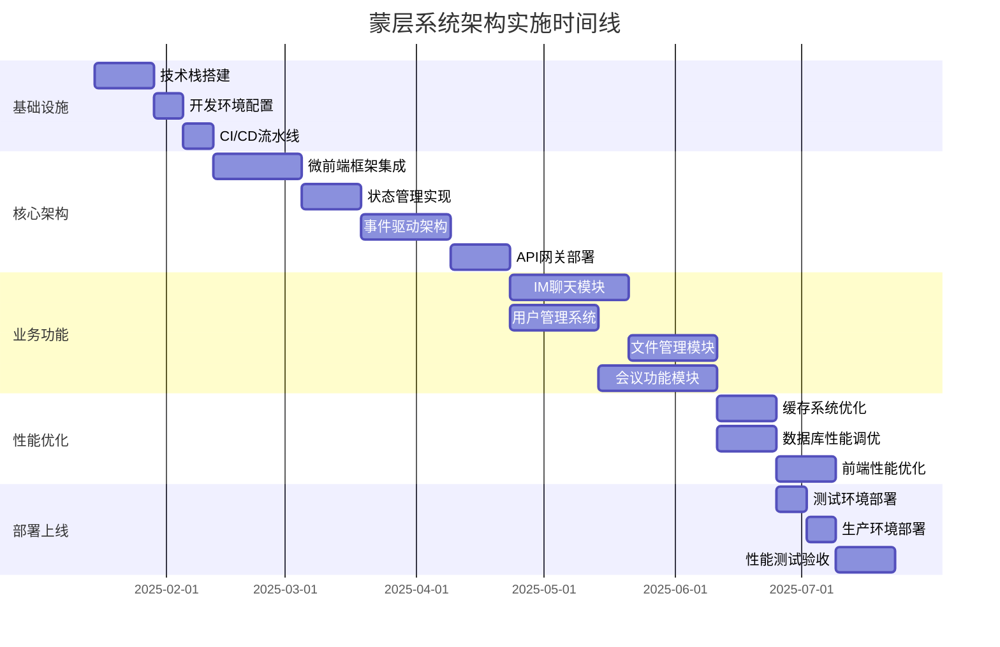
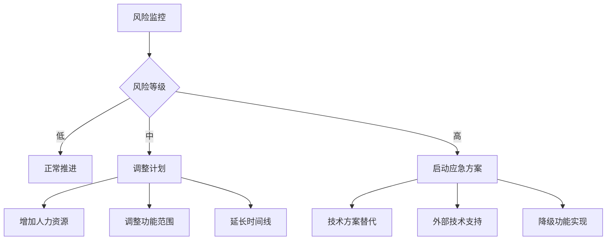

# 架构实施路线图

## 1. 实施总体规划

### 1.1 项目阶段划分



### 1.2 里程碑定义

| 里程碑 | 完成时间 | 关键交付物 | 验收标准 |
|--------|----------|------------|----------|
| **M1: 基础设施完成** | Week 4 | 开发环境、CI/CD | 自动化构建部署成功 |
| **M2: 核心架构完成** | Week 14 | 微前端框架、状态管理 | 子应用独立运行 |
| **M3: 核心功能完成** | Week 28 | IM、用户、文件模块 | 基础功能测试通过 |
| **M4: 性能优化完成** | Week 34 | 性能调优、监控 | 性能指标达标 |
| **M5: 生产环境上线** | Week 37 | 完整系统部署 | 用户验收测试通过 |

## 2. 技术实施计划

### 2.1 阶段一：基础设施建设 (Week 1-4)

#### 技术栈搭建
```bash
# 项目初始化脚本
#!/bin/bash

# 1. 创建项目结构
npx create-monorepo mask-system --template=typescript

# 2. 配置包管理
cd mask-system
npm install -g pnpm
pnpm install

# 3. 安装核心依赖
pnpm add -w @qiankun/cli webpack-module-federation-plugin
pnpm add -w @reduxjs/toolkit zustand
pnpm add -w socket.io-client @types/socket.io-client

# 4. 配置开发工具
pnpm add -D -w @typescript-eslint/parser prettier husky lint-staged

# 5. 初始化Git和Hooks
git init
npx husky install
```

#### 开发环境配置
- **本地开发**: Docker Compose + Dev Containers
- **代码质量**: ESLint + Prettier + Husky
- **类型检查**: TypeScript严格模式
- **测试框架**: Jest + React Testing Library

#### CI/CD流水线配置
```yaml
# .github/workflows/ci-cd.yml
name: CI/CD Pipeline

on:
  push:
    branches: [main, develop]
  pull_request:
    branches: [main]

jobs:
  test:
    runs-on: ubuntu-latest
    steps:
      - uses: actions/checkout@v3
      - uses: actions/setup-node@v3
        with:
          node-version: '18'
          cache: 'pnpm'
      
      - name: Install dependencies
        run: pnpm install
      
      - name: Run type check
        run: pnpm type-check
      
      - name: Run tests
        run: pnpm test:ci
      
      - name: Run E2E tests
        run: pnpm test:e2e

  build:
    needs: test
    runs-on: ubuntu-latest
    steps:
      - name: Build applications
        run: pnpm build
      
      - name: Build Docker images
        run: docker build -t mask-system:${{ github.sha }} .
```

### 2.2 阶段二：核心架构实现 (Week 5-14)

#### 微前端框架集成
```typescript
// apps/shell/src/main.tsx
import { registerMicroApps, start } from 'qiankun';
import { setupModuleFederation } from './module-federation';

// 注册子应用
registerMicroApps([
  {
    name: 'chat-app',
    entry: process.env.NODE_ENV === 'development' 
      ? '//localhost:3001' 
      : '//chat.example.com',
    container: '#chat-container',
    activeRule: '/chat',
    props: {
      shared: {
        eventBus: globalEventBus,
        stateManager: globalStateManager
      }
    }
  },
  {
    name: 'meeting-app',
    entry: process.env.NODE_ENV === 'development' 
      ? '//localhost:3002' 
      : '//meeting.example.com',
    container: '#meeting-container',
    activeRule: '/meeting'
  }
]);

// 配置Module Federation
setupModuleFederation();

// 启动微前端框架
start();
```

#### 状态管理架构实现
```typescript
// packages/shared/src/store/global-store.ts
import { configureStore } from '@reduxjs/toolkit';
import { authSlice } from './slices/auth';
import { uiSlice } from './slices/ui';
import { sharedSlice } from './slices/shared';

export const globalStore = configureStore({
  reducer: {
    auth: authSlice.reducer,
    ui: uiSlice.reducer,
    shared: sharedSlice.reducer
  },
  middleware: (getDefaultMiddleware) =>
    getDefaultMiddleware({
      serializableCheck: {
        ignoredActions: ['persist/PERSIST', 'persist/REHYDRATE']
      }
    }).concat(
      // 自定义中间件：跨应用状态同步
      crossAppSyncMiddleware
    )
});

// packages/shared/src/store/local-store.ts
import { create } from 'zustand';
import { subscribeWithSelector } from 'zustand/middleware';

interface LocalStoreState {
  // 本地UI状态
  sidebarCollapsed: boolean;
  theme: 'light' | 'dark';
  
  // 缓存数据
  cachedData: Record<string, any>;
  
  // 动作方法
  toggleSidebar: () => void;
  setTheme: (theme: 'light' | 'dark') => void;
  updateCache: (key: string, data: any) => void;
}

export const useLocalStore = create<LocalStoreState>()(
  subscribeWithSelector((set, get) => ({
    sidebarCollapsed: false,
    theme: 'light',
    cachedData: {},
    
    toggleSidebar: () => set(state => ({ 
      sidebarCollapsed: !state.sidebarCollapsed 
    })),
    
    setTheme: (theme) => set({ theme }),
    
    updateCache: (key, data) => set(state => ({
      cachedData: { ...state.cachedData, [key]: data }
    }))
  }))
);
```

#### 事件驱动架构实现
```typescript
// packages/shared/src/events/event-bus.ts
interface EventPayload {
  [key: string]: any;
}

interface EventListener<T = EventPayload> {
  (payload: T): void | Promise<void>;
}

class GlobalEventBus {
  private listeners: Map<string, Set<EventListener>> = new Map();
  private history: Array<{ type: string; payload: any; timestamp: number }> = [];
  
  // 发布事件
  emit<T = EventPayload>(eventType: string, payload: T): void {
    const listeners = this.listeners.get(eventType) || new Set();
    
    // 记录事件历史
    this.history.push({
      type: eventType,
      payload,
      timestamp: Date.now()
    });
    
    // 限制历史记录数量
    if (this.history.length > 1000) {
      this.history = this.history.slice(-1000);
    }
    
    // 通知所有监听器
    listeners.forEach(async (listener) => {
      try {
        await listener(payload);
      } catch (error) {
        console.error(`Event listener error for ${eventType}:`, error);
      }
    });
    
    // 跨iframe通信
    this.broadcastToIframes(eventType, payload);
  }
  
  // 订阅事件
  on<T = EventPayload>(
    eventType: string, 
    listener: EventListener<T>
  ): () => void {
    if (!this.listeners.has(eventType)) {
      this.listeners.set(eventType, new Set());
    }
    
    const listeners = this.listeners.get(eventType)!;
    listeners.add(listener as EventListener);
    
    // 返回取消订阅函数
    return () => {
      listeners.delete(listener as EventListener);
      if (listeners.size === 0) {
        this.listeners.delete(eventType);
      }
    };
  }
  
  // 一次性订阅
  once<T = EventPayload>(
    eventType: string, 
    listener: EventListener<T>
  ): void {
    const unsubscribe = this.on(eventType, (payload) => {
      listener(payload);
      unsubscribe();
    });
  }
  
  // 跨iframe广播
  private broadcastToIframes(eventType: string, payload: any): void {
    const frames = document.querySelectorAll('iframe');
    frames.forEach(frame => {
      try {
        frame.contentWindow?.postMessage({
          type: 'GLOBAL_EVENT',
          eventType,
          payload
        }, '*');
      } catch (error) {
        console.warn('Failed to broadcast to iframe:', error);
      }
    });
  }
}

export const globalEventBus = new GlobalEventBus();
```

### 2.3 阶段三：业务功能开发 (Week 15-28)

#### IM聊天模块实现计划

**Week 15-16: 基础架构**
- WebSocket连接管理
- 消息数据模型定义
- 基础UI组件开发

**Week 17-18: 核心功能**
- 发送/接收消息
- 会话列表管理
- 消息状态同步

**Week 19: 高级功能**
- 文件发送
- 表情包支持
- 消息搜索

```typescript
// apps/chat/src/services/websocket.service.ts
class WebSocketService {
  private ws: WebSocket | null = null;
  private reconnectAttempts = 0;
  private maxReconnectAttempts = 5;
  private heartbeatInterval: NodeJS.Timeout | null = null;
  
  connect(token: string): Promise<void> {
    return new Promise((resolve, reject) => {
      const wsUrl = `${process.env.REACT_APP_WS_URL}?token=${token}`;
      this.ws = new WebSocket(wsUrl);
      
      this.ws.onopen = () => {
        console.log('WebSocket connected');
        this.reconnectAttempts = 0;
        this.startHeartbeat();
        resolve();
      };
      
      this.ws.onmessage = (event) => {
        const message = JSON.parse(event.data);
        this.handleMessage(message);
      };
      
      this.ws.onclose = () => {
        this.stopHeartbeat();
        this.attemptReconnect();
      };
      
      this.ws.onerror = (error) => {
        console.error('WebSocket error:', error);
        reject(error);
      };
    });
  }
  
  private handleMessage(message: WebSocketMessage): void {
    switch (message.type) {
      case 'MESSAGE_RECEIVED':
        globalEventBus.emit('message:received', message.payload);
        break;
      case 'USER_STATUS_CHANGED':
        globalEventBus.emit('user:status_changed', message.payload);
        break;
      case 'TYPING_INDICATOR':
        globalEventBus.emit('typing:indicator', message.payload);
        break;
    }
  }
}
```

#### 用户管理系统

**Week 15-17: 实现计划**
- 用户认证和授权
- 用户信息管理
- 权限控制系统

```typescript
// packages/shared/src/services/auth.service.ts
class AuthService {
  private tokenStorage = new TokenStorage();
  private userCache = new Map<string, User>();
  
  async login(credentials: LoginCredentials): Promise<AuthResult> {
    const response = await api.post('/auth/login', credentials);
    const { token, refreshToken, user } = response.data;
    
    // 存储令牌
    this.tokenStorage.setTokens(token, refreshToken);
    
    // 缓存用户信息
    this.userCache.set(user.id, user);
    
    // 更新全局状态
    globalStore.dispatch(authSlice.actions.setUser(user));
    
    // 发布登录事件
    globalEventBus.emit('auth:login', { user });
    
    return { success: true, user };
  }
  
  async refreshToken(): Promise<string> {
    const refreshToken = this.tokenStorage.getRefreshToken();
    if (!refreshToken) {
      throw new Error('No refresh token available');
    }
    
    const response = await api.post('/auth/refresh', { refreshToken });
    const { token } = response.data;
    
    this.tokenStorage.setToken(token);
    return token;
  }
}
```

### 2.4 阶段四：性能优化 (Week 29-34)

#### 缓存系统优化
```typescript
// packages/shared/src/cache/smart-cache.ts
class SmartCacheManager {
  private l1Cache = new Map<string, CacheItem>();
  private l2Cache: RedisClient;
  private analytics = new CacheAnalytics();
  
  async get<T>(key: string): Promise<T | null> {
    // 记录缓存访问
    this.analytics.recordAccess(key);
    
    // L1缓存查找
    const l1Result = this.l1Cache.get(key);
    if (l1Result && !this.isExpired(l1Result)) {
      this.analytics.recordHit('L1', key);
      return l1Result.data;
    }
    
    // L2缓存查找
    const l2Result = await this.l2Cache.get(key);
    if (l2Result) {
      this.analytics.recordHit('L2', key);
      
      // 回写L1缓存
      this.l1Cache.set(key, {
        data: l2Result,
        timestamp: Date.now(),
        ttl: this.getTTL(key)
      });
      
      return l2Result;
    }
    
    this.analytics.recordMiss(key);
    return null;
  }
  
  // 智能预加载
  async preload(keys: string[]): Promise<void> {
    const predictions = await this.analytics.predictAccess(keys);
    const highPriorityKeys = predictions
      .filter(p => p.probability > 0.7)
      .map(p => p.key);
    
    await Promise.all(
      highPriorityKeys.map(key => this.warmupCache(key))
    );
  }
}
```

#### 数据库性能调优
```sql
-- 数据库优化脚本
-- 1. 添加复合索引
CREATE INDEX CONCURRENTLY idx_messages_conversation_timestamp
ON messages (conversation_id, timestamp DESC)
WHERE deleted_at IS NULL;

-- 2. 分区表设置
CREATE TABLE messages_2025 PARTITION OF messages
FOR VALUES FROM ('2025-01-01') TO ('2026-01-01');

-- 3. 查询优化
EXPLAIN (ANALYZE, BUFFERS) 
SELECT m.*, u.username, u.avatar
FROM messages m
JOIN users u ON m.sender_id = u.id
WHERE m.conversation_id = $1
  AND m.deleted_at IS NULL
ORDER BY m.timestamp DESC
LIMIT 50;
```

### 2.5 阶段五：部署上线 (Week 35-37)

#### 部署架构配置
```yaml
# kubernetes/production/deployment.yaml
apiVersion: apps/v1
kind: Deployment
metadata:
  name: mask-system-api
  namespace: production
spec:
  replicas: 5
  strategy:
    type: RollingUpdate
    rollingUpdate:
      maxSurge: 2
      maxUnavailable: 1
  template:
    metadata:
      labels:
        app: mask-system-api
    spec:
      containers:
      - name: api
        image: mask-system/api:latest
        ports:
        - containerPort: 3000
        env:
        - name: NODE_ENV
          value: "production"
        - name: DB_HOST
          valueFrom:
            secretKeyRef:
              name: database-secret
              key: host
        resources:
          requests:
            memory: "256Mi"
            cpu: "200m"
          limits:
            memory: "512Mi"
            cpu: "500m"
        livenessProbe:
          httpGet:
            path: /health
            port: 3000
          initialDelaySeconds: 30
          periodSeconds: 10
        readinessProbe:
          httpGet:
            path: /ready
            port: 3000
          initialDelaySeconds: 10
          periodSeconds: 5
```

## 3. 风险管理和应对策略

### 3.1 技术风险识别

| 风险类型 | 风险描述 | 概率 | 影响 | 应对策略 |
|---------|----------|------|------|----------|
| **微前端集成复杂度** | 跨应用通信和状态同步困难 | 中 | 高 | 详细的集成测试、降级方案 |
| **性能瓶颈** | 大量并发用户导致系统响应慢 | 中 | 高 | 性能测试、监控告警 |
| **数据一致性** | 分布式系统数据同步问题 | 低 | 高 | 事务补偿机制、监控 |
| **第三方依赖** | 关键依赖库升级或停维 | 低 | 中 | 依赖替代方案、版本锁定 |

### 3.2 进度风险应对



### 3.3 质量保证措施

1. **代码质量**
   - 代码审查：所有代码必须经过至少2人审查
   - 自动化测试：单元测试覆盖率不低于80%
   - 静态分析：使用SonarQube进行代码质量检查

2. **性能质量**
   - 性能基准：建立性能基准测试套件
   - 负载测试：模拟真实用户负载测试
   - 监控告警：实时性能监控和告警机制

3. **安全质量**
   - 安全审计：定期进行安全漏洞扫描
   - 权限控制：实施最小权限原则
   - 数据加密：敏感数据传输和存储加密

## 4. 成功标准定义

### 4.1 技术指标

- **性能指标**: API响应时间 < 200ms，首屏加载时间 < 2s
- **稳定性指标**: 系统可用性 > 99.9%，故障恢复时间 < 10分钟
- **扩展性指标**: 支持10,000+并发用户，消息吞吐量50,000/s
- **安全指标**: 通过安全渗透测试，满足GDPR合规要求

### 4.2 业务指标

- **功能完整性**: 核心功能100%实现，高级功能80%实现
- **用户体验**: 用户满意度 > 4.5/5，界面响应性 < 100ms
- **运维效率**: 自动化部署成功率 > 95%，监控覆盖率100%

### 4.3 交付标准

- **文档完整**: 技术文档、API文档、运维手册100%完成
- **测试通过**: 单元测试、集成测试、端到端测试全部通过
- **环境就绪**: 开发、测试、生产环境部署成功
- **团队培训**: 开发和运维团队培训完成，技能评估合格

这个实施路线图提供了详细的分阶段实施计划，包含具体的时间安排、技术实现方案、风险管理策略和成功标准，确保蒙层系统架构能够按计划高质量交付。