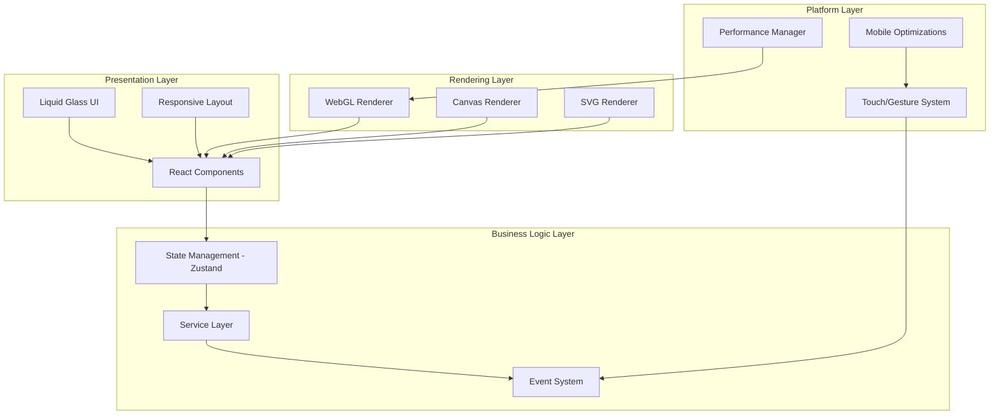
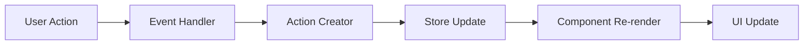

# System Architecture

Mobile IM Floating Components系统采用现代化的模块化架构设计，为移动端即时通讯界面提供高性能的悬浮组件解决方案。

## 整体架构概览



## 核心设计原则

### 1. 移动优先 (Mobile-First)
- 所有组件从移动端设计开始
- 触摸友好的交互设计
- 电池效率优化
- 网络带宽考量

### 2. 性能优先 (Performance-First)
- WebGL硬件加速渲染
- 虚拟滚动和懒加载
- 内存管理优化
- 60fps流畅动画

### 3. 模块化架构 (Modular Architecture)
- 松耦合组件设计
- 可插拔渲染引擎
- 可扩展的服务层
- 独立的性能管理

### 4. 类型安全 (Type Safety)
- 完整的TypeScript支持
- 严格的类型检查
- 运行时类型验证
- 开发时智能提示

## 系统分层架构

### 表现层 (Presentation Layer)

#### React组件层
负责用户界面的渲染和用户交互处理：

```typescript
interface ComponentLayer {
  // 基础UI组件
  avatar: AvatarComponent
  messageBubble: MessageBubbleComponent
  connectionLine: ConnectionLineComponent
  
  // 布局组件
  overlayContainer: OverlayContainerComponent
  gestureHandler: GestureHandlerComponent
  
  // 复合组件
  chatArea: ChatAreaComponent
  actionMenu: ActionMenuComponent
}
```

#### Liquid Glass UI主题层
提供统一的视觉设计语言：

```css
/* 玻璃效果核心样式 */
.glass-effect {
  background: rgba(255, 255, 255, 0.1);
  backdrop-filter: blur(10px);
  border: 1px solid rgba(255, 255, 255, 0.2);
  box-shadow: 0 8px 32px rgba(0, 0, 0, 0.1);
}
```

### 业务逻辑层 (Business Logic Layer)

#### 状态管理 - Zustand
```typescript
interface AppState {
  // 聊天状态
  messages: Message[]
  users: User[]
  conversations: Conversation[]
  
  // UI状态
  overlayVisible: boolean
  selectedMessages: string[]
  gestureMode: GestureMode
  
  // 性能状态
  renderingEngine: RenderingEngine
  memoryUsage: MemoryMetrics
}
```

#### 服务层架构
```typescript
interface ServiceLayer {
  // IM适配器
  wechatAdapter: IMAdapter
  dingTalkAdapter: IMAdapter
  telegramAdapter: IMAdapter
  
  // 核心服务
  messageService: MessageService
  userService: UserService
  authService: AuthService
  
  // 性能服务
  performanceService: PerformanceService
  memoryService: MemoryService
}
```

### 渲染层 (Rendering Layer)

#### WebGL渲染引擎
高性能连接线渲染系统：

```javascript
class WebGLRenderer {
  constructor(canvas) {
    this.gl = canvas.getContext('webgl2')
    this.programs = new Map()
    this.buffers = new Map()
    this.textures = new Map()
  }
  
  // 连接线渲染
  renderConnections(connections) {
    this.useProgram('connection-line')
    this.updateBuffers(connections)
    this.draw()
  }
  
  // 性能优化
  optimize() {
    this.cullInvisibleConnections()
    this.batchDrawCalls()
    this.manageMemory()
  }
}
```

#### 多渲染引擎支持
```typescript
interface RenderingEngine {
  webgl: WebGLRenderer      // 高性能3D渲染
  canvas: CanvasRenderer    // 2D图形渲染
  svg: SVGRenderer          // 矢量图形渲染
  css: CSSRenderer          // CSS动画渲染
}
```

### 平台层 (Platform Layer)

#### 移动端优化管理器
```typescript
class MobileOptimizer {
  // 触摸事件优化
  optimizeTouchEvents() {
    this.enablePassiveListeners()
    this.implementTouchDebouncing()
    this.optimizeScrollPerformance()
  }
  
  // 内存管理
  manageMemory() {
    this.implementVirtualScrolling()
    this.lazyLoadComponents()
    this.garbageCollectImages()
  }
  
  // 电池优化
  optimizeBattery() {
    this.throttleAnimations()
    this.reduceBackgroundProcessing()
    this.optimizeNetworkCalls()
  }
}
```

## 数据流架构

### 单向数据流


### 状态管理流程
```typescript
// 1. Action触发
const sendMessage = (content: string) => {
  messageStore.addMessage({
    id: generateId(),
    content,
    timestamp: new Date(),
    user: currentUser
  })
}

// 2. Store更新
const messageStore = create<MessageState>((set) => ({
  messages: [],
  addMessage: (message) => set((state) => ({
    messages: [...state.messages, message]
  }))
}))

// 3. 组件响应
const MessageList = () => {
  const messages = messageStore(state => state.messages)
  
  return (
    <VirtualScrollContainer>
      {messages.map(message => (
        <MessageBubble key={message.id} message={message} />
      ))}
    </VirtualScrollContainer>
  )
}
```

## 性能优化策略

### 1. 渲染优化
- **WebGL硬件加速**: 连接线和复杂动画使用WebGL
- **虚拟滚动**: 大列表性能优化
- **RAF调度**: 使用requestAnimationFrame优化动画
- **批量更新**: 合并DOM操作减少重排重绘

### 2. 内存优化
- **对象池**: 复用频繁创建的对象
- **懒加载**: 按需加载组件和资源
- **缓存策略**: 智能缓存用户头像和媒体文件
- **垃圾回收**: 主动清理未使用的资源

### 3. 网络优化
- **增量更新**: 只传输变化的数据
- **压缩传输**: 使用Brotli/Gzip压缩
- **预加载**: 预测性加载可能需要的资源
- **离线支持**: 本地缓存关键数据

## 扩展性设计

### 插件系统
```typescript
interface PluginSystem {
  // 渲染引擎插件
  registerRenderer(name: string, renderer: Renderer): void
  
  // IM适配器插件
  registerIMAdapter(platform: string, adapter: IMAdapter): void
  
  // 组件主题插件
  registerTheme(name: string, theme: Theme): void
  
  // 性能监控插件
  registerMonitor(name: string, monitor: PerformanceMonitor): void
}
```

### 配置系统
```typescript
interface SystemConfig {
  // 渲染配置
  rendering: {
    engine: 'webgl' | 'canvas' | 'svg'
    quality: 'high' | 'medium' | 'low'
    fps: number
  }
  
  // 移动端配置
  mobile: {
    touchSensitivity: number
    gestureTimeout: number
    vibrationEnabled: boolean
  }
  
  // 性能配置
  performance: {
    memoryLimit: number
    virtualScrollThreshold: number
    lazyLoadDistance: number
  }
}
```

## 下一步阅读

- [组件层次结构](./component-hierarchy)
- [数据流设计](./data-flow)
- [状态管理](./state-management)
- [渲染管道](./rendering-pipeline)
- [性能系统](./performance-system)