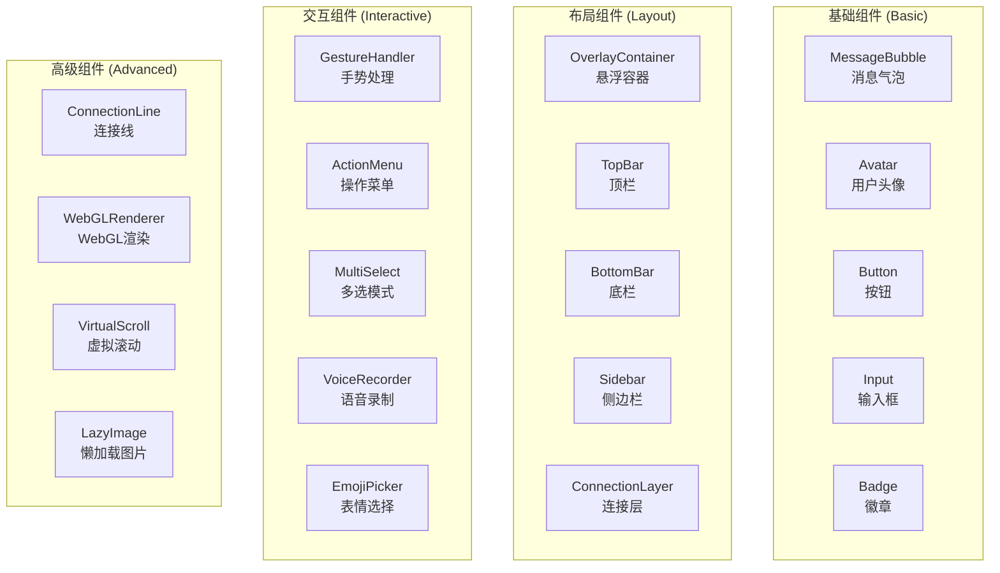

# Component Library

Mobile IM Floating Components提供了一套完整的移动端IM组件库，每个组件都经过精心设计和优化，确保在各种移动设备上都能提供卓越的用户体验。

## 组件分类



## 组件使用统计

| 组件类别 | 组件数量 | 使用频率 | 性能影响 |
|----------|----------|----------|----------|
| 基础组件 | 8个 | 🔥 极高 | ⚡ 轻量 |
| 布局组件 | 6个 | 🔥 极高 | ⚡ 中等 |
| 交互组件 | 7个 | 🚀 高 | ⚡ 中等 |
| 高级组件 | 5个 | 📊 中等 | ⚡ 重量级 |

## 快速导航

### 🎯 最常用组件

**必备三件套**
- [**MessageBubble**](./message-bubble) - 消息气泡，IM应用的核心组件
- [**OverlayContainer**](./overlay-container) - 悬浮容器，管理所有浮层
- [**GestureHandler**](./gesture-handler) - 手势处理，移动端交互基础

**高频使用**
- [**Avatar**](./avatar) - 用户头像，个性化展示
- [**ActionMenu**](./action-menu) - 操作菜单，快捷操作入口
- [**ConnectionLine**](./connection-line) - 连接线，消息关系可视化

### 📱 移动端特色组件

- [**MobileMessageInput**](./mobile-message-input) - 移动端优化的消息输入
- [**TouchFeedback**](./touch-feedback) - 触控反馈系统
- [**SwipeActions**](./swipe-actions) - 滑动操作面板
- [**PullToRefresh**](./pull-to-refresh) - 下拉刷新组件

### 🎨 视觉效果组件

- [**GlassPanel**](./glass-panel) - 玻璃面板效果
- [**ParticleSystem**](./particle-system) - 粒子系统
- [**RippleEffect**](./ripple-effect) - 涟漪效果
- [**GlowBorder**](./glow-border) - 发光边框

## 组件设计原则

### 1. 移动优先 (Mobile-First)

所有组件都从移动端体验开始设计：

```typescript
// 示例：移动优先的触控目标尺寸
const MOBILE_DESIGN_TOKENS = {
  // 最小触控目标 44x44px (Apple HIG)
  minTouchTarget: '44px',
  
  // 舒适的触控目标 48x48px (Material Design)
  comfortableTouchTarget: '48px',
  
  // 移动端手势识别阈值
  swipeThreshold: '50px',
  longPressDelay: '500ms',
  
  // 移动端字体大小（防止iOS缩放）
  minFontSize: '16px'
}
```

### 2. 性能优先 (Performance-First)

每个组件都经过性能优化：

```typescript
// 示例：虚拟化长列表
const VirtualizedMessageList = React.memo(({ messages }) => {
  const [visibleRange, setVisibleRange] = useState({ start: 0, end: 20 })
  
  // 只渲染可见区域的消息
  const visibleMessages = messages.slice(visibleRange.start, visibleRange.end)
  
  return (
    <VirtualScrollContainer
      itemHeight={80}
      totalItems={messages.length}
      onVisibleRangeChange={setVisibleRange}
    >
      {visibleMessages.map(message => (
        <MessageBubble key={message.id} message={message} />
      ))}
    </VirtualScrollContainer>
  )
})
```

### 3. 无障碍访问 (Accessibility-First)

所有组件都支持无障碍访问：

```jsx
// 示例：无障碍友好的消息气泡
<MessageBubble
  message={message}
  role="listitem"
  aria-label={`Message from ${user.name} at ${formatTime(message.timestamp)}`}
  aria-describedby={`message-content-${message.id}`}
  tabIndex={0}
  onKeyDown={(e) => {
    if (e.key === 'Enter' || e.key === ' ') {
      onMessageSelect(message)
    }
  }}
>
  <div id={`message-content-${message.id}`} aria-live="polite">
    {message.content}
  </div>
</MessageBubble>
```

### 4. 主题化支持 (Theme-First)

所有组件都支持Liquid Glass主题系统：

```css
/* 组件主题化示例 */
.message-bubble {
  /* 使用主题令牌 */
  background: var(--glass-primary);
  border: 1px solid var(--glass-border-light);
  box-shadow: var(--glass-shadow-md);
  border-radius: var(--radius-lg);
  
  /* 响应主题变化 */
  transition: all var(--animation-medium) var(--easing-standard);
}

.message-bubble:hover {
  background: var(--glass-secondary);
  box-shadow: var(--glass-shadow-lg);
}
```

## 组件开发标准

### TypeScript接口规范

```typescript
// 组件Props接口标准
interface ComponentProps {
  // 基础属性
  className?: string
  style?: React.CSSProperties
  children?: React.ReactNode
  
  // 主题支持
  theme?: ThemeName
  variant?: ComponentVariant
  size?: ComponentSize
  
  // 状态控制
  disabled?: boolean
  loading?: boolean
  error?: boolean | string
  
  // 移动端优化
  mobileOptimized?: boolean
  touchOptimized?: boolean
  gestureEnabled?: boolean
  
  // 性能优化
  lazy?: boolean
  virtualised?: boolean
  memoized?: boolean
  
  // 无障碍访问
  'aria-label'?: string
  'aria-describedby'?: string
  role?: string
  tabIndex?: number
  
  // 事件回调
  onClick?: (event: MouseEvent | TouchEvent) => void
  onLongPress?: (event: TouchEvent) => void
  onSwipe?: (direction: SwipeDirection) => void
  
  // 自定义渲染
  renderCustomContent?: () => React.ReactNode
  renderIcon?: () => React.ReactNode
  renderActions?: () => React.ReactNode
}
```

### 组件文档标准

每个组件都包含完整的文档：

```markdown
## 组件名称

### 概述
简要描述组件的用途和主要功能

### 何时使用
- 场景1：具体的使用场景描述
- 场景2：具体的使用场景描述

### 基础用法
```tsx
<Component prop="value" />
```

### API参考
详细的Props、Methods、Events文档

### 设计指南
- 设计原则
- 视觉规范
- 交互规范

### 最佳实践
- 性能优化建议
- 无障碍访问建议
- 移动端优化建议

### 示例代码
完整的使用示例

### 相关组件
链接到相关的组件文档
```

## 组件状态管理

### 局部状态 vs 全局状态

```typescript
// 组件内部状态（局部）
const MessageBubble = ({ message }) => {
  const [isExpanded, setIsExpanded] = useState(false)
  const [isHovered, setIsHovered] = useState(false)
  
  return (
    <div 
      className={`message-bubble ${isExpanded ? 'expanded' : ''}`}
      onMouseEnter={() => setIsHovered(true)}
      onMouseLeave={() => setIsHovered(false)}
    >
      {/* 组件内容 */}
    </div>
  )
}

// 全局状态（Zustand Store）
const useMessageStore = create((set) => ({
  messages: [],
  selectedMessages: [],
  replyingTo: null,
  
  selectMessage: (id) => set((state) => ({
    selectedMessages: [...state.selectedMessages, id]
  })),
  
  setReplyingTo: (message) => set({ replyingTo: message })
}))
```

### 组件通信模式

```typescript
// 1. Props向下传递
<ParentComponent>
  <ChildComponent data={parentData} onAction={handleAction} />
</ParentComponent>

// 2. 事件向上冒泡
const ChildComponent = ({ onAction }) => {
  const handleClick = () => {
    onAction({ type: 'click', data: someData })
  }
  
  return <button onClick={handleClick}>Click me</button>
}

// 3. Context跨层传递
const ThemeContext = React.createContext()

const ThemeProvider = ({ theme, children }) => (
  <ThemeContext.Provider value={theme}>
    {children}
  </ThemeContext.Provider>
)

// 4. Store全局状态
const Component = () => {
  const { messages, addMessage } = useMessageStore()
  
  return (
    <div>
      {messages.map(message => (
        <MessageBubble key={message.id} message={message} />
      ))}
    </div>
  )
}
```

## 组件测试策略

### 单元测试示例

```typescript
import { render, screen, fireEvent } from '@testing-library/react'
import { MessageBubble } from './MessageBubble'

describe('MessageBubble', () => {
  const mockMessage = {
    id: '1',
    content: 'Hello World',
    timestamp: new Date(),
    userId: 'user1',
    type: 'text'
  }
  
  const mockUser = {
    id: 'user1',
    name: 'John Doe',
    avatar: '/avatar.jpg'
  }
  
  it('renders message content correctly', () => {
    render(
      <MessageBubble 
        message={mockMessage} 
        user={mockUser} 
        position="right" 
      />
    )
    
    expect(screen.getByText('Hello World')).toBeInTheDocument()
    expect(screen.getByAltText('John Doe')).toBeInTheDocument()
  })
  
  it('handles click events', () => {
    const onPress = jest.fn()
    
    render(
      <MessageBubble 
        message={mockMessage} 
        user={mockUser} 
        position="right"
        onPress={onPress}
      />
    )
    
    fireEvent.click(screen.getByText('Hello World'))
    expect(onPress).toHaveBeenCalledWith(mockMessage)
  })
  
  it('supports keyboard navigation', () => {
    const onPress = jest.fn()
    
    render(
      <MessageBubble 
        message={mockMessage} 
        user={mockUser} 
        position="right"
        onPress={onPress}
        tabIndex={0}
      />
    )
    
    const bubble = screen.getByText('Hello World').closest('div')
    fireEvent.keyDown(bubble, { key: 'Enter' })
    expect(onPress).toHaveBeenCalledWith(mockMessage)
  })
})
```

### 视觉回归测试

```typescript
import { test, expect } from '@playwright/test'

test.describe('MessageBubble Visual Tests', () => {
  test('renders correctly on mobile', async ({ page }) => {
    await page.setViewportSize({ width: 375, height: 667 })
    await page.goto('/storybook/?path=/story/components-messagebubble--default')
    
    await expect(page.locator('.message-bubble')).toHaveScreenshot('message-bubble-mobile.png')
  })
  
  test('hover state works correctly', async ({ page }) => {
    await page.goto('/storybook/?path=/story/components-messagebubble--default')
    
    const bubble = page.locator('.message-bubble')
    await bubble.hover()
    
    await expect(bubble).toHaveScreenshot('message-bubble-hover.png')
  })
})
```

## 组件性能监控

### 性能指标收集

```typescript
import { Profiler } from 'react'

const PerformanceMonitor = ({ children, componentName }) => {
  const onRenderCallback = (id, phase, actualDuration) => {
    // 收集性能数据
    if (actualDuration > 16) { // 超过一帧时间
      console.warn(`${componentName} render took ${actualDuration}ms`)
      
      // 发送到分析服务
      analytics.track('component_performance', {
        component: componentName,
        phase,
        duration: actualDuration,
        timestamp: Date.now()
      })
    }
  }
  
  return (
    <Profiler id={componentName} onRender={onRenderCallback}>
      {children}
    </Profiler>
  )
}

// 使用示例
<PerformanceMonitor componentName="MessageBubble">
  <MessageBubble message={message} user={user} />
</PerformanceMonitor>
```

## 下一步探索

### 按使用场景浏览
- **[聊天界面](./chat-interface)** - 完整的聊天界面组件
- **[消息类型](./message-types)** - 各种消息类型组件
- **[用户交互](./user-interactions)** - 交互相关组件

### 按技术特性浏览
- **[WebGL组件](./webgl-components)** - 高性能WebGL组件
- **[动画组件](./animated-components)** - 丰富的动画效果
- **[手势组件](./gesture-components)** - 移动端手势支持

### 工具和实用程序
- **[开发工具](./dev-tools)** - 组件开发辅助工具
- **[测试工具](./testing-tools)** - 组件测试工具
- **[性能工具](./performance-tools)** - 性能监控和优化工具