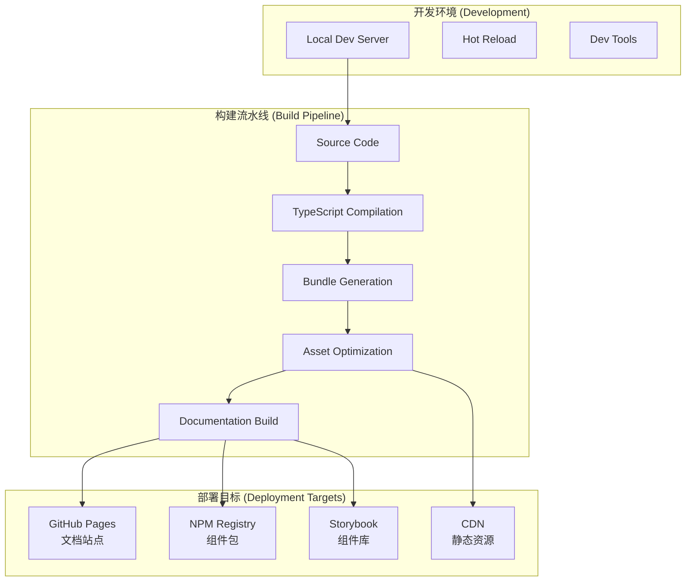

# Deployment Guide

本指南详细介绍如何部署Mobile IM Floating Components的文档站点和组件库，包括自动化构建、GitHub Pages部署、CDN分发等内容。

## 部署架构



## GitHub Actions CI/CD

### 主要工作流配置

```yaml
# .github/workflows/ci-cd.yml
name: CI/CD Pipeline

on:
  push:
    branches: [ main, develop ]
  pull_request:
    branches: [ main ]
  release:
    types: [ published ]

env:
  NODE_VERSION: '18'
  CACHE_KEY: ${{ runner.os }}-node-${{ hashFiles('**/package-lock.json') }}

jobs:
  # 代码质量检查
  quality-check:
    runs-on: ubuntu-latest
    steps:
      - name: Checkout code
        uses: actions/checkout@v4
        
      - name: Setup Node.js
        uses: actions/setup-node@v3
        with:
          node-version: ${{ env.NODE_VERSION }}
          cache: 'npm'
          
      - name: Install dependencies
        run: npm ci
        
      - name: TypeScript check
        run: npm run type-check
        
      - name: Lint code
        run: npm run lint
        
      - name: Run tests
        run: npm run test:coverage
        
      - name: Upload coverage
        uses: codecov/codecov-action@v3
        with:
          file: ./coverage/lcov.info
          
  # 构建组件库
  build-library:
    needs: quality-check
    runs-on: ubuntu-latest
    steps:
      - name: Checkout code
        uses: actions/checkout@v4
        
      - name: Setup Node.js
        uses: actions/setup-node@v3
        with:
          node-version: ${{ env.NODE_VERSION }}
          cache: 'npm'
          
      - name: Install dependencies
        run: npm ci
        
      - name: Build library
        run: npm run build
        
      - name: Build Storybook
        run: npm run build-storybook
        
      - name: Upload build artifacts
        uses: actions/upload-artifact@v3
        with:
          name: build-artifacts
          path: |
            dist/
            storybook-static/
          retention-days: 30
          
  # 构建文档
  build-docs:
    needs: quality-check
    runs-on: ubuntu-latest
    steps:
      - name: Checkout code
        uses: actions/checkout@v4
        with:
          fetch-depth: 0
          
      - name: Setup Node.js
        uses: actions/setup-node@v3
        with:
          node-version: ${{ env.NODE_VERSION }}
          cache: 'npm'
          
      - name: Install dependencies
        run: npm ci
        
      - name: Build VitePress docs
        run: npm run docs:build
        
      - name: Upload docs artifacts
        uses: actions/upload-artifact@v3
        with:
          name: docs-build
          path: docs/.vitepress/dist/
          retention-days: 30
          
  # 部署到GitHub Pages
  deploy-docs:
    needs: [build-library, build-docs]
    runs-on: ubuntu-latest
    if: github.ref == 'refs/heads/main'
    environment:
      name: github-pages
      url: ${{ steps.deployment.outputs.page_url }}
    permissions:
      contents: read
      pages: write
      id-token: write
    steps:
      - name: Download docs build
        uses: actions/download-artifact@v3
        with:
          name: docs-build
          path: docs-dist
          
      - name: Download storybook build
        uses: actions/download-artifact@v3
        with:
          name: build-artifacts
          path: build-artifacts
          
      - name: Prepare GitHub Pages
        run: |
          mkdir -p public
          cp -r docs-dist/* public/
          cp -r build-artifacts/storybook-static public/storybook
          
      - name: Setup Pages
        uses: actions/configure-pages@v3
        
      - name: Upload to GitHub Pages
        uses: actions/upload-pages-artifact@v2
        with:
          path: public
          
      - name: Deploy to GitHub Pages
        id: deployment
        uses: actions/deploy-pages@v2
        
  # 发布到NPM
  publish-npm:
    needs: [build-library, build-docs]
    runs-on: ubuntu-latest
    if: github.event_name == 'release'
    steps:
      - name: Checkout code
        uses: actions/checkout@v4
        
      - name: Setup Node.js
        uses: actions/setup-node@v3
        with:
          node-version: ${{ env.NODE_VERSION }}
          registry-url: 'https://registry.npmjs.org'
          cache: 'npm'
          
      - name: Install dependencies
        run: npm ci
        
      - name: Download build artifacts
        uses: actions/download-artifact@v3
        with:
          name: build-artifacts
          path: .
          
      - name: Publish to NPM
        run: npm publish --access public
        env:
          NODE_AUTH_TOKEN: ${{ secrets.NPM_TOKEN }}
          
  # 通知部署状态
  notify-deployment:
    needs: [deploy-docs, publish-npm]
    runs-on: ubuntu-latest
    if: always()
    steps:
      - name: Notify success
        if: needs.deploy-docs.result == 'success'
        run: |
          echo "✅ Deployment successful!"
          echo "📚 Docs: https://${{ github.repository_owner }}.github.io/${{ github.event.repository.name }}"
          echo "📖 Storybook: https://${{ github.repository_owner }}.github.io/${{ github.event.repository.name }}/storybook"
          
      - name: Notify failure
        if: needs.deploy-docs.result == 'failure' || needs.publish-npm.result == 'failure'
        run: |
          echo "❌ Deployment failed!"
          exit 1
```

### Semantic Release配置

```json
{
  "release": {
    "branches": ["main"],
    "plugins": [
      "@semantic-release/commit-analyzer",
      "@semantic-release/release-notes-generator",
      "@semantic-release/changelog",
      [
        "@semantic-release/npm",
        {
          "npmPublish": true,
          "tarballDir": "dist"
        }
      ],
      [
        "@semantic-release/github",
        {
          "assets": [
            {
              "path": "dist/*.tgz",
              "label": "NPM Package"
            },
            {
              "path": "storybook-static/**",
              "label": "Storybook Build"
            }
          ]
        }
      ],
      "@semantic-release/git"
    ]
  }
}
```

## 构建配置

### Vite构建配置

```typescript
// vite.config.ts
import { defineConfig } from 'vite'
import react from '@vitejs/plugin-react'
import dts from 'vite-plugin-dts'
import { resolve } from 'path'

export default defineConfig({
  plugins: [
    react(),
    dts({
      insertTypesEntry: true,
      exclude: ['**/*.test.*', '**/*.spec.*', '**/*.stories.*']
    })
  ],
  
  build: {
    lib: {
      entry: resolve(__dirname, 'src/index.ts'),
      name: 'MobileIMComponents',
      formats: ['es', 'cjs', 'umd'],
      fileName: (format) => `mobile-im-components.${format}.js`
    },
    
    rollupOptions: {
      external: [
        'react',
        'react-dom',
        'zustand'
      ],
      
      output: {
        globals: {
          'react': 'React',
          'react-dom': 'ReactDOM',
          'zustand': 'zustand'
        },
        
        // 代码分割优化
        manualChunks: {
          'webgl': ['./src/rendering/webgl'],
          'mobile': ['./src/mobile'],
          'themes': ['./src/styles']
        }
      }
    },
    
    // 构建优化
    minify: 'terser',
    terserOptions: {
      compress: {
        drop_console: true,
        drop_debugger: true
      }
    },
    
    // 源码映射
    sourcemap: true,
    
    // 输出目录清理
    emptyOutDir: true
  },
  
  resolve: {
    alias: {
      '@': resolve(__dirname, 'src')
    }
  },
  
  // 开发服务器配置
  server: {
    port: 3000,
    host: '0.0.0.0', // 允许外部访问
    open: true
  }
})
```

### TypeScript构建配置

```json
{
  "compilerOptions": {
    "target": "ES2020",
    "lib": ["ES2020", "DOM", "DOM.Iterable"],
    "module": "ESNext",
    "skipLibCheck": true,
    
    /* Bundler mode */
    "moduleResolution": "bundler",
    "allowImportingTsExtensions": false,
    "resolveJsonModule": true,
    "isolatedModules": true,
    "noEmit": false,
    "jsx": "react-jsx",
    
    /* Linting */
    "strict": true,
    "noUnusedLocals": true,
    "noUnusedParameters": true,
    "noFallthroughCasesInSwitch": true,
    
    /* Declaration */
    "declaration": true,
    "declarationMap": true,
    "outDir": "dist/types",
    
    /* Path mapping */
    "baseUrl": ".",
    "paths": {
      "@/*": ["src/*"]
    }
  },
  
  "include": [
    "src/**/*"
  ],
  
  "exclude": [
    "node_modules",
    "dist",
    "**/*.test.*",
    "**/*.spec.*",
    "**/*.stories.*"
  ]
}
```

## 包管理和发布

### package.json配置

```json
{
  "name": "@mobile-im/components",
  "version": "1.0.0",
  "description": "Advanced mobile IM floating components with WebGL rendering",
  "type": "module",
  
  "main": "./dist/mobile-im-components.cjs.js",
  "module": "./dist/mobile-im-components.es.js",
  "types": "./dist/types/index.d.ts",
  
  "exports": {
    ".": {
      "import": "./dist/mobile-im-components.es.js",
      "require": "./dist/mobile-im-components.cjs.js",
      "types": "./dist/types/index.d.ts"
    },
    "./styles": "./dist/styles/index.css",
    "./webgl": {
      "import": "./dist/webgl.es.js",
      "require": "./dist/webgl.cjs.js"
    }
  },
  
  "files": [
    "dist",
    "README.md",
    "LICENSE"
  ],
  
  "scripts": {
    "dev": "vite",
    "build": "tsc && vite build",
    "build:watch": "vite build --watch",
    "preview": "vite preview",
    
    "docs:dev": "vitepress dev docs",
    "docs:build": "vitepress build docs",
    "docs:preview": "vitepress preview docs",
    
    "storybook": "storybook dev -p 6006",
    "build-storybook": "storybook build",
    
    "test": "vitest",
    "test:coverage": "vitest --coverage",
    "test:ui": "vitest --ui",
    
    "lint": "eslint . --ext ts,tsx --report-unused-disable-directives --max-warnings 0",
    "lint:fix": "eslint . --ext ts,tsx --fix",
    
    "type-check": "tsc --noEmit",
    
    "prepare": "husky install",
    "prepublishOnly": "npm run build && npm run test",
    
    "release": "semantic-release"
  },
  
  "peerDependencies": {
    "react": ">=18.0.0",
    "react-dom": ">=18.0.0"
  },
  
  "dependencies": {
    "zustand": "^4.4.7"
  },
  
  "devDependencies": {
    "@types/react": "^18.2.43",
    "@types/react-dom": "^18.2.17",
    "@typescript-eslint/eslint-plugin": "^6.14.0",
    "@typescript-eslint/parser": "^6.14.0",
    "@vitejs/plugin-react": "^4.2.1",
    "eslint": "^8.55.0",
    "eslint-plugin-react": "^7.33.2",
    "eslint-plugin-react-hooks": "^4.6.0",
    "eslint-plugin-react-refresh": "^0.4.5",
    "husky": "^8.0.3",
    "lint-staged": "^15.2.0",
    "typescript": "^5.2.2",
    "vite": "^5.0.8",
    "vite-plugin-dts": "^3.6.4",
    "vitepress": "^1.0.0",
    "vitest": "^1.1.0",
    "@vitest/ui": "^1.1.0",
    "@storybook/react-vite": "^7.6.6",
    "@semantic-release/changelog": "^6.0.3",
    "@semantic-release/git": "^10.0.1",
    "semantic-release": "^22.0.12"
  },
  
  "keywords": [
    "react",
    "typescript",
    "mobile",
    "im",
    "chat",
    "components",
    "webgl",
    "liquid-glass",
    "ui"
  ],
  
  "author": "Mobile IM Components Team",
  "license": "MIT",
  "homepage": "https://mobile-im.github.io/components",
  "repository": {
    "type": "git",
    "url": "https://github.com/mobile-im/components.git"
  },
  
  "bugs": {
    "url": "https://github.com/mobile-im/components/issues"
  }
}
```

### 发布前检查脚本

```bash
#!/bin/bash
# scripts/pre-publish.sh

set -e

echo "🚀 Starting pre-publish checks..."

# 1. 类型检查
echo "📋 Running TypeScript checks..."
npm run type-check

# 2. 代码质量检查
echo "🔍 Running ESLint..."
npm run lint

# 3. 运行测试
echo "🧪 Running tests..."
npm run test:coverage

# 4. 构建检查
echo "🔨 Building project..."
npm run build

# 5. 包大小检查
echo "📦 Checking bundle size..."
ls -lh dist/

# 6. 依赖检查
echo "🔗 Checking dependencies..."
npm audit --audit-level high

# 7. 文档构建检查
echo "📚 Building documentation..."
npm run docs:build
npm run build-storybook

echo "✅ All pre-publish checks passed!"
```

## CDN配置

### jsDelivr CDN使用

```html
<!-- 在HTML中直接使用 -->
<script src="https://cdn.jsdelivr.net/npm/@mobile-im/components@latest/dist/mobile-im-components.umd.js"></script>
<link rel="stylesheet" href="https://cdn.jsdelivr.net/npm/@mobile-im/components@latest/dist/styles/index.css">

<script>
  // 全局访问
  const { MessageBubble, OverlayContainer } = MobileIMComponents
</script>
```

### 自定义CDN配置

```javascript
// cdn-config.js
const CDN_CONFIG = {
  // 主要CDN
  primary: {
    base: 'https://cdn.example.com',
    paths: {
      js: '/js/mobile-im-components.min.js',
      css: '/css/mobile-im-components.min.css',
      webgl: '/js/webgl-renderer.min.js'
    }
  },
  
  // 备用CDN
  fallback: {
    base: 'https://backup-cdn.example.com',
    paths: {
      js: '/dist/mobile-im-components.min.js',
      css: '/dist/mobile-im-components.min.css'
    }
  }
}

// CDN加载器
class CDNLoader {
  static async loadComponent(version = 'latest') {
    try {
      // 尝试主要CDN
      await this.loadFromCDN(CDN_CONFIG.primary, version)
    } catch (error) {
      console.warn('Primary CDN failed, trying fallback...')
      // 使用备用CDN
      await this.loadFromCDN(CDN_CONFIG.fallback, version)
    }
  }
  
  static loadFromCDN(config, version) {
    return Promise.all([
      this.loadScript(`${config.base}${config.paths.js}?v=${version}`),
      this.loadStyles(`${config.base}${config.paths.css}?v=${version}`)
    ])
  }
  
  static loadScript(src) {
    return new Promise((resolve, reject) => {
      const script = document.createElement('script')
      script.src = src
      script.onload = resolve
      script.onerror = reject
      document.head.appendChild(script)
    })
  }
  
  static loadStyles(href) {
    return new Promise((resolve, reject) => {
      const link = document.createElement('link')
      link.rel = 'stylesheet'
      link.href = href
      link.onload = resolve
      link.onerror = reject
      document.head.appendChild(link)
    })
  }
}
```

## 性能优化

### 构建优化配置

```typescript
// build-optimizer.ts
import { defineConfig } from 'vite'

export default defineConfig({
  build: {
    // 代码分割优化
    rollupOptions: {
      output: {
        manualChunks: {
          // 分离第三方库
          vendor: ['react', 'react-dom'],
          
          // 按功能分割
          webgl: ['./src/rendering/webgl'],
          mobile: ['./src/mobile'],
          themes: ['./src/styles'],
          utils: ['./src/utils']
        },
        
        // 优化块大小
        chunkSizeWarningLimit: 500,
        
        // 资源哈希
        assetFileNames: 'assets/[name].[hash].[ext]',
        chunkFileNames: 'js/[name].[hash].js',
        entryFileNames: 'js/[name].[hash].js'
      }
    },
    
    // 压缩优化
    minify: 'terser',
    terserOptions: {
      compress: {
        // 移除console
        drop_console: process.env.NODE_ENV === 'production',
        // 移除debugger
        drop_debugger: true,
        // 移除注释
        comments: false,
        // 内联函数
        inline: 2
      },
      mangle: {
        // 保留类名（用于调试）
        keep_classnames: process.env.NODE_ENV === 'development'
      }
    }
  }
})
```

### 资源优化

```bash
#!/bin/bash
# scripts/optimize-assets.sh

echo "🖼️  Optimizing images..."
# 图片压缩
find public/images -name "*.png" -exec pngquant --force --output {} {} \;
find public/images -name "*.jpg" -exec jpegoptim --max=80 {} \;

echo "📱 Generating PWA icons..."
# 生成多尺寸图标
convert public/icon-original.png -resize 16x16 public/favicon-16x16.png
convert public/icon-original.png -resize 32x32 public/favicon-32x32.png
convert public/icon-original.png -resize 192x192 public/icon-192x192.png
convert public/icon-original.png -resize 512x512 public/icon-512x512.png

echo "🗜️  Compressing JavaScript..."
# JavaScript压缩
terser dist/mobile-im-components.es.js -o dist/mobile-im-components.es.min.js --compress --mangle

echo "🎨 Optimizing CSS..."
# CSS压缩
cleancss -o dist/styles/index.min.css dist/styles/index.css

echo "📦 Creating gzipped versions..."
# 创建gzip版本
find dist -name "*.js" -exec gzip -9 -k {} \;
find dist -name "*.css" -exec gzip -9 -k {} \;

echo "✅ Asset optimization complete!"
```

## 监控和分析

### 构建分析

```json
{
  "scripts": {
    "analyze": "npm run build && npx vite-bundle-analyzer dist",
    "analyze:webpack": "npx webpack-bundle-analyzer dist",
    "size-limit": "npx size-limit",
    "lighthouse": "npx lighthouse https://mobile-im.github.io/components --output html --output-path lighthouse-report.html"
  },
  
  "size-limit": [
    {
      "name": "Core Bundle",
      "path": "dist/mobile-im-components.es.js",
      "limit": "50 KB"
    },
    {
      "name": "WebGL Renderer",
      "path": "dist/webgl.es.js", 
      "limit": "30 KB"
    },
    {
      "name": "Styles",
      "path": "dist/styles/index.css",
      "limit": "20 KB"
    }
  ]
}
```

### 部署后验证

```javascript
// scripts/deployment-verification.js
const axios = require('axios')

const ENDPOINTS = {
  docs: 'https://mobile-im.github.io/components',
  storybook: 'https://mobile-im.github.io/components/storybook',
  cdn: 'https://cdn.jsdelivr.net/npm/@mobile-im/components@latest'
}

async function verifyDeployment() {
  console.log('🔍 Verifying deployment...')
  
  for (const [name, url] of Object.entries(ENDPOINTS)) {
    try {
      const response = await axios.get(url, { timeout: 10000 })
      
      if (response.status === 200) {
        console.log(`✅ ${name}: OK`)
      } else {
        console.error(`❌ ${name}: Status ${response.status}`)
        process.exit(1)
      }
    } catch (error) {
      console.error(`❌ ${name}: ${error.message}`)
      process.exit(1)
    }
  }
  
  console.log('🎉 All deployments verified successfully!')
}

verifyDeployment()
```

## 环境配置

### 开发环境

```bash
# .env.development
NODE_ENV=development
VITE_API_URL=http://localhost:3001
VITE_ENABLE_DEVTOOLS=true
VITE_HOT_RELOAD=true
VITE_SOURCE_MAPS=true
```

### 生产环境

```bash
# .env.production
NODE_ENV=production
VITE_API_URL=https://api.mobile-im.com
VITE_ENABLE_DEVTOOLS=false
VITE_HOT_RELOAD=false
VITE_SOURCE_MAPS=false
VITE_CDN_URL=https://cdn.jsdelivr.net/npm/@mobile-im/components@latest
```

### 部署脚本

```bash
#!/bin/bash
# deploy.sh

set -e

# 环境检查
if [ -z "$GITHUB_TOKEN" ]; then
    echo "❌ GITHUB_TOKEN is required"
    exit 1
fi

# 构建项目
echo "🔨 Building project..."
npm run build
npm run docs:build
npm run build-storybook

# 运行测试
echo "🧪 Running tests..."
npm run test

# 部署到GitHub Pages
echo "🚀 Deploying to GitHub Pages..."
npm run deploy

# 发布到NPM (如果是release分支)
if [ "$GITHUB_REF" == "refs/heads/main" ] && [ "$GITHUB_EVENT_NAME" == "release" ]; then
    echo "📦 Publishing to NPM..."
    npm publish --access public
fi

echo "✅ Deployment complete!"
```

## 问题排查

### 常见部署问题

1. **构建失败**
```bash
# 清理缓存和依赖
rm -rf node_modules package-lock.json
npm install

# 检查TypeScript配置
npm run type-check
```

2. **GitHub Pages 404错误**
```bash
# 检查基础路径配置
# vitepress config
base: '/repository-name/'

# 检查CNAME文件
echo 'your-domain.com' > docs/.vitepress/dist/CNAME
```

3. **CDN缓存问题**
```bash
# 使用版本号强制更新
https://cdn.jsdelivr.net/npm/@mobile-im/components@1.2.3/dist/mobile-im-components.es.js

# 清除jsDelivr缓存
https://purge.jsdelivr.net/npm/@mobile-im/components@latest/
```

## 下一步

- **[监控和分析](./monitoring)** - 部署后的性能监控
- **[自动化测试](./testing)** - 端到端测试策略
- **[安全配置](./security)** - 部署安全最佳实践
- **[扩展部署](./scaling)** - 大规模部署策略