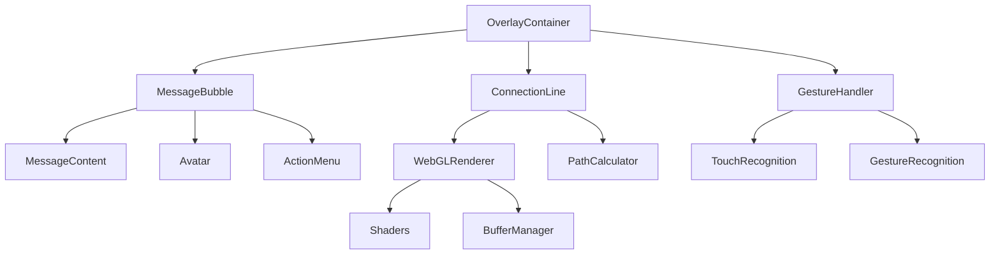

## Quick Start

Get up and running with Mobile IM Floating Components in minutes:

```bash
npm install @mobile-im/components
```

```tsx
import { MessageBubble, OverlayContainer } from '@mobile-im/components'
import '@mobile-im/components/styles'

function App() {
  return (
    <OverlayContainer>
      <MessageBubble
        message="Hello, World!"
        user={{ id: '1', name: 'John', avatar: '/avatar.jpg' }}
        timestamp={new Date()}
      />
    </OverlayContainer>
  )
}
```

## Key Features

### 🎨 Liquid Glass UI Theme
Experience the beauty of frosted glass effects with our advanced Liquid Glass UI theme. Built with modern CSS features including backdrop filters and advanced blur effects.

### 📱 Mobile-Optimized
Every component is designed and optimized for mobile devices with:
- Touch-friendly interactions
- Gesture recognition system
- Battery-efficient rendering
- Responsive design patterns

### ⚡ WebGL-Powered Rendering
Advanced connection line system powered by WebGL for:
- Smooth 60fps animations
- Dynamic connection updates
- Collision detection
- Performance optimization

### 🔧 Developer Experience
Built with modern development practices:
- Full TypeScript support
- Comprehensive documentation
- Interactive playground
- Storybook component library

## Architecture Overview

The Mobile IM Floating Components system is built with a modular architecture:



## Performance Metrics

Our components are optimized for mobile performance:

| Metric | Value |
|--------|-------|
| Bundle Size | < 50KB (gzipped) |
| Memory Usage | < 20MB (typical) |
| Frame Rate | 60fps (smooth animations) |
| Battery Impact | Minimal (optimized rendering) |
| Load Time | < 1s (first render) |

## Browser Support

- **iOS Safari**: 14.0+
- **Chrome Mobile**: 90+
- **Firefox Mobile**: 88+
- **Samsung Internet**: 14.0+
- **UC Browser**: Latest

## Getting Help

- 📖 [Documentation](/guide/)
- 🔧 [API Reference](/api/)
- 🎯 [Component Library](/components/)
- 🚀 [GitHub Issues](https://github.com/your-org/mobile-im-components/issues)

## Contributing

We welcome contributions! Please see our [Contributing Guide](https://github.com/your-org/mobile-im-components/blob/main/CONTRIBUTING.md) for details.

## License

MIT © Mobile IM Components Team