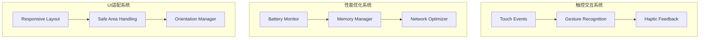

# Mobile Adaptation

Mobile IM Floating Components专为移动设备深度优化，提供原生级的触控体验和卓越的性能表现。本章详细介绍移动端适配的各个方面。

## 移动端设计原则

### 1. 触控优先 (Touch-First)
- **大触控目标**: 最小44x44px的触控区域
- **手势友好**: 支持自然的手势操作
- **即时反馈**: 触控即时视觉响应
- **容错设计**: 宽松的触控边界

### 2. 性能优先 (Performance-First)  
- **60fps流畅度**: 保持高帧率体验
- **电池友好**: 最小化电量消耗
- **内存高效**: 智能的内存管理
- **网络优化**: 减少数据传输

### 3. 适应性设计 (Adaptive Design)
- **多屏幕适配**: 从小屏到全面屏
- **方向自适应**: 横竖屏无缝切换
- **密度适配**: 不同DPI的完美显示
- **安全区域**: 刘海屏、挖孔屏适配

## 核心移动端特性



## 触控交互系统

### 基础触控事件处理

```typescript
class TouchEventManager {
  constructor(element: HTMLElement) {
    this.element = element
    this.setupTouchEvents()
    this.touchHistory = []
    this.activeGestures = new Set()
  }
  
  private setupTouchEvents() {
    // 使用passive listeners优化滚动性能
    this.element.addEventListener('touchstart', this.handleTouchStart.bind(this), { 
      passive: false 
    })
    this.element.addEventListener('touchmove', this.handleTouchMove.bind(this), { 
      passive: false 
    })
    this.element.addEventListener('touchend', this.handleTouchEnd.bind(this), { 
      passive: true 
    })
    this.element.addEventListener('touchcancel', this.handleTouchCancel.bind(this), { 
      passive: true 
    })
  }
  
  private handleTouchStart(event: TouchEvent) {
    // 记录触控点信息
    Array.from(event.changedTouches).forEach(touch => {
      this.touchHistory.push({
        id: touch.identifier,
        startTime: performance.now(),
        startX: touch.clientX,
        startY: touch.clientY,
        currentX: touch.clientX,
        currentY: touch.clientY,
        path: [{ x: touch.clientX, y: touch.clientY, time: performance.now() }]
      })
    })
    
    // 触控反馈
    this.provideTouchFeedback(event)
    
    // 阻止默认行为（如双击缩放）
    if (event.touches.length > 1) {
      event.preventDefault()
    }
  }
  
  private handleTouchMove(event: TouchEvent) {
    Array.from(event.changedTouches).forEach(touch => {
      const touchData = this.findTouchData(touch.identifier)
      if (touchData) {
        touchData.currentX = touch.clientX
        touchData.currentY = touch.clientY
        touchData.path.push({
          x: touch.clientX,
          y: touch.clientY,
          time: performance.now()
        })
        
        // 限制路径长度
        if (touchData.path.length > 50) {
          touchData.path.shift()
        }
      }
    })
    
    // 检测手势
    this.detectGestures()
  }
}
```

### 高级手势识别

```typescript
class GestureRecognizer {
  private recognizers = new Map<string, GesturePattern>()
  
  constructor() {
    this.setupBuiltinGestures()
  }
  
  private setupBuiltinGestures() {
    // 长按手势
    this.recognizers.set('longpress', {
      name: 'longpress',
      minDuration: 500,
      maxMovement: 10,
      touchCount: 1,
      recognizer: this.recognizeLongPress.bind(this)
    })
    
    // 滑动手势
    this.recognizers.set('swipe', {
      name: 'swipe',
      minDistance: 50,
      minVelocity: 0.5,
      maxDuration: 300,
      touchCount: 1,
      recognizer: this.recognizeSwipe.bind(this)
    })
    
    // 捏合手势
    this.recognizers.set('pinch', {
      name: 'pinch',
      touchCount: 2,
      recognizer: this.recognizePinch.bind(this)
    })
    
    // 旋转手势
    this.recognizers.set('rotation', {
      name: 'rotation',
      touchCount: 2,
      minAngle: 5,
      recognizer: this.recognizeRotation.bind(this)
    })
  }
  
  // 长按识别
  private recognizeLongPress(touchData: TouchData[]): GestureEvent | null {
    const touch = touchData[0]
    const duration = performance.now() - touch.startTime
    const movement = this.calculateDistance(
      { x: touch.startX, y: touch.startY },
      { x: touch.currentX, y: touch.currentY }
    )
    
    if (duration >= 500 && movement <= 10) {
      return {
        type: 'longpress',
        point: { x: touch.currentX, y: touch.currentY },
        duration,
        timestamp: performance.now()
      }
    }
    
    return null
  }
  
  // 滑动识别
  private recognizeSwipe(touchData: TouchData[]): GestureEvent | null {
    const touch = touchData[0]
    const distance = this.calculateDistance(
      { x: touch.startX, y: touch.startY },
      { x: touch.currentX, y: touch.currentY }
    )
    
    if (distance >= 50) {
      const angle = this.calculateAngle(
        { x: touch.startX, y: touch.startY },
        { x: touch.currentX, y: touch.currentY }
      )
      
      const direction = this.getSwipeDirection(angle)
      const velocity = this.calculateVelocity(touch.path)
      
      return {
        type: 'swipe',
        direction,
        distance,
        velocity,
        angle,
        startPoint: { x: touch.startX, y: touch.startY },
        endPoint: { x: touch.currentX, y: touch.currentY },
        timestamp: performance.now()
      }
    }
    
    return null
  }
  
  // 捏合识别
  private recognizePinch(touchData: TouchData[]): GestureEvent | null {
    if (touchData.length !== 2) return null
    
    const [touch1, touch2] = touchData
    
    const currentDistance = this.calculateDistance(
      { x: touch1.currentX, y: touch1.currentY },
      { x: touch2.currentX, y: touch2.currentY }
    )
    
    const startDistance = this.calculateDistance(
      { x: touch1.startX, y: touch1.startY },
      { x: touch2.startX, y: touch2.startY }
    )
    
    const scale = currentDistance / startDistance
    const center = {
      x: (touch1.currentX + touch2.currentX) / 2,
      y: (touch1.currentY + touch2.currentY) / 2
    }
    
    return {
      type: 'pinch',
      scale,
      center,
      distance: currentDistance,
      timestamp: performance.now()
    }
  }
}
```

### 触觉反馈系统

```typescript
class HapticFeedback {
  private isSupported: boolean
  
  constructor() {
    this.isSupported = 'vibrate' in navigator
  }
  
  // 轻触反馈
  light() {
    if (this.isSupported) {
      navigator.vibrate(10)
    }
  }
  
  // 中等强度反馈
  medium() {
    if (this.isSupported) {
      navigator.vibrate(25)
    }
  }
  
  // 强烈反馈
  heavy() {
    if (this.isSupported) {
      navigator.vibrate(50)
    }
  }
  
  // 成功反馈
  success() {
    if (this.isSupported) {
      navigator.vibrate([10, 50, 10])
    }
  }
  
  // 错误反馈
  error() {
    if (this.isSupported) {
      navigator.vibrate([25, 100, 25, 100, 25])
    }
  }
  
  // 自定义模式
  custom(pattern: number[]) {
    if (this.isSupported) {
      navigator.vibrate(pattern)
    }
  }
}
```

## 响应式布局系统

### 智能布局管理器

```typescript
class ResponsiveLayoutManager {
  private breakpoints = {
    xs: 0,      // 小屏手机
    sm: 480,    // 大屏手机
    md: 768,    // 平板竖屏
    lg: 1024,   // 平板横屏
    xl: 1440    // 桌面
  }
  
  private currentBreakpoint: string = 'xs'
  private orientation: 'portrait' | 'landscape' = 'portrait'
  
  constructor() {
    this.updateLayout()
    this.setupResizeListener()
    this.setupOrientationListener()
  }
  
  private updateLayout() {
    const width = window.innerWidth
    const height = window.innerHeight
    
    // 确定当前断点
    this.currentBreakpoint = this.getBreakpoint(width)
    
    // 确定屏幕方向
    this.orientation = width > height ? 'landscape' : 'portrait'
    
    // 应用布局规则
    this.applyLayoutRules()
  }
  
  private applyLayoutRules() {
    const rules = this.getLayoutRules()
    
    // 应用CSS变量
    Object.entries(rules.cssVariables).forEach(([key, value]) => {
      document.documentElement.style.setProperty(`--${key}`, value)
    })
    
    // 更新组件布局
    this.updateComponentLayouts(rules)
  }
  
  private getLayoutRules(): LayoutRules {
    const isMobile = this.currentBreakpoint === 'xs' || this.currentBreakpoint === 'sm'
    const isTablet = this.currentBreakpoint === 'md' || this.currentBreakpoint === 'lg'
    
    return {
      cssVariables: {
        'message-max-width': isMobile ? '85%' : '70%',
        'avatar-size': isMobile ? '32px' : '40px',
        'font-size-base': isMobile ? '14px' : '16px',
        'spacing-unit': isMobile ? '8px' : '12px',
        'border-radius': isMobile ? '12px' : '16px'
      },
      
      messageLayout: {
        showAvatars: !isMobile || this.orientation === 'landscape',
        showTimestamps: true,
        groupMessages: isMobile,
        compactMode: isMobile && this.orientation === 'portrait'
      },
      
      inputArea: {
        height: isMobile ? '60px' : '80px',
        fontSize: isMobile ? '16px' : '18px', // 防止iOS缩放
        padding: isMobile ? '12px' : '16px'
      }
    }
  }
}
```

### 安全区域处理

```typescript
class SafeAreaManager {
  private safeAreaInsets = {
    top: 0,
    right: 0,
    bottom: 0,
    left: 0
  }
  
  constructor() {
    this.detectSafeArea()
    this.applySafeAreaStyles()
  }
  
  private detectSafeArea() {
    // 使用CSS环境变量检测安全区域
    const computedStyle = getComputedStyle(document.documentElement)
    
    this.safeAreaInsets = {
      top: this.parseCSSValue(computedStyle.getPropertyValue('env(safe-area-inset-top)')),
      right: this.parseCSSValue(computedStyle.getPropertyValue('env(safe-area-inset-right)')),
      bottom: this.parseCSSValue(computedStyle.getPropertyValue('env(safe-area-inset-bottom)')),
      left: this.parseCSSValue(computedStyle.getPropertyValue('env(safe-area-inset-left)'))
    }
    
    // iOS Safari特殊处理
    if (this.isIOSSafari()) {
      this.handleIOSSafari()
    }
  }
  
  private applySafeAreaStyles() {
    const root = document.documentElement
    
    root.style.setProperty('--safe-area-top', `${this.safeAreaInsets.top}px`)
    root.style.setProperty('--safe-area-right', `${this.safeAreaInsets.right}px`)
    root.style.setProperty('--safe-area-bottom', `${this.safeAreaInsets.bottom}px`)
    root.style.setProperty('--safe-area-left', `${this.safeAreaInsets.left}px`)
    
    // 应用安全区域填充
    root.style.paddingTop = `env(safe-area-inset-top)`
    root.style.paddingBottom = `env(safe-area-inset-bottom)`
    root.style.paddingLeft = `env(safe-area-inset-left)`
    root.style.paddingRight = `env(safe-area-inset-right)`
  }
  
  private isIOSSafari(): boolean {
    const userAgent = navigator.userAgent
    return /iPhone|iPad|iPod/.test(userAgent) && /Safari/.test(userAgent) && !/CriOS|FxiOS/.test(userAgent)
  }
  
  private handleIOSSafari() {
    // iOS Safari地址栏自动隐藏处理
    const updateViewportHeight = () => {
      const vh = window.innerHeight * 0.01
      document.documentElement.style.setProperty('--vh', `${vh}px`)
    }
    
    updateViewportHeight()
    window.addEventListener('resize', updateViewportHeight)
    window.addEventListener('orientationchange', () => {
      setTimeout(updateViewportHeight, 500)
    })
  }
}
```

## 性能优化系统

### 电池使用优化

```typescript
class BatteryOptimizer {
  private batteryManager: any = null
  private isOptimizationEnabled = false
  
  constructor() {
    this.initializeBatteryAPI()
  }
  
  private async initializeBatteryAPI() {
    if ('getBattery' in navigator) {
      try {
        this.batteryManager = await (navigator as any).getBattery()
        this.setupBatteryMonitoring()
      } catch (error) {
        console.warn('Battery API not available:', error)
      }
    }
  }
  
  private setupBatteryMonitoring() {
    if (!this.batteryManager) return
    
    const checkBatteryLevel = () => {
      const level = this.batteryManager.level
      const charging = this.batteryManager.charging
      
      // 低电量时启用优化
      if (level < 0.2 && !charging) {
        this.enableBatteryOptimization()
      } else if (level > 0.5 || charging) {
        this.disableBatteryOptimization()
      }
    }
    
    this.batteryManager.addEventListener('levelchange', checkBatteryLevel)
    this.batteryManager.addEventListener('chargingchange', checkBatteryLevel)
    checkBatteryLevel()
  }
  
  private enableBatteryOptimization() {
    if (this.isOptimizationEnabled) return
    
    this.isOptimizationEnabled = true
    
    // 降低渲染质量
    this.setRenderQuality('low')
    
    // 减少动画
    this.reduceAnimations()
    
    // 降低刷新率
    this.setTargetFPS(30)
    
    // 减少网络请求
    this.throttleNetworkRequests()
    
    console.info('Battery optimization enabled')
  }
  
  private disableBatteryOptimization() {
    if (!this.isOptimizationEnabled) return
    
    this.isOptimizationEnabled = false
    
    // 恢复正常质量
    this.setRenderQuality('high')
    this.restoreAnimations()
    this.setTargetFPS(60)
    this.restoreNetworkRequests()
    
    console.info('Battery optimization disabled')
  }
}
```

### 内存管理系统

```typescript
class MobileMemoryManager {
  private memoryThresholds = {
    warning: 30 * 1024 * 1024,    // 30MB
    critical: 50 * 1024 * 1024,   // 50MB
    maximum: 80 * 1024 * 1024     // 80MB
  }
  
  private cleanupTasks: Array<() => void> = []
  
  constructor() {
    this.setupMemoryMonitoring()
    this.setupVisibilityChange()
  }
  
  private setupMemoryMonitoring() {
    setInterval(() => {
      this.checkMemoryUsage()
    }, 10000) // 每10秒检查一次
  }
  
  private checkMemoryUsage() {
    if (!performance.memory) return
    
    const used = performance.memory.usedJSHeapSize
    
    if (used > this.memoryThresholds.critical) {
      this.performAggressiveCleanup()
    } else if (used > this.memoryThresholds.warning) {
      this.performGentleCleanup()
    }
  }
  
  private performGentleCleanup() {
    // 清理过期的图片缓存
    this.cleanupImageCache()
    
    // 清理旧的消息历史
    this.cleanupOldMessages()
    
    // 清理未使用的组件状态
    this.cleanupUnusedState()
  }
  
  private performAggressiveCleanup() {
    console.warn('Performing aggressive memory cleanup')
    
    // 执行温和清理
    this.performGentleCleanup()
    
    // 强制垃圾回收
    this.forceGarbageCollection()
    
    // 清理所有非关键缓存
    this.clearAllCaches()
    
    // 减少渲染质量
    this.reduceRenderQuality()
    
    // 通知用户内存不足
    this.notifyLowMemory()
  }
  
  private setupVisibilityChange() {
    document.addEventListener('visibilitychange', () => {
      if (document.hidden) {
        // 应用进入后台，执行清理
        this.performBackgroundCleanup()
      } else {
        // 应用恢复前台，恢复状态
        this.restoreFromBackground()
      }
    })
  }
  
  private performBackgroundCleanup() {
    // 暂停动画
    this.pauseAllAnimations()
    
    // 停止网络轮询
    this.pauseNetworkPolling()
    
    // 清理临时数据
    this.cleanupTemporaryData()
    
    // 释放WebGL资源
    this.releaseWebGLResources()
  }
}
```

### 网络优化系统

```typescript
class MobileNetworkOptimizer {
  private connectionType: string = 'unknown'
  private isSlowConnection = false
  
  constructor() {
    this.detectConnectionType()
    this.setupNetworkMonitoring()
  }
  
  private detectConnectionType() {
    if ('connection' in navigator) {
      const connection = (navigator as any).connection
      this.connectionType = connection.effectiveType || 'unknown'
      this.isSlowConnection = connection.effectiveType === 'slow-2g' || connection.effectiveType === '2g'
      
      connection.addEventListener('change', () => {
        this.updateConnectionType()
      })
    }
  }
  
  private updateConnectionType() {
    const connection = (navigator as any).connection
    const oldType = this.connectionType
    
    this.connectionType = connection.effectiveType
    this.isSlowConnection = connection.effectiveType === 'slow-2g' || connection.effectiveType === '2g'
    
    if (oldType !== this.connectionType) {
      this.adaptToConnectionChange()
    }
  }
  
  private adaptToConnectionChange() {
    if (this.isSlowConnection) {
      // 慢网络优化
      this.enableSlowNetworkMode()
    } else {
      // 恢复正常模式
      this.disableSlowNetworkMode()
    }
  }
  
  private enableSlowNetworkMode() {
    console.info('Slow network detected, enabling optimizations')
    
    // 降低图片质量
    this.reduceImageQuality()
    
    // 禁用自动预加载
    this.disablePreloading()
    
    // 增加请求去重
    this.enableRequestDeduplication()
    
    // 启用数据压缩
    this.enableDataCompression()
    
    // 减少实时更新频率
    this.reduceRealtimeUpdates()
  }
  
  // 智能预加载
  private implementSmartPreloading() {
    return {
      // 预加载用户可能需要的资源
      preloadUserAvatars: () => {
        if (!this.isSlowConnection) {
          this.preloadRecentUserAvatars()
        }
      },
      
      // 预测性内容加载
      preloadMessageContent: () => {
        if (this.connectionType === '4g') {
          this.preloadRecentMessages()
        }
      },
      
      // 智能缓存策略
      smartCache: () => {
        const cacheSize = this.isSlowConnection ? '10MB' : '50MB'
        this.setCacheSize(cacheSize)
      }
    }
  }
}
```

## 移动端特定组件

### 移动端消息输入框

```tsx
import React, { useState, useRef, useEffect } from 'react'

interface MobileMessageInputProps {
  onSend: (message: string) => void
  placeholder?: string
  maxLength?: number
  enableVoiceInput?: boolean
  enableSuggestions?: boolean
}

export const MobileMessageInput: React.FC<MobileMessageInputProps> = ({
  onSend,
  placeholder = '输入消息...',
  maxLength = 1000,
  enableVoiceInput = true,
  enableSuggestions = true
}) => {
  const [message, setMessage] = useState('')
  const [isRecording, setIsRecording] = useState(false)
  const [showEmojiPicker, setShowEmojiPicker] = useState(false)
  const inputRef = useRef<HTMLTextAreaElement>(null)
  
  // 自动调整输入框高度
  const adjustInputHeight = () => {
    const input = inputRef.current
    if (input) {
      input.style.height = 'auto'
      input.style.height = Math.min(input.scrollHeight, 120) + 'px'
    }
  }
  
  // 处理键盘显示/隐藏
  useEffect(() => {
    const handleResize = () => {
      // iOS Safari键盘处理
      const viewportHeight = window.visualViewport?.height || window.innerHeight
      document.documentElement.style.setProperty('--keyboard-height', 
        `${window.innerHeight - viewportHeight}px`)
    }
    
    window.visualViewport?.addEventListener('resize', handleResize)
    return () => {
      window.visualViewport?.removeEventListener('resize', handleResize)
    }
  }, [])
  
  const handleSend = () => {
    if (message.trim()) {
      onSend(message.trim())
      setMessage('')
      adjustInputHeight()
    }
  }
  
  return (
    <div className="mobile-message-input">
      <div className="input-container">
        <button 
          className="emoji-button"
          onClick={() => setShowEmojiPicker(!showEmojiPicker)}
          aria-label="表情"
        >
          😊
        </button>
        
        <textarea
          ref={inputRef}
          value={message}
          onChange={(e) => {
            setMessage(e.target.value)
            adjustInputHeight()
          }}
          onKeyPress={(e) => {
            if (e.key === 'Enter' && !e.shiftKey) {
              e.preventDefault()
              handleSend()
            }
          }}
          placeholder={placeholder}
          maxLength={maxLength}
          rows={1}
          className="message-textarea"
          // 防止iOS Safari缩放
          style={{ fontSize: '16px' }}
        />
        
        {enableVoiceInput && (
          <button
            className={`voice-button ${isRecording ? 'recording' : ''}`}
            onTouchStart={() => setIsRecording(true)}
            onTouchEnd={() => setIsRecording(false)}
            aria-label="语音输入"
          >
            🎤
          </button>
        )}
        
        <button
          className="send-button"
          onClick={handleSend}
          disabled={!message.trim()}
          aria-label="发送"
        >
          ➤
        </button>
      </div>
      
      {showEmojiPicker && (
        <EmojiPicker 
          onEmojiSelect={(emoji) => {
            setMessage(prev => prev + emoji)
            setShowEmojiPicker(false)
          }}
        />
      )}
    </div>
  )
}
```

### 移动端手势处理组件

```tsx
import React, { useRef, useEffect } from 'react'

interface MobileGestureHandlerProps {
  children: React.ReactNode
  onSwipeLeft?: () => void
  onSwipeRight?: () => void
  onLongPress?: () => void
  onDoubleTap?: () => void
  className?: string
}

export const MobileGestureHandler: React.FC<MobileGestureHandlerProps> = ({
  children,
  onSwipeLeft,
  onSwipeRight,
  onLongPress,
  onDoubleTap,
  className
}) => {
  const elementRef = useRef<HTMLDivElement>(null)
  const gestureStateRef = useRef({
    touchStartX: 0,
    touchStartY: 0,
    touchStartTime: 0,
    lastTapTime: 0,
    longPressTimer: null as NodeJS.Timeout | null
  })
  
  useEffect(() => {
    const element = elementRef.current
    if (!element) return
    
    const handleTouchStart = (e: TouchEvent) => {
      const touch = e.touches[0]
      const state = gestureStateRef.current
      
      state.touchStartX = touch.clientX
      state.touchStartY = touch.clientY
      state.touchStartTime = Date.now()
      
      // 长按检测
      if (onLongPress) {
        state.longPressTimer = setTimeout(() => {
          onLongPress()
          // 触觉反馈
          if ('vibrate' in navigator) {
            navigator.vibrate(50)
          }
        }, 500)
      }
    }
    
    const handleTouchMove = (e: TouchEvent) => {
      const state = gestureStateRef.current
      
      // 如果移动超过10px，取消长按
      const touch = e.touches[0]
      const deltaX = Math.abs(touch.clientX - state.touchStartX)
      const deltaY = Math.abs(touch.clientY - state.touchStartY)
      
      if (deltaX > 10 || deltaY > 10) {
        if (state.longPressTimer) {
          clearTimeout(state.longPressTimer)
          state.longPressTimer = null
        }
      }
    }
    
    const handleTouchEnd = (e: TouchEvent) => {
      const state = gestureStateRef.current
      const touch = e.changedTouches[0]
      
      // 清除长按定时器
      if (state.longPressTimer) {
        clearTimeout(state.longPressTimer)
        state.longPressTimer = null
      }
      
      const deltaX = touch.clientX - state.touchStartX
      const deltaY = touch.clientY - state.touchStartY
      const deltaTime = Date.now() - state.touchStartTime
      
      // 滑动检测
      if (Math.abs(deltaX) > 50 && deltaTime < 300) {
        if (deltaX > 0 && onSwipeRight) {
          onSwipeRight()
        } else if (deltaX < 0 && onSwipeLeft) {
          onSwipeLeft()
        }
      }
      
      // 双击检测
      if (onDoubleTap && deltaTime < 200) {
        const now = Date.now()
        if (now - state.lastTapTime < 300) {
          onDoubleTap()
        }
        state.lastTapTime = now
      }
    }
    
    element.addEventListener('touchstart', handleTouchStart, { passive: true })
    element.addEventListener('touchmove', handleTouchMove, { passive: true })
    element.addEventListener('touchend', handleTouchEnd, { passive: true })
    
    return () => {
      element.removeEventListener('touchstart', handleTouchStart)
      element.removeEventListener('touchmove', handleTouchMove)
      element.removeEventListener('touchend', handleTouchEnd)
    }
  }, [onSwipeLeft, onSwipeRight, onLongPress, onDoubleTap])
  
  return (
    <div ref={elementRef} className={className}>
      {children}
    </div>
  )
}
```

## 最佳实践

### 移动端性能优化清单

```typescript
const MobileOptimizationChecklist = {
  // 触控优化
  touch: [
    '✅ 使用passive event listeners',
    '✅ 最小触控目标44x44px', 
    '✅ 防止意外的双击缩放',
    '✅ 优化触控反馈延迟',
    '✅ 实现proper touch cancellation'
  ],
  
  // 性能优化
  performance: [
    '✅ 启用硬件加速',
    '✅ 使用transform代替position变化',
    '✅ 实现虚拟滚动',
    '✅ 懒加载图片和组件',
    '✅ 优化JavaScript执行'
  ],
  
  // 内存优化
  memory: [
    '✅ 清理事件监听器',
    '✅ 避免内存泄漏',
    '✅ 使用对象池',
    '✅ 及时释放大对象',
    '✅ 监控内存使用'
  ],
  
  // 电池优化
  battery: [
    '✅ 减少不必要的动画',
    '✅ 优化网络请求',
    '✅ 合理使用WebGL',
    '✅ 暂停后台处理',
    '✅ 智能降级'
  ]
}
```

### 移动端调试技巧

```typescript
class MobileDebugger {
  static setupRemoteDebugging() {
    // 移动端远程调试
    if (this.isMobile()) {
      // 显示调试信息
      this.showDebugInfo()
      
      // 错误上报
      window.addEventListener('error', this.reportError)
      
      // 性能监控
      this.monitorPerformance()
    }
  }
  
  static showDebugInfo() {
    const debugPanel = document.createElement('div')
    debugPanel.id = 'mobile-debug-panel'
    debugPanel.style.cssText = `
      position: fixed;
      top: 0;
      right: 0;
      background: rgba(0,0,0,0.8);
      color: white;
      padding: 10px;
      font-size: 12px;
      z-index: 9999;
      max-width: 200px;
    `
    
    const updateInfo = () => {
      debugPanel.innerHTML = `
        <div>屏幕: ${window.innerWidth}x${window.innerHeight}</div>
        <div>DPR: ${window.devicePixelRatio}</div>
        <div>内存: ${this.getMemoryInfo()}</div>
        <div>网络: ${this.getNetworkInfo()}</div>
        <div>电池: ${this.getBatteryInfo()}</div>
      `
    }
    
    document.body.appendChild(debugPanel)
    setInterval(updateInfo, 1000)
    updateInfo()
  }
}
```

## 下一步

- **[触控交互详解](./touch-interactions)** - 深入了解触控事件处理
- **[手势识别系统](./gesture-recognition)** - 高级手势识别技术
- **[响应式设计](./responsive-design)** - 移动端布局最佳实践
- **[性能优化](./optimization)** - 移动端性能调优指南