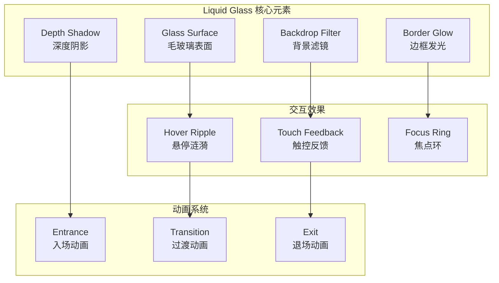

# Liquid Glass UI Theme System

Liquid Glass UI是Mobile IM Floating Components的核心设计语言，灵感来源于现代毛玻璃美学，为移动端应用提供优雅、现代且高性能的视觉体验。

## 设计哲学

### 1. 透明度与深度 (Transparency & Depth)
通过半透明背景和精心调制的模糊效果，创造出层次感丰富的视觉深度，让界面元素仿佛漂浮在空间中。

### 2. 光影与材质 (Light & Material)
模拟真实玻璃材质的光影效果，通过渐变、反射和阴影，让数字界面具备触感般的物理质感。

### 3. 流动与动态 (Fluidity & Motion)
所有交互都伴随着流畅的动画过渡，营造如液体般自然流动的用户体验。

## 核心视觉元素



## CSS设计令牌 (Design Tokens)

### 颜色系统

```css
:root {
  /* 主色调 - Glass Palette */
  --glass-primary: rgba(255, 255, 255, 0.1);
  --glass-secondary: rgba(255, 255, 255, 0.05);
  --glass-tertiary: rgba(255, 255, 255, 0.02);
  
  /* 边框颜色 */
  --glass-border-light: rgba(255, 255, 255, 0.2);
  --glass-border-medium: rgba(255, 255, 255, 0.1);
  --glass-border-subtle: rgba(255, 255, 255, 0.05);
  
  /* 阴影系统 */
  --glass-shadow-sm: 0 2px 8px rgba(0, 0, 0, 0.1);
  --glass-shadow-md: 0 4px 16px rgba(0, 0, 0, 0.15);
  --glass-shadow-lg: 0 8px 32px rgba(0, 0, 0, 0.2);
  --glass-shadow-xl: 0 16px 64px rgba(0, 0, 0, 0.25);
  
  /* 模糊强度 */
  --glass-blur-sm: 8px;
  --glass-blur-md: 12px;
  --glass-blur-lg: 16px;
  --glass-blur-xl: 24px;
  
  /* 品牌色彩 */
  --brand-primary: #646cff;
  --brand-secondary: #747bff;
  --brand-accent: #f97316;
  --brand-success: #22c55e;
  --brand-warning: #f59e0b;
  --brand-error: #ef4444;
  
  /* 文字颜色 */
  --text-primary: rgba(255, 255, 255, 0.95);
  --text-secondary: rgba(255, 255, 255, 0.7);
  --text-tertiary: rgba(255, 255, 255, 0.5);
  --text-inverse: rgba(0, 0, 0, 0.87);
}

/* 暗色主题适配 */
.dark {
  --glass-primary: rgba(0, 0, 0, 0.2);
  --glass-secondary: rgba(0, 0, 0, 0.1);
  --glass-tertiary: rgba(0, 0, 0, 0.05);
  
  --glass-border-light: rgba(255, 255, 255, 0.1);
  --glass-border-medium: rgba(255, 255, 255, 0.05);
  --glass-border-subtle: rgba(255, 255, 255, 0.02);
  
  --text-primary: rgba(255, 255, 255, 0.95);
  --text-secondary: rgba(255, 255, 255, 0.7);
  --text-tertiary: rgba(255, 255, 255, 0.5);
}
```

### 空间系统

```css
:root {
  /* 基础间距 */
  --space-1: 0.25rem;  /* 4px */
  --space-2: 0.5rem;   /* 8px */
  --space-3: 0.75rem;  /* 12px */
  --space-4: 1rem;     /* 16px */
  --space-5: 1.25rem;  /* 20px */
  --space-6: 1.5rem;   /* 24px */
  --space-8: 2rem;     /* 32px */
  --space-10: 2.5rem;  /* 40px */
  --space-12: 3rem;    /* 48px */
  --space-16: 4rem;    /* 64px */
  
  /* 圆角系统 */
  --radius-sm: 0.5rem;   /* 8px */
  --radius-md: 0.75rem;  /* 12px */
  --radius-lg: 1rem;     /* 16px */
  --radius-xl: 1.5rem;   /* 24px */
  --radius-full: 50%;
  
  /* Z轴层级 */
  --z-base: 0;
  --z-raised: 1;
  --z-overlay: 10;
  --z-dropdown: 100;
  --z-modal: 1000;
  --z-toast: 2000;
  --z-tooltip: 3000;
}
```

### 字体系统

```css
:root {
  /* 字体族 */
  --font-sans: -apple-system, BlinkMacSystemFont, 'Segoe UI', 'Roboto', 'Oxygen',
               'Ubuntu', 'Cantarell', 'Fira Sans', 'Droid Sans', 'Helvetica Neue',
               sans-serif;
  --font-mono: 'Fira Code', 'Monaco', 'Consolas', 'Courier New', monospace;
  
  /* 字体大小 */
  --text-xs: 0.75rem;    /* 12px */
  --text-sm: 0.875rem;   /* 14px */
  --text-base: 1rem;     /* 16px */
  --text-lg: 1.125rem;   /* 18px */
  --text-xl: 1.25rem;    /* 20px */
  --text-2xl: 1.5rem;    /* 24px */
  --text-3xl: 1.875rem;  /* 30px */
  --text-4xl: 2.25rem;   /* 36px */
  
  /* 行高 */
  --leading-tight: 1.25;
  --leading-normal: 1.5;
  --leading-relaxed: 1.75;
  
  /* 字重 */
  --font-light: 300;
  --font-normal: 400;
  --font-medium: 500;
  --font-semibold: 600;
  --font-bold: 700;
}
```

## 核心组件样式

### Glass Surface (玻璃表面)

```css
.glass-surface {
  /* 基础玻璃效果 */
  background: var(--glass-primary);
  backdrop-filter: blur(var(--glass-blur-md));
  -webkit-backdrop-filter: blur(var(--glass-blur-md));
  
  /* 边框和阴影 */
  border: 1px solid var(--glass-border-light);
  box-shadow: var(--glass-shadow-md);
  border-radius: var(--radius-lg);
  
  /* 性能优化 */
  will-change: transform;
  transform: translateZ(0);
  
  /* 交互状态 */
  transition: all 0.3s cubic-bezier(0.4, 0, 0.2, 1);
}

.glass-surface:hover {
  background: var(--glass-secondary);
  border-color: var(--glass-border-medium);
  box-shadow: var(--glass-shadow-lg);
  transform: translateY(-2px) translateZ(0);
}

/* 不同强度的玻璃效果 */
.glass-surface--subtle {
  background: var(--glass-tertiary);
  backdrop-filter: blur(var(--glass-blur-sm));
  border-color: var(--glass-border-subtle);
  box-shadow: var(--glass-shadow-sm);
}

.glass-surface--strong {
  background: var(--glass-primary);
  backdrop-filter: blur(var(--glass-blur-lg));
  border-color: var(--glass-border-light);
  box-shadow: var(--glass-shadow-xl);
}
```

### Message Bubble Glass

```css
.message-bubble {
  @apply glass-surface;
  
  /* 消息特定样式 */
  max-width: min(85vw, 320px);
  padding: var(--space-3) var(--space-4);
  margin: var(--space-2) var(--space-4);
  
  /* 发送者和接收者不同样式 */
  &.message-bubble--sent {
    background: linear-gradient(135deg, 
      var(--brand-primary), 
      rgba(100, 108, 255, 0.8)
    );
    margin-left: auto;
    border-bottom-right-radius: var(--radius-sm);
  }
  
  &.message-bubble--received {
    background: var(--glass-primary);
    margin-right: auto;
    border-bottom-left-radius: var(--radius-sm);
  }
  
  /* 消息内容样式 */
  .message-content {
    color: var(--text-primary);
    font-size: var(--text-base);
    line-height: var(--leading-normal);
    word-wrap: break-word;
  }
  
  .message-timestamp {
    color: var(--text-tertiary);
    font-size: var(--text-xs);
    margin-top: var(--space-1);
    text-align: right;
  }
}
```

### Connection Line Glass

```css
.connection-line {
  /* SVG连接线样式 */
  stroke: var(--brand-primary);
  stroke-width: 2;
  fill: none;
  opacity: 0.8;
  
  /* 玻璃效果滤镜 */
  filter: drop-shadow(0 2px 4px rgba(100, 108, 255, 0.3))
          blur(0.5px);
  
  /* 动画效果 */
  stroke-dasharray: 0;
  stroke-dashoffset: 0;
  animation: lineGlow 2s ease-in-out infinite alternate;
  
  &.connection-line--animated {
    stroke-dasharray: 5 5;
    animation: lineDash 1s linear infinite,
               lineGlow 2s ease-in-out infinite alternate;
  }
}

@keyframes lineDash {
  to {
    stroke-dashoffset: -10;
  }
}

@keyframes lineGlow {
  0% {
    filter: drop-shadow(0 2px 4px rgba(100, 108, 255, 0.3));
    opacity: 0.8;
  }
  100% {
    filter: drop-shadow(0 4px 8px rgba(100, 108, 255, 0.6));
    opacity: 1;
  }
}
```

## 交互动画系统

### 入场动画

```css
@keyframes glassEnter {
  from {
    opacity: 0;
    transform: translateY(20px) scale(0.95);
    backdrop-filter: blur(0px);
  }
  to {
    opacity: 1;
    transform: translateY(0) scale(1);
    backdrop-filter: blur(var(--glass-blur-md));
  }
}

.glass-enter {
  animation: glassEnter 0.3s cubic-bezier(0.4, 0, 0.2, 1);
}

/* 交错动画 */
.glass-enter-stagger {
  animation: glassEnter 0.3s cubic-bezier(0.4, 0, 0.2, 1);
  animation-fill-mode: both;
}

.glass-enter-stagger:nth-child(1) { animation-delay: 0ms; }
.glass-enter-stagger:nth-child(2) { animation-delay: 50ms; }
.glass-enter-stagger:nth-child(3) { animation-delay: 100ms; }
.glass-enter-stagger:nth-child(4) { animation-delay: 150ms; }
.glass-enter-stagger:nth-child(5) { animation-delay: 200ms; }
```

### 触控反馈动画

```css
.glass-touch-feedback {
  position: relative;
  overflow: hidden;
}

.glass-touch-feedback::after {
  content: '';
  position: absolute;
  top: 50%;
  left: 50%;
  width: 0;
  height: 0;
  border-radius: 50%;
  background: radial-gradient(
    circle,
    rgba(255, 255, 255, 0.3) 0%,
    rgba(255, 255, 255, 0.1) 70%,
    transparent 100%
  );
  transform: translate(-50%, -50%);
  opacity: 0;
  pointer-events: none;
  transition: all 0.5s cubic-bezier(0.4, 0, 0.2, 1);
}

.glass-touch-feedback:active::after {
  width: 200px;
  height: 200px;
  opacity: 1;
  transition: all 0.2s cubic-bezier(0.4, 0, 0.2, 1);
}
```

### 悬停效果

```css
.glass-hover {
  position: relative;
  transition: all 0.3s cubic-bezier(0.4, 0, 0.2, 1);
}

.glass-hover::before {
  content: '';
  position: absolute;
  top: -2px;
  left: -2px;
  right: -2px;
  bottom: -2px;
  background: linear-gradient(
    45deg,
    transparent,
    rgba(255, 255, 255, 0.1),
    transparent
  );
  border-radius: inherit;
  opacity: 0;
  z-index: -1;
  transition: opacity 0.3s cubic-bezier(0.4, 0, 0.2, 1);
}

.glass-hover:hover::before {
  opacity: 1;
  animation: borderGlow 2s linear infinite;
}

@keyframes borderGlow {
  0% { background-position: 0% 50%; }
  50% { background-position: 100% 50%; }
  100% { background-position: 0% 50%; }
}
```

## 自适应主题系统

### 主题配置接口

```typescript
interface LiquidGlassTheme {
  name: string
  colors: {
    glass: {
      primary: string
      secondary: string
      tertiary: string
    }
    border: {
      light: string
      medium: string
      subtle: string
    }
    brand: {
      primary: string
      secondary: string
      accent: string
    }
    text: {
      primary: string
      secondary: string
      tertiary: string
    }
  }
  effects: {
    blur: {
      sm: string
      md: string
      lg: string
      xl: string
    }
    shadow: {
      sm: string
      md: string
      lg: string
      xl: string
    }
  }
  animations: {
    duration: {
      fast: string
      medium: string
      slow: string
    }
    easing: {
      enter: string
      exit: string
      standard: string
    }
  }
}
```

### 主题切换工具

```typescript
class ThemeManager {
  private currentTheme: LiquidGlassTheme
  private themeRegistry = new Map<string, LiquidGlassTheme>()
  
  constructor() {
    this.registerBuiltinThemes()
    this.loadSavedTheme()
  }
  
  private registerBuiltinThemes() {
    // 默认主题
    this.register('default', {
      name: 'Default',
      colors: {
        glass: {
          primary: 'rgba(255, 255, 255, 0.1)',
          secondary: 'rgba(255, 255, 255, 0.05)',
          tertiary: 'rgba(255, 255, 255, 0.02)'
        },
        // ... 其他颜色配置
      },
      // ... 其他配置
    })
    
    // 深色主题
    this.register('dark', {
      name: 'Dark Glass',
      colors: {
        glass: {
          primary: 'rgba(0, 0, 0, 0.2)',
          secondary: 'rgba(0, 0, 0, 0.1)',
          tertiary: 'rgba(0, 0, 0, 0.05)'
        },
        // ... 其他颜色配置
      },
      // ... 其他配置
    })
  }
  
  // 注册自定义主题
  register(name: string, theme: LiquidGlassTheme) {
    this.themeRegistry.set(name, theme)
  }
  
  // 应用主题
  apply(name: string) {
    const theme = this.themeRegistry.get(name)
    if (!theme) {
      throw new Error(`Theme "${name}" not found`)
    }
    
    this.currentTheme = theme
    this.updateCSSVariables(theme)
    this.saveTheme(name)
    this.notifyThemeChange(theme)
  }
  
  private updateCSSVariables(theme: LiquidGlassTheme) {
    const root = document.documentElement
    
    // 更新玻璃效果颜色
    Object.entries(theme.colors.glass).forEach(([key, value]) => {
      root.style.setProperty(`--glass-${key}`, value)
    })
    
    // 更新边框颜色
    Object.entries(theme.colors.border).forEach(([key, value]) => {
      root.style.setProperty(`--glass-border-${key}`, value)
    })
    
    // 更新品牌颜色
    Object.entries(theme.colors.brand).forEach(([key, value]) => {
      root.style.setProperty(`--brand-${key}`, value)
    })
    
    // 更新模糊效果
    Object.entries(theme.effects.blur).forEach(([key, value]) => {
      root.style.setProperty(`--glass-blur-${key}`, value)
    })
    
    // 更新阴影效果
    Object.entries(theme.effects.shadow).forEach(([key, value]) => {
      root.style.setProperty(`--glass-shadow-${key}`, value)
    })
  }
}
```

### 动态主题生成器

```typescript
class ThemeGenerator {
  // 从图片生成主题
  static async generateFromImage(imageUrl: string): Promise<LiquidGlassTheme> {
    const colors = await this.extractColorsFromImage(imageUrl)
    
    return {
      name: 'Generated',
      colors: {
        glass: {
          primary: this.addAlpha(colors.primary, 0.1),
          secondary: this.addAlpha(colors.primary, 0.05),
          tertiary: this.addAlpha(colors.primary, 0.02)
        },
        brand: {
          primary: colors.primary,
          secondary: colors.secondary,
          accent: colors.accent
        },
        // ... 其他生成的颜色
      },
      // ... 其他默认配置
    }
  }
  
  // 从颜色生成主题
  static generateFromColors(primaryColor: string, secondaryColor?: string): LiquidGlassTheme {
    const hsl = this.hexToHsl(primaryColor)
    
    return {
      name: 'Custom',
      colors: {
        glass: {
          primary: this.hslToRgba(hsl.h, hsl.s, hsl.l, 0.1),
          secondary: this.hslToRgba(hsl.h, hsl.s, hsl.l, 0.05),
          tertiary: this.hslToRgba(hsl.h, hsl.s, hsl.l, 0.02)
        },
        brand: {
          primary: primaryColor,
          secondary: secondaryColor || this.adjustLightness(primaryColor, -10),
          accent: this.adjustHue(primaryColor, 30)
        },
        // ... 其他生成的颜色
      },
      // ... 其他配置
    }
  }
}
```

## 性能优化

### GPU加速优化

```css
/* 强制GPU加速的玻璃效果 */
.glass-gpu-optimized {
  /* 触发合成层 */
  transform: translateZ(0);
  will-change: transform, opacity, backdrop-filter;
  
  /* 优化的backdrop-filter */
  backdrop-filter: blur(var(--glass-blur-md));
  -webkit-backdrop-filter: blur(var(--glass-blur-md));
  
  /* 减少重排重绘 */
  contain: layout style paint;
}

/* 移动端优化 */
@media (max-width: 768px) {
  .glass-mobile-optimized {
    /* 在低性能设备上降级 */
    backdrop-filter: blur(6px);
    -webkit-backdrop-filter: blur(6px);
  }
}

/* 低性能设备降级 */
@media (prefers-reduced-motion: reduce) {
  .glass-surface {
    animation: none;
    transition: none;
  }
}
```

### 动画性能优化

```css
/* 优化的动画 - 只使用transform和opacity */
@keyframes optimizedGlassEnter {
  from {
    opacity: 0;
    transform: translate3d(0, 20px, 0) scale3d(0.95, 0.95, 1);
  }
  to {
    opacity: 1;
    transform: translate3d(0, 0, 0) scale3d(1, 1, 1);
  }
}

.glass-optimized-enter {
  animation: optimizedGlassEnter 0.3s cubic-bezier(0.4, 0, 0.2, 1);
  /* 动画期间强制合成层 */
  will-change: transform, opacity;
}

.glass-optimized-enter.animation-complete {
  /* 动画完成后清除will-change */
  will-change: auto;
}
```

## 自定义主题开发

### 创建自定义主题

```typescript
// 1. 定义主题配置
const myCustomTheme: LiquidGlassTheme = {
  name: 'Ocean Breeze',
  colors: {
    glass: {
      primary: 'rgba(59, 130, 246, 0.1)',  // 蓝色玻璃
      secondary: 'rgba(59, 130, 246, 0.05)',
      tertiary: 'rgba(59, 130, 246, 0.02)'
    },
    border: {
      light: 'rgba(59, 130, 246, 0.2)',
      medium: 'rgba(59, 130, 246, 0.1)',
      subtle: 'rgba(59, 130, 246, 0.05)'
    },
    brand: {
      primary: '#3b82f6',
      secondary: '#1d4ed8',
      accent: '#06b6d4'
    },
    text: {
      primary: 'rgba(255, 255, 255, 0.95)',
      secondary: 'rgba(255, 255, 255, 0.75)',
      tertiary: 'rgba(255, 255, 255, 0.5)'
    }
  },
  effects: {
    blur: {
      sm: '6px',
      md: '10px',
      lg: '14px',
      xl: '20px'
    },
    shadow: {
      sm: '0 2px 8px rgba(59, 130, 246, 0.1)',
      md: '0 4px 16px rgba(59, 130, 246, 0.15)',
      lg: '0 8px 32px rgba(59, 130, 246, 0.2)',
      xl: '0 16px 64px rgba(59, 130, 246, 0.25)'
    }
  },
  animations: {
    duration: {
      fast: '0.15s',
      medium: '0.3s',
      slow: '0.5s'
    },
    easing: {
      enter: 'cubic-bezier(0.4, 0, 0.2, 1)',
      exit: 'cubic-bezier(0.4, 0, 1, 1)',
      standard: 'cubic-bezier(0.4, 0, 0.2, 1)'
    }
  }
}

// 2. 注册主题
const themeManager = new ThemeManager()
themeManager.register('ocean-breeze', myCustomTheme)

// 3. 应用主题
themeManager.apply('ocean-breeze')
```

### 主题组件包装器

```tsx
import React from 'react'

interface ThemeProviderProps {
  theme: string
  children: React.ReactNode
}

export const LiquidGlassThemeProvider: React.FC<ThemeProviderProps> = ({
  theme,
  children
}) => {
  React.useEffect(() => {
    const themeManager = new ThemeManager()
    themeManager.apply(theme)
  }, [theme])
  
  return (
    <div className="liquid-glass-theme-provider">
      {children}
    </div>
  )
}

// 使用示例
function App() {
  return (
    <LiquidGlassThemeProvider theme="ocean-breeze">
      <MessageBubble message="Hello with custom theme!" />
    </LiquidGlassThemeProvider>
  )
}
```

## 下一步

- **[设计令牌详解](./design-tokens)** - 深入了解设计系统令牌
- **[自定义主题开发](./custom-themes)** - 创建个性化主题
- **[CSS变量系统](./css-variables)** - 动态样式控制
- **[组件样式指南](./component-styling)** - 组件样式最佳实践
- **[动画效果库](./animation-effects)** - 丰富的动画效果集