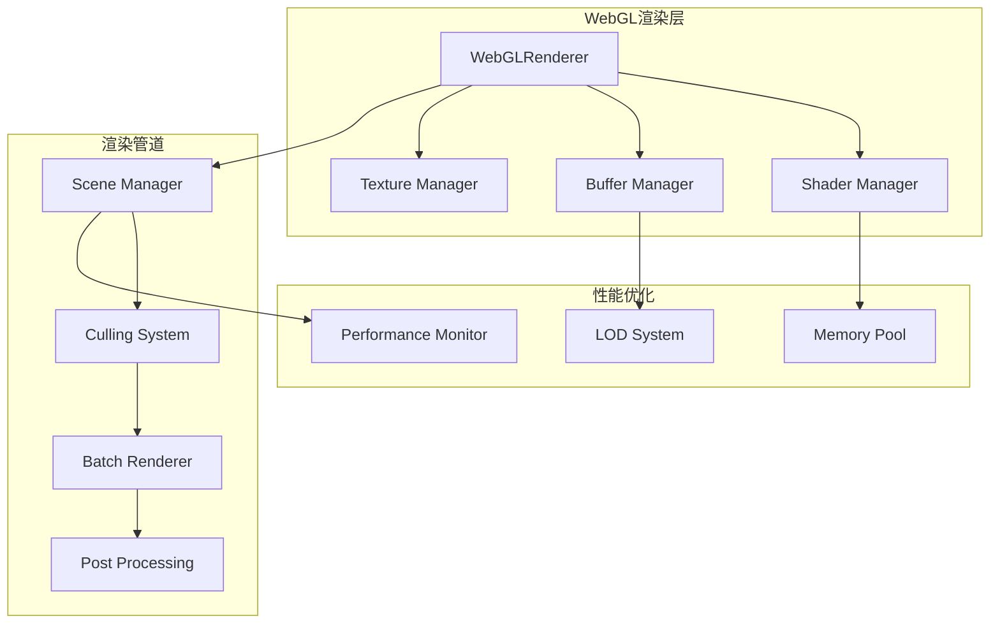

# WebGL Rendering System

Mobile IM Floating Components集成了先进的WebGL渲染系统，为连接线动画和视觉效果提供硬件加速支持，确保在移动设备上也能实现60fps的流畅体验。

## 系统架构



## 核心特性

### 🚀 硬件加速渲染
- WebGL 2.0 支持，向下兼容WebGL 1.0
- GPU并行计算，显著提升渲染性能
- 智能批处理，减少Draw Call数量
- 实例化渲染，优化重复元素绘制

### 🎨 高质量视觉效果
- 平滑的抗锯齿处理
- 高质量的Bezier曲线连接线
- 动态阴影和光照效果
- 自定义Shader材质支持

### 📱 移动端优化
- 自适应质量调节
- 电池使用优化
- 内存使用监控
- 热插拔降级机制

## 快速开始

### 基础配置

```typescript
import { WebGLRenderer, ConnectionLineLayer } from '@mobile-im/components'

// 创建WebGL渲染器
const renderer = new WebGLRenderer({
  canvas: canvasElement,
  antialias: true,
  preserveDrawingBuffer: false,
  powerPreference: 'high-performance',
  failIfMajorPerformanceCaveat: true
})

// 配置渲染选项
renderer.configure({
  quality: 'high',        // 'low' | 'medium' | 'high' | 'ultra'
  maxConnections: 1000,   // 最大连接线数量
  enableCulling: true,    // 启用视锥剔除
  enableBatching: true,   // 启用批处理
  enableLOD: true         // 启用细节层次
})
```

### 创建连接线

```tsx
import { ConnectionLineLayer } from '@mobile-im/components'

function ChatWithConnections() {
  const connections = [
    {
      id: 'conn1',
      from: 'message-1',
      to: 'message-2',
      type: 'reply',
      style: {
        color: '#646cff',
        width: 2,
        animated: true,
        dashArray: [5, 5]
      }
    },
    {
      id: 'conn2', 
      from: { x: 100, y: 200 },
      to: { x: 300, y: 400 },
      type: 'bezier',
      style: {
        gradient: {
          start: '#ff6b6b',
          end: '#4ecdc4'
        },
        width: 3,
        opacity: 0.8
      }
    }
  ]

  return (
    <OverlayContainer>
      <ConnectionLineLayer
        connections={connections}
        renderer="webgl"
        quality="high"
        enableAnimations={true}
        onConnectionClick={(conn) => console.log('Clicked:', conn)}
        onConnectionHover={(conn) => console.log('Hovered:', conn)}
      />
      {/* 消息组件 */}
    </OverlayContainer>
  )
}
```

## 渲染管道详解

### 1. 场景管理 (Scene Management)

```typescript
class SceneManager {
  constructor(renderer: WebGLRenderer) {
    this.renderer = renderer
    this.sceneGraph = new SceneGraph()
    this.camera = new OrthographicCamera()
    this.viewport = new Viewport()
  }
  
  // 添加连接线到场景
  addConnection(connection: Connection) {
    const geometry = this.createConnectionGeometry(connection)
    const material = this.createConnectionMaterial(connection.style)
    const mesh = new ConnectionMesh(geometry, material)
    
    this.sceneGraph.add(mesh)
    return mesh.id
  }
  
  // 更新场景
  update(deltaTime: number) {
    this.sceneGraph.traverse((node) => {
      if (node.needsUpdate) {
        node.update(deltaTime)
      }
    })
  }
  
  // 渲染场景
  render() {
    this.renderer.clear()
    this.renderer.render(this.sceneGraph, this.camera)
  }
}
```

### 2. 连接线几何生成

```typescript
class ConnectionGeometry {
  static createStraightLine(start: Point, end: Point): Float32Array {
    return new Float32Array([
      start.x, start.y, 0,
      end.x, end.y, 0
    ])
  }
  
  static createBezierCurve(
    start: Point, 
    end: Point, 
    control1?: Point, 
    control2?: Point,
    segments = 50
  ): Float32Array {
    const points: number[] = []
    
    for (let i = 0; i <= segments; i++) {
      const t = i / segments
      const point = this.calculateBezierPoint(t, start, control1, control2, end)
      points.push(point.x, point.y, 0)
    }
    
    return new Float32Array(points)
  }
  
  static createAnimatedLine(
    start: Point, 
    end: Point, 
    progress: number
  ): Float32Array {
    const currentEnd = {
      x: start.x + (end.x - start.x) * progress,
      y: start.y + (end.y - start.y) * progress
    }
    
    return this.createStraightLine(start, currentEnd)
  }
}
```

### 3. Shader系统

#### 顶点着色器 (Vertex Shader)

```glsl
#version 300 es

in vec3 position;
in vec2 uv;
in float thickness;

uniform mat4 projectionMatrix;
uniform mat4 viewMatrix;
uniform vec2 resolution;
uniform float pixelRatio;

out vec2 vUv;
out float vThickness;

void main() {
    vec4 worldPosition = viewMatrix * vec4(position, 1.0);
    gl_Position = projectionMatrix * worldPosition;
    
    vUv = uv;
    vThickness = thickness * pixelRatio;
}
```

#### 片段着色器 (Fragment Shader)

```glsl
#version 300 es
precision mediump float;

in vec2 vUv;
in float vThickness;

uniform vec3 color;
uniform float opacity;
uniform float dashSize;
uniform float gapSize;
uniform float animationOffset;
uniform sampler2D gradientTexture;

out vec4 fragColor;

void main() {
    // 计算距离中心线的距离
    float distance = abs(vUv.y - 0.5) * 2.0;
    
    // 应用线条粗细
    float alpha = 1.0 - smoothstep(0.0, 1.0, distance / vThickness);
    
    // 虚线效果
    if (dashSize > 0.0) {
        float totalSize = dashSize + gapSize;
        float offset = mod(vUv.x + animationOffset, totalSize);
        alpha *= step(offset, dashSize);
    }
    
    // 渐变色支持
    vec3 finalColor = texture(gradientTexture, vec2(vUv.x, 0.5)).rgb;
    
    fragColor = vec4(finalColor * color, alpha * opacity);
}
```

## 性能优化策略

### 1. 批处理渲染

```typescript
class BatchRenderer {
  private batches = new Map<string, RenderBatch>()
  
  // 添加连接线到批处理
  addConnection(connection: Connection) {
    const materialKey = this.getMaterialKey(connection.material)
    let batch = this.batches.get(materialKey)
    
    if (!batch) {
      batch = new RenderBatch(connection.material)
      this.batches.set(materialKey, batch)
    }
    
    batch.addGeometry(connection.geometry)
  }
  
  // 渲染所有批次
  render(renderer: WebGLRenderer) {
    this.batches.forEach(batch => {
      batch.updateBuffers()
      renderer.drawBatch(batch)
    })
  }
  
  // 清理批次
  clear() {
    this.batches.forEach(batch => batch.dispose())
    this.batches.clear()
  }
}
```

### 2. 视锥剔除 (Frustum Culling)

```typescript
class CullingSystem {
  constructor(camera: Camera) {
    this.camera = camera
    this.frustum = new Frustum()
  }
  
  // 更新视锥
  updateFrustum() {
    this.frustum.setFromProjectionMatrix(
      this.camera.projectionMatrix,
      this.camera.viewMatrix
    )
  }
  
  // 剔除不可见的连接线
  cullConnections(connections: Connection[]): Connection[] {
    return connections.filter(connection => {
      const bbox = connection.getBoundingBox()
      return this.frustum.intersectsBox(bbox)
    })
  }
}
```

### 3. 细节层次 (Level of Detail)

```typescript
class LODSystem {
  private lodLevels = [
    { distance: 0, segments: 100 },      // 高质量
    { distance: 500, segments: 50 },     // 中等质量  
    { distance: 1000, segments: 20 },    // 低质量
    { distance: 2000, segments: 2 }      // 线段
  ]
  
  // 根据距离选择LOD级别
  getLODLevel(connection: Connection, cameraPosition: Point): number {
    const distance = this.calculateDistance(connection, cameraPosition)
    
    for (let i = this.lodLevels.length - 1; i >= 0; i--) {
      if (distance >= this.lodLevels[i].distance) {
        return this.lodLevels[i].segments
      }
    }
    
    return this.lodLevels[0].segments
  }
  
  // 更新连接线的几何复杂度
  updateConnectionLOD(connection: Connection, lodLevel: number) {
    if (connection.currentLOD !== lodLevel) {
      connection.geometry = this.generateGeometry(connection, lodLevel)
      connection.currentLOD = lodLevel
      connection.needsUpdate = true
    }
  }
}
```

## 高级特性

### 1. 动态阴影

```typescript
class ShadowSystem {
  constructor(renderer: WebGLRenderer) {
    this.shadowMapSize = 1024
    this.shadowMap = renderer.createFramebuffer(this.shadowMapSize, this.shadowMapSize)
  }
  
  // 生成阴影贴图
  generateShadowMap(connections: Connection[], lightPosition: Point) {
    this.renderer.setRenderTarget(this.shadowMap)
    this.renderer.clear()
    
    // 从光源位置渲染场景
    const lightCamera = this.createLightCamera(lightPosition)
    connections.forEach(connection => {
      this.renderConnectionDepth(connection, lightCamera)
    })
    
    this.renderer.setRenderTarget(null)
  }
  
  // 应用阴影
  applyShadows(connections: Connection[]) {
    connections.forEach(connection => {
      connection.material.uniforms.shadowMap = this.shadowMap.texture
      connection.material.uniforms.lightSpaceMatrix = this.lightCamera.projectionViewMatrix
    })
  }
}
```

### 2. 后处理效果

```typescript
class PostProcessing {
  constructor(renderer: WebGLRenderer) {
    this.renderer = renderer
    this.setupFramebuffers()
    this.setupShaders()
  }
  
  // 模糊效果
  blur(texture: WebGLTexture, blurRadius: number): WebGLTexture {
    // 水平模糊
    this.renderer.useShader('blur-horizontal')
    this.renderer.setUniform('texture', texture)
    this.renderer.setUniform('blurRadius', blurRadius)
    this.renderer.drawQuad()
    
    // 垂直模糊
    this.renderer.useShader('blur-vertical') 
    this.renderer.setUniform('texture', this.tempBuffer.texture)
    this.renderer.setUniform('blurRadius', blurRadius)
    this.renderer.drawQuad()
    
    return this.resultBuffer.texture
  }
  
  // 发光效果
  bloom(texture: WebGLTexture, threshold: number, intensity: number): WebGLTexture {
    // 提取亮部
    this.extractBrightPixels(texture, threshold)
    
    // 多次下采样模糊
    let blurTexture = this.brightBuffer.texture
    for (let i = 0; i < 5; i++) {
      blurTexture = this.blur(blurTexture, 2 ** i)
    }
    
    // 合成最终结果
    this.combineTextures(texture, blurTexture, intensity)
    return this.finalBuffer.texture
  }
}
```

### 3. 实时动画

```typescript
class AnimationSystem {
  private animations = new Map<string, Animation>()
  
  // 创建连接线动画
  createConnectionAnimation(connectionId: string, config: AnimationConfig): void {
    const animation = new ConnectionAnimation(config)
    this.animations.set(connectionId, animation)
  }
  
  // 更新动画
  update(deltaTime: number) {
    this.animations.forEach((animation, id) => {
      animation.update(deltaTime)
      
      if (animation.isComplete()) {
        animation.dispose()
        this.animations.delete(id)
      }
    })
  }
  
  // 暂停/恢复动画
  pauseAnimation(connectionId: string) {
    const animation = this.animations.get(connectionId)
    if (animation) animation.pause()
  }
  
  resumeAnimation(connectionId: string) {
    const animation = this.animations.get(connectionId)
    if (animation) animation.resume()
  }
}

class ConnectionAnimation {
  constructor(config: AnimationConfig) {
    this.startTime = performance.now()
    this.duration = config.duration
    this.easing = config.easing || Easing.easeInOut
    this.fromValue = config.from
    this.toValue = config.to
  }
  
  update(currentTime: number): number {
    const elapsed = currentTime - this.startTime
    const progress = Math.min(elapsed / this.duration, 1)
    const easedProgress = this.easing(progress)
    
    return this.fromValue + (this.toValue - this.fromValue) * easedProgress
  }
}
```

## 移动端优化

### 1. 电池使用优化

```typescript
class BatteryOptimizer {
  constructor(renderer: WebGLRenderer) {
    this.renderer = renderer
    this.batteryLevel = this.getBatteryLevel()
    this.setupBatteryMonitoring()
  }
  
  // 根据电池电量调整渲染质量
  adjustQualityByBattery() {
    if (this.batteryLevel < 0.2) {
      this.renderer.setQuality('low')
      this.renderer.setFPS(30)
    } else if (this.batteryLevel < 0.5) {
      this.renderer.setQuality('medium')
      this.renderer.setFPS(45)
    } else {
      this.renderer.setQuality('high')
      this.renderer.setFPS(60)
    }
  }
  
  // 监听电池状态变化
  private setupBatteryMonitoring() {
    if ('getBattery' in navigator) {
      navigator.getBattery().then(battery => {
        battery.addEventListener('levelchange', () => {
          this.batteryLevel = battery.level
          this.adjustQualityByBattery()
        })
      })
    }
  }
}
```

### 2. 内存管理

```typescript
class MemoryManager {
  private objectPool = new Map<string, any[]>()
  private memoryThreshold = 50 * 1024 * 1024 // 50MB
  
  // 对象池管理
  getFromPool<T>(type: string, factory: () => T): T {
    let pool = this.objectPool.get(type)
    if (!pool) {
      pool = []
      this.objectPool.set(type, pool)
    }
    
    return pool.pop() || factory()
  }
  
  returnToPool(type: string, object: any) {
    const pool = this.objectPool.get(type)
    if (pool && pool.length < 100) { // 限制池大小
      this.resetObject(object)
      pool.push(object)
    }
  }
  
  // 监控内存使用
  checkMemoryUsage() {
    if (performance.memory && performance.memory.usedJSHeapSize > this.memoryThreshold) {
      this.performCleanup()
    }
  }
  
  // 清理未使用的资源
  private performCleanup() {
    // 清理纹理缓存
    this.renderer.cleanupUnusedTextures()
    
    // 清理几何体缓存
    this.renderer.cleanupUnusedGeometry()
    
    // 强制垃圾回收
    if (window.gc) {
      window.gc()
    }
  }
}
```

## 错误处理和降级

### WebGL上下文丢失处理

```typescript
class WebGLContextManager {
  constructor(canvas: HTMLCanvasElement) {
    this.canvas = canvas
    this.setupContextLossHandling()
  }
  
  private setupContextLossHandling() {
    this.canvas.addEventListener('webglcontextlost', (event) => {
      event.preventDefault()
      console.warn('WebGL context lost, attempting recovery...')
      this.handleContextLoss()
    })
    
    this.canvas.addEventListener('webglcontextrestored', () => {
      console.info('WebGL context restored')
      this.handleContextRestore()
    })
  }
  
  private handleContextLoss() {
    // 停止渲染循环
    this.stopRenderLoop()
    
    // 清理资源引用
    this.cleanupResources()
    
    // 通知应用层
    this.emit('context-lost')
  }
  
  private handleContextRestore() {
    // 重新初始化渲染器
    this.reinitializeRenderer()
    
    // 重新加载资源
    this.reloadResources()
    
    // 重新启动渲染
    this.startRenderLoop()
    
    // 通知应用层
    this.emit('context-restored')
  }
}
```

### 降级处理

```typescript
class RenderingFallback {
  constructor() {
    this.checkWebGLSupport()
  }
  
  private checkWebGLSupport(): RendererType {
    const canvas = document.createElement('canvas')
    
    // 检查WebGL 2.0支持
    const gl2 = canvas.getContext('webgl2')
    if (gl2) {
      return 'webgl2'
    }
    
    // 检查WebGL 1.0支持
    const gl = canvas.getContext('webgl') || canvas.getContext('experimental-webgl')
    if (gl) {
      return 'webgl'
    }
    
    // 降级到Canvas 2D
    const ctx = canvas.getContext('2d')
    if (ctx) {
      return 'canvas'
    }
    
    // 最后降级到SVG
    return 'svg'
  }
  
  // 自动选择最佳渲染器
  selectOptimalRenderer(): RendererType {
    const supportedRenderer = this.checkWebGLSupport()
    const devicePerformance = this.estimateDevicePerformance()
    
    // 在低性能设备上使用Canvas
    if (devicePerformance === 'low' && supportedRenderer === 'webgl') {
      return 'canvas'
    }
    
    return supportedRenderer
  }
}
```

## 调试和性能分析

### WebGL调试工具

```typescript
class WebGLDebugger {
  constructor(gl: WebGLRenderingContext) {
    this.gl = gl
    this.setupErrorChecking()
    this.setupPerformanceMonitoring()
  }
  
  // 错误检查
  private setupErrorChecking() {
    const originalFunctions = {}
    
    Object.getOwnPropertyNames(WebGLRenderingContext.prototype).forEach(name => {
      if (typeof this.gl[name] === 'function') {
        originalFunctions[name] = this.gl[name]
        this.gl[name] = (...args) => {
          const result = originalFunctions[name].apply(this.gl, args)
          this.checkError(name)
          return result
        }
      }
    })
  }
  
  private checkError(functionName: string) {
    const error = this.gl.getError()
    if (error !== this.gl.NO_ERROR) {
      console.error(`WebGL error in ${functionName}: ${this.getErrorString(error)}`)
    }
  }
  
  // 性能监控
  private setupPerformanceMonitoring() {
    this.frameCount = 0
    this.lastTime = performance.now()
    
    setInterval(() => {
      this.logPerformanceMetrics()
    }, 1000)
  }
  
  private logPerformanceMetrics() {
    const currentTime = performance.now()
    const fps = this.frameCount * 1000 / (currentTime - this.lastTime)
    
    console.log(`WebGL Performance:
      FPS: ${fps.toFixed(1)}
      Draw Calls: ${this.drawCallCount}
      Triangles: ${this.triangleCount}
      Memory: ${this.getMemoryUsage()}MB
    `)
    
    this.frameCount = 0
    this.drawCallCount = 0
    this.triangleCount = 0
    this.lastTime = currentTime
  }
}
```

## 下一步

- **[连接线系统详解](./connection-system)** - 深入了解连接线渲染
- **[性能优化指南](./performance)** - WebGL性能优化技巧
- **[Shader开发](./shaders)** - 自定义着色器开发
- **[动画系统](./animation-system)** - 高性能动画实现