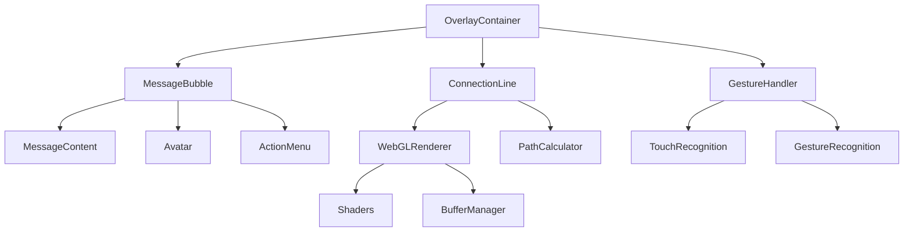

## 快速开始

在几分钟内开始使用Mobile IM Floating Components：

```bash
npm install @mobile-im/components
```

```tsx
import { MessageBubble, OverlayContainer } from '@mobile-im/components'
import '@mobile-im/components/styles'

function App() {
  return (
    <OverlayContainer>
      <MessageBubble
        message="你好，世界！"
        user={{ id: '1', name: '小明', avatar: '/avatar.jpg' }}
        timestamp={new Date()}
      />
    </OverlayContainer>
  )
}
```

## 核心特性

### 🎨 Liquid Glass UI主题
体验毛玻璃效果的美妙，我们的高级Liquid Glass UI主题采用现代CSS特性，包括背景滤镜和高级模糊效果。

### 📱 移动端优化
每个组件都为移动设备精心设计和优化：
- 触摸友好的交互
- 手势识别系统
- 电池效率渲染
- 响应式设计模式

### ⚡ WebGL驱动渲染
先进的连接线系统由WebGL驱动：
- 平滑60fps动画
- 动态连接更新
- 碰撞检测
- 性能优化

### 🔧 开发者体验
使用现代开发实践构建：
- 完整的TypeScript支持
- 全面的文档
- 交互式演练场
- Storybook组件库

## 架构概览

Mobile IM Floating Components系统采用模块化架构构建：



## 性能指标

我们的组件专为移动端性能优化：

| 指标 | 数值 |
|------|------|
| 包大小 | < 50KB (gzipped) |
| 内存使用 | < 20MB (典型) |
| 帧率 | 60fps (流畅动画) |
| 电池影响 | 最小 (优化渲染) |
| 加载时间 | < 1s (首次渲染) |

## 浏览器支持

- **iOS Safari**: 14.0+
- **Chrome Mobile**: 90+
- **Firefox Mobile**: 88+
- **Samsung Internet**: 14.0+
- **UC Browser**: 最新版

## 获取帮助

- 📖 [文档](/zh/guide/)
- 🔧 [API参考](/zh/api/)
- 🎯 [组件库](/zh/components/)
- 🚀 [GitHub Issues](https://github.com/your-org/mobile-im-components/issues)

## 贡献

我们欢迎贡献！请查看我们的[贡献指南](https://github.com/your-org/mobile-im-components/blob/main/CONTRIBUTING.md)了解详情。

## 许可证

MIT © Mobile IM Components Team