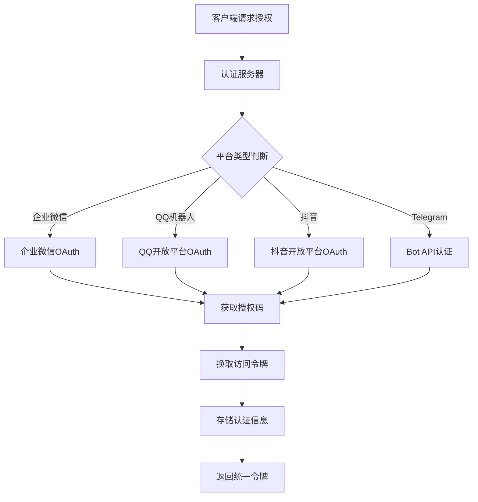

# 多账号管理和消息代发技术架构方案

## 概述

本文档详细设计多平台IM系统中的账号管理和消息代发的技术架构，包括认证授权、会话管理、消息队列等核心组件。

## 账号管理架构

### 1. 多平台账号统一管理

#### 账号抽象模型
```typescript
interface AccountModel {
  id: string;                    // 系统内部ID
  platformType: PlatformType;    // 平台类型
  platformAccountId: string;     // 平台账号ID
  accountName: string;           // 账号显示名
  avatar?: string;               // 头像URL
  status: AccountStatus;         // 账号状态
  credentials: AccountCredentials; // 认证信息
  metadata: Record<string, any>; // 平台特定信息
  createdAt: Date;
  updatedAt: Date;
}

enum PlatformType {
  WECHAT_ENTERPRISE = 'wechat_enterprise',
  QQ_OFFICIAL = 'qq_official',
  DOUYIN_OPEN = 'douyin_open',
  TELEGRAM = 'telegram'
}

enum AccountStatus {
  ACTIVE = 'active',
  INACTIVE = 'inactive',
  SUSPENDED = 'suspended',
  EXPIRED = 'expired'
}
```

#### 认证信息管理
```typescript
interface AccountCredentials {
  accessToken: string;
  refreshToken?: string;
  expiresAt?: Date;
  scope?: string[];
  
  // 平台特定字段
  platformSpecific: {
    // 企业微信
    corpId?: string;
    agentId?: string;
    secret?: string;
    
    // QQ机器人
    appId?: string;
    token?: string;
    
    // 抖音开放平台
    clientKey?: string;
    clientSecret?: string;
    
    // Telegram
    botToken?: string;
  };
}
```

### 2. OAuth2.0 统一认证架构

#### 认证流程设计


#### Token管理策略
1. **Access Token管理**
   - 短生命周期(1-2小时)
   - JWT格式，包含用户和平台信息
   - Redis缓存，支持快速验证

2. **Refresh Token管理**
   - 长生命周期(7-90天)
   - 一次性使用(token rotation)
   - 数据库持久化存储
   - 支持令牌撤销

3. **Token刷新机制**
```typescript
class TokenManager {
  async refreshAccessToken(refreshToken: string): Promise<TokenPair> {
    // 验证refresh token有效性
    const tokenInfo = await this.validateRefreshToken(refreshToken);
    
    // 调用平台API刷新token
    const newTokens = await this.callPlatformRefreshAPI(tokenInfo);
    
    // 更新数据库记录
    await this.updateTokenInDatabase(newTokens);
    
    // 清理旧的refresh token(实现token rotation)
    await this.revokeOldRefreshToken(refreshToken);
    
    return newTokens;
  }
}
```

### 3. 多账号Session管理

#### Session存储架构
```typescript
interface UserSession {
  sessionId: string;
  userId: string;
  connectedAccounts: AccountSession[];
  preferences: UserPreferences;
  createdAt: Date;
  lastActiveAt: Date;
  expiresAt: Date;
}

interface AccountSession {
  accountId: string;
  platformType: PlatformType;
  isActive: boolean;
  permissions: Permission[];
  lastSyncAt: Date;
}
```

#### Session同步策略
- **多设备同步**: 使用Redis Pub/Sub实现实时同步
- **账号状态同步**: 定期检查平台账号状态
- **权限同步**: 动态更新账号权限变化

## 消息代发架构

### 1. 消息队列设计

#### 队列架构选择
基于需求分析，采用**Redis Streams + Kafka**的混合架构：

- **Redis Streams**: 处理实时消息，低延迟(< 10ms)
- **Apache Kafka**: 处理批量消息，高吞吐量，消息持久化

#### 消息模型设计
```typescript
interface UnifiedMessage {
  messageId: string;
  fromAccount: AccountReference;
  toTarget: MessageTarget;
  messageType: MessageType;
  content: MessageContent;
  priority: MessagePriority;
  retryPolicy: RetryPolicy;
  metadata: MessageMetadata;
  createdAt: Date;
  scheduledAt?: Date;
}

interface MessageTarget {
  platformType: PlatformType;
  targetType: 'user' | 'group' | 'channel';
  targetId: string;
  targetName?: string;
}

interface MessageContent {
  text?: string;
  images?: MediaAttachment[];
  files?: MediaAttachment[];
  mentions?: Mention[];
  replyTo?: string;
}

enum MessagePriority {
  LOW = 0,
  NORMAL = 1,
  HIGH = 2,
  URGENT = 3
}
```

#### 队列分片策略
```typescript
class MessageQueue {
  // 根据目标平台和优先级分片
  getQueueName(message: UnifiedMessage): string {
    const platform = message.toTarget.platformType;
    const priority = message.priority;
    return `messages:${platform}:priority_${priority}`;
  }
  
  // 消息路由策略
  async routeMessage(message: UnifiedMessage): Promise<void> {
    const queueName = this.getQueueName(message);
    
    if (message.priority >= MessagePriority.HIGH) {
      // 高优先级消息使用Redis实时队列
      await this.redisQueue.add(queueName, message);
    } else {
      // 普通消息使用Kafka批处理队列
      await this.kafkaProducer.send({
        topic: queueName,
        messages: [{ value: JSON.stringify(message) }]
      });
    }
  }
}
```

### 2. 平台适配器设计

#### 适配器接口定义
```typescript
interface PlatformAdapter {
  platformType: PlatformType;
  
  // 消息发送
  sendMessage(account: AccountModel, target: MessageTarget, content: MessageContent): Promise<SendResult>;
  
  // 消息接收
  onMessage(handler: MessageHandler): void;
  
  // 连接管理
  connect(account: AccountModel): Promise<void>;
  disconnect(account: AccountModel): Promise<void>;
  
  // 状态检查
  checkAccountStatus(account: AccountModel): Promise<AccountStatus>;
  
  // 特性支持检查
  getSupportedFeatures(): PlatformFeature[];
}

interface SendResult {
  success: boolean;
  messageId?: string;
  error?: string;
  retryAfter?: number;
}
```

#### 企业微信适配器实现示例
```typescript
class WeChatEnterpriseAdapter implements PlatformAdapter {
  async sendMessage(account: AccountModel, target: MessageTarget, content: MessageContent): Promise<SendResult> {
    try {
      // 获取access_token
      const accessToken = await this.getAccessToken(account);
      
      // 构建企业微信消息格式
      const wechatMessage = this.buildWeChatMessage(target, content);
      
      // 调用企业微信API
      const response = await this.wechatAPI.sendMessage(accessToken, wechatMessage);
      
      return {
        success: true,
        messageId: response.msgid
      };
    } catch (error) {
      return {
        success: false,
        error: error.message,
        retryAfter: this.calculateRetryDelay(error)
      };
    }
  }
  
  private buildWeChatMessage(target: MessageTarget, content: MessageContent): WeChatMessage {
    return {
      touser: target.targetId,
      msgtype: 'text',
      text: {
        content: content.text
      }
    };
  }
}
```

### 3. 消息重试和容错机制

#### 重试策略设计
```typescript
interface RetryPolicy {
  maxRetries: number;
  backoffStrategy: BackoffStrategy;
  retryableErrors: string[];
}

enum BackoffStrategy {
  FIXED = 'fixed',           // 固定间隔
  LINEAR = 'linear',         // 线性递增
  EXPONENTIAL = 'exponential' // 指数递增
}

class MessageRetryHandler {
  async handleFailedMessage(message: UnifiedMessage, error: SendError): Promise<void> {
    const retryPolicy = message.retryPolicy;
    
    if (!this.shouldRetry(error, retryPolicy)) {
      await this.moveToDeadLetterQueue(message, error);
      return;
    }
    
    const delay = this.calculateDelay(message.retryCount, retryPolicy);
    await this.scheduleRetry(message, delay);
  }
  
  private shouldRetry(error: SendError, policy: RetryPolicy): boolean {
    return policy.retryableErrors.includes(error.code) &&
           error.retryCount < policy.maxRetries;
  }
  
  private calculateDelay(retryCount: number, policy: RetryPolicy): number {
    switch (policy.backoffStrategy) {
      case BackoffStrategy.EXPONENTIAL:
        return Math.pow(2, retryCount) * 1000; // 1s, 2s, 4s, 8s...
      case BackoffStrategy.LINEAR:
        return retryCount * 1000; // 1s, 2s, 3s, 4s...
      default:
        return 1000; // 固定1秒
    }
  }
}
```

## 实时通信架构

### 1. WebSocket vs Server-Sent Events选择

基于前期研究，采用**混合方案**：

#### WebSocket应用场景
- **双向实时聊天**: 需要客户端主动发送消息
- **状态同步**: 账号状态、连接状态实时更新
- **交互式功能**: 输入状态提示、已读回执等

#### Server-Sent Events应用场景
- **消息推送**: 服务端向客户端推送新消息
- **系统通知**: 系统状态更新、错误提醒
- **数据流**: 实时数据统计、日志流

### 2. 推送服务设计

#### 推送服务架构
```typescript
class RealtimePushService {
  private wsConnections: Map<string, WebSocket> = new Map();
  private sseConnections: Map<string, ServerResponse> = new Map();
  
  async pushMessage(userId: string, message: RealtimeMessage): Promise<void> {
    // 尝试WebSocket推送(优先级更高)
    if (this.wsConnections.has(userId)) {
      const ws = this.wsConnections.get(userId);
      ws.send(JSON.stringify(message));
      return;
    }
    
    // 降级到SSE推送
    if (this.sseConnections.has(userId)) {
      const sse = this.sseConnections.get(userId);
      sse.write(`data: ${JSON.stringify(message)}\n\n`);
      return;
    }
    
    // 都不可用，存储离线消息
    await this.storeOfflineMessage(userId, message);
  }
}
```

### 3. 连接管理和负载均衡

#### 连接池管理
```typescript
class ConnectionManager {
  private connectionPools: Map<PlatformType, ConnectionPool> = new Map();
  
  async getConnection(account: AccountModel): Promise<PlatformConnection> {
    const pool = this.connectionPools.get(account.platformType);
    return await pool.acquire(account);
  }
  
  async releaseConnection(connection: PlatformConnection): Promise<void> {
    const pool = this.connectionPools.get(connection.platformType);
    await pool.release(connection);
  }
}

class ConnectionPool {
  private activeConnections: Map<string, PlatformConnection> = new Map();
  private maxConnections: number = 100;
  
  async acquire(account: AccountModel): Promise<PlatformConnection> {
    const key = `${account.platformType}:${account.platformAccountId}`;
    
    if (this.activeConnections.has(key)) {
      return this.activeConnections.get(key);
    }
    
    if (this.activeConnections.size >= this.maxConnections) {
      await this.evictLRU();
    }
    
    const connection = await this.createConnection(account);
    this.activeConnections.set(key, connection);
    
    return connection;
  }
}
```

## 数据持久化策略

### 1. 多数据库架构
- **PostgreSQL**: 用户账号、会话、配置等结构化数据
- **MongoDB**: 消息内容、聊天记录等文档数据
- **Redis**: 缓存、会话、实时数据
- **InfluxDB**: 性能监控、统计数据

### 2. 数据分片策略
```sql
-- 按用户ID分片的消息表
CREATE TABLE messages_shard_{shard_id} (
  message_id VARCHAR(64) PRIMARY KEY,
  user_id VARCHAR(64) NOT NULL,
  platform_type VARCHAR(32) NOT NULL,
  content JSONB NOT NULL,
  created_at TIMESTAMP DEFAULT CURRENT_TIMESTAMP,
  
  INDEX idx_user_created (user_id, created_at),
  INDEX idx_platform_type (platform_type)
);
```

## 总结

该架构方案具备以下特点：
1. **可扩展性**: 微服务架构，水平扩展能力强
2. **可靠性**: 多级重试机制，消息不丢失
3. **高性能**: 混合队列架构，支持低延迟和高吞吐
4. **标准化**: 统一的消息协议和接口设计
5. **容错性**: 完善的错误处理和降级策略