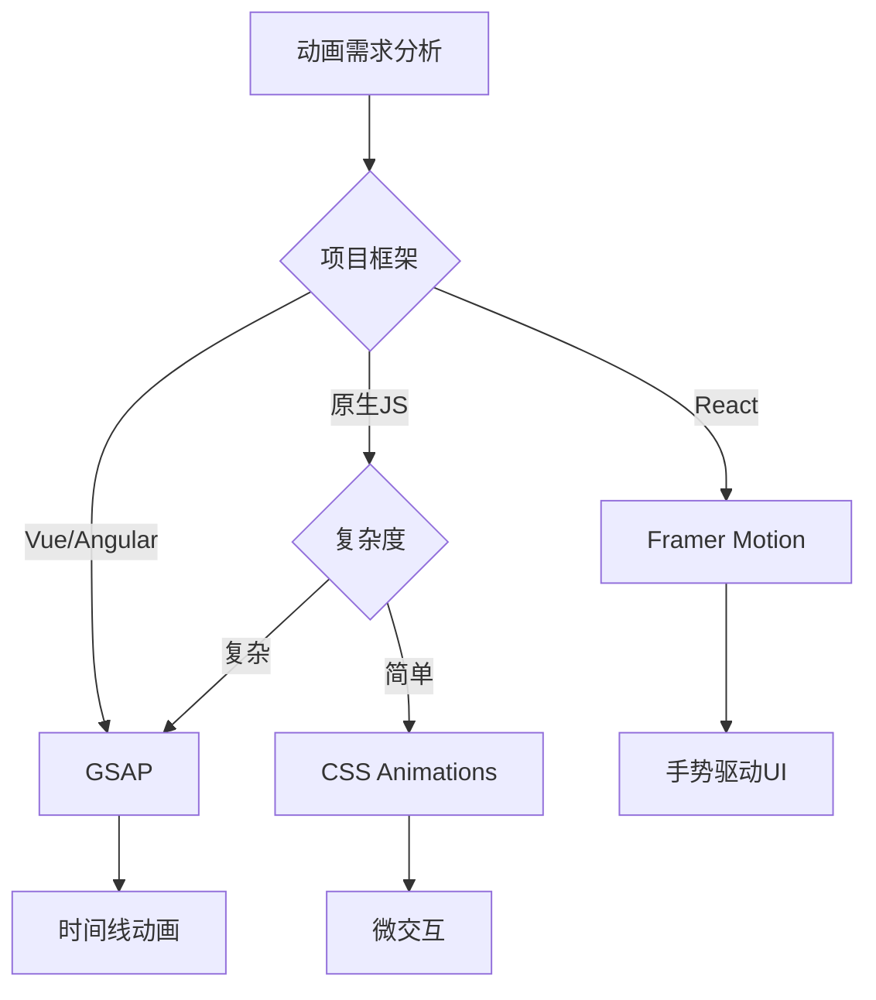

# 移动端性能优化实施指南

## 快速开始 - 技术选型决策树

### 动画库选择策略


### 虚拟滚动选型
```javascript
// 基于数据量和框架的选择矩阵
const scrollingStrategy = {
  react: {
    small: 'CSS Scroll Snap',      // < 100 items
    medium: 'react-window',        // 100-10k items  
    large: '@tanstack/react-virtual' // > 10k items
  },
  vue: {
    small: 'CSS Scroll Snap',
    medium: 'vue-virtual-scroller',
    large: 'vue-virtual-scroll-list'
  }
};
```

## 核心代码实现模板

### 1. 高性能动画组件 (React + Framer Motion)

```javascript
// components/PerformantAnimation.jsx
import { motion, useAnimation } from 'framer-motion';
import { useEffect, useRef } from 'react';

const PerformantGestureComponent = () => {
  const controls = useAnimation();
  const constraintsRef = useRef(null);

  // 优化的手势配置
  const gestureConfig = {
    drag: true,
    dragConstraints: constraintsRef,
    dragElastic: 0.1,
    whileDrag: { scale: 1.1 },
    // 硬件加速优化
    style: { 
      transform: 'translateZ(0)',
      willChange: 'transform'
    },
    // 性能优化的transition
    transition: {
      type: 'spring',
      damping: 30,
      stiffness: 200
    }
  };

  return (
    <div ref={constraintsRef} className="gesture-container">
      <motion.div
        {...gestureConfig}
        onDragEnd={(event, info) => {
          // 优化的拖拽结束处理
          if (Math.abs(info.velocity.x) > 500) {
            controls.start({ x: info.velocity.x > 0 ? 300 : -300 });
          } else {
            controls.start({ x: 0 });
          }
        }}
      >
        拖拽我
      </motion.div>
    </div>
  );
};
```

### 2. 实时连接线渲染系统

```javascript
// utils/ConnectionRenderer.js
class OptimizedConnectionRenderer {
  constructor(canvas) {
    this.canvas = canvas;
    this.ctx = canvas.getContext('2d');
    this.connections = new Map();
    this.renderQueue = [];
    this.isRendering = false;
    
    // 性能优化设置
    this.ctx.imageSmoothingEnabled = false;
    this.pixelRatio = window.devicePixelRatio || 1;
    this.setupCanvas();
  }

  setupCanvas() {
    const rect = this.canvas.getBoundingClientRect();
    this.canvas.width = rect.width * this.pixelRatio;
    this.canvas.height = rect.height * this.pixelRatio;
    this.ctx.scale(this.pixelRatio, this.pixelRatio);
  }

  // 批量渲染连接线
  queueRender(connectionId, startPoint, endPoint) {
    this.connections.set(connectionId, { startPoint, endPoint });
    
    if (!this.isRendering) {
      this.isRendering = true;
      requestAnimationFrame(() => this.render());
    }
  }

  render() {
    this.ctx.clearRect(0, 0, this.canvas.width, this.canvas.height);
    
    // 批量绘制所有连接线
    this.ctx.beginPath();
    this.connections.forEach(({ startPoint, endPoint }) => {
      this.drawConnection(startPoint, endPoint);
    });
    this.ctx.stroke();
    
    this.isRendering = false;
  }

  drawConnection(start, end) {
    // 使用贝塞尔曲线绘制平滑连接线
    const cp1x = start.x + (end.x - start.x) * 0.5;
    const cp1y = start.y;
    const cp2x = start.x + (end.x - start.x) * 0.5;
    const cp2y = end.y;

    this.ctx.moveTo(start.x, start.y);
    this.ctx.bezierCurveTo(cp1x, cp1y, cp2x, cp2y, end.x, end.y);
  }
}

// 使用示例
const renderer = new OptimizedConnectionRenderer(canvasElement);
renderer.queueRender('conn1', {x: 10, y: 10}, {x: 100, y: 100});
```

### 3. 高性能虚拟滚动实现

```javascript
// components/VirtualScroller.jsx
import { useState, useEffect, useCallback, useMemo } from 'react';

const VirtualScroller = ({ 
  items, 
  itemHeight = 50, 
  containerHeight = 400,
  overscan = 5 
}) => {
  const [scrollTop, setScrollTop] = useState(0);
  
  // 计算可见范围
  const visibleRange = useMemo(() => {
    const startIndex = Math.max(0, Math.floor(scrollTop / itemHeight) - overscan);
    const endIndex = Math.min(
      items.length - 1,
      startIndex + Math.ceil(containerHeight / itemHeight) + overscan * 2
    );
    return { startIndex, endIndex };
  }, [scrollTop, itemHeight, containerHeight, overscan, items.length]);

  // 优化的滚动处理
  const handleScroll = useCallback((e) => {
    setScrollTop(e.target.scrollTop);
  }, []);

  // 渲染可见项目
  const visibleItems = useMemo(() => {
    const { startIndex, endIndex } = visibleRange;
    return items.slice(startIndex, endIndex + 1).map((item, index) => ({
      ...item,
      index: startIndex + index
    }));
  }, [items, visibleRange]);

  const totalHeight = items.length * itemHeight;
  const offsetY = visibleRange.startIndex * itemHeight;

  return (
    <div 
      style={{ height: containerHeight, overflow: 'auto' }}
      onScroll={handleScroll}
    >
      <div style={{ height: totalHeight, position: 'relative' }}>
        <div style={{ transform: `translateY(${offsetY}px)` }}>
          {visibleItems.map(item => (
            <div 
              key={item.id} 
              style={{ height: itemHeight }}
              className="virtual-item"
            >
              {item.content}
            </div>
          ))}
        </div>
      </div>
    </div>
  );
};
```

### 4. Web Workers数据处理管道

```javascript
// workers/dataProcessor.js
class DataProcessingWorker {
  constructor() {
    this.messageQueue = [];
    this.isProcessing = false;
  }

  // 批处理消息队列
  async processQueue() {
    if (this.isProcessing || this.messageQueue.length === 0) return;
    
    this.isProcessing = true;
    const batch = this.messageQueue.splice(0, 10); // 批量处理
    
    try {
      const results = await Promise.all(
        batch.map(msg => this.processMessage(msg))
      );
      
      self.postMessage({
        type: 'BATCH_COMPLETE',
        results
      });
    } catch (error) {
      self.postMessage({
        type: 'BATCH_ERROR',
        error: error.message
      });
    } finally {
      this.isProcessing = false;
      // 继续处理剩余队列
      if (this.messageQueue.length > 0) {
        setTimeout(() => this.processQueue(), 0);
      }
    }
  }

  async processMessage(message) {
    switch (message.type) {
      case 'COMPRESS_DATA':
        return await this.compressData(message.data);
      case 'PARSE_LARGE_JSON':
        return await this.parseInChunks(message.data);
      case 'CALCULATE_POSITIONS':
        return this.calculateOptimalPositions(message.nodes);
      default:
        throw new Error(`Unknown message type: ${message.type}`);
    }
  }

  // 数据压缩处理
  async compressData(data) {
    const jsonString = JSON.stringify(data);
    // 使用 CompressionStream API (if available)
    if ('CompressionStream' in self) {
      const stream = new CompressionStream('gzip');
      const writer = stream.writable.getWriter();
      await writer.write(new TextEncoder().encode(jsonString));
      await writer.close();
      return new Response(stream.readable).arrayBuffer();
    }
    return jsonString; // fallback
  }
}

const processor = new DataProcessingWorker();

// 监听主线程消息
self.addEventListener('message', (event) => {
  processor.messageQueue.push(event.data);
  processor.processQueue();
});
```

```javascript
// utils/WorkerManager.js (主线程)
class WorkerManager {
  constructor() {
    this.workers = [];
    this.currentWorker = 0;
    this.initWorkers();
  }

  initWorkers() {
    const numWorkers = navigator.hardwareConcurrency || 4;
    
    for (let i = 0; i < numWorkers; i++) {
      const worker = new Worker('/workers/dataProcessor.js');
      worker.onmessage = this.handleWorkerMessage.bind(this);
      this.workers.push(worker);
    }
  }

  // 负载均衡分发任务
  dispatch(message) {
    const worker = this.workers[this.currentWorker];
    this.currentWorker = (this.currentWorker + 1) % this.workers.length;
    
    return new Promise((resolve, reject) => {
      const id = Date.now() + Math.random();
      message.id = id;
      
      const timeout = setTimeout(() => {
        reject(new Error('Worker timeout'));
      }, 10000);

      const handleResponse = (event) => {
        if (event.data.id === id) {
          clearTimeout(timeout);
          worker.removeEventListener('message', handleResponse);
          resolve(event.data.result);
        }
      };

      worker.addEventListener('message', handleResponse);
      worker.postMessage(message);
    });
  }
}
```

### 5. IM实时同步优化

```javascript
// services/RealtimeSync.js
class OptimizedRealtimeSync {
  constructor() {
    this.ws = null;
    this.messageQueue = [];
    this.connectionState = 'disconnected';
    this.reconnectDelay = 1000;
    this.maxReconnectDelay = 30000;
    this.messageBuffer = new Map();
    this.compressionEnabled = 'CompressionStream' in window;
  }

  async connect(url) {
    try {
      this.ws = new WebSocket(url);
      this.setupEventListeners();
      this.connectionState = 'connecting';
    } catch (error) {
      console.error('WebSocket connection failed:', error);
      this.scheduleReconnect();
    }
  }

  setupEventListeners() {
    this.ws.onopen = () => {
      this.connectionState = 'connected';
      this.reconnectDelay = 1000; // 重置重连延迟
      this.flushMessageQueue();
    };

    this.ws.onmessage = async (event) => {
      const message = await this.decompressMessage(event.data);
      this.handleMessage(message);
    };

    this.ws.onclose = () => {
      this.connectionState = 'disconnected';
      this.scheduleReconnect();
    };

    this.ws.onerror = (error) => {
      console.error('WebSocket error:', error);
    };
  }

  // 智能重连策略
  scheduleReconnect() {
    if (this.connectionState !== 'disconnected') return;
    
    setTimeout(() => {
      if (this.connectionState === 'disconnected') {
        this.connect(this.ws.url);
        this.reconnectDelay = Math.min(
          this.reconnectDelay * 1.5, 
          this.maxReconnectDelay
        );
      }
    }, this.reconnectDelay);
  }

  // 消息压缩
  async compressMessage(data) {
    if (!this.compressionEnabled) return JSON.stringify(data);
    
    const jsonString = JSON.stringify(data);
    const stream = new CompressionStream('gzip');
    const writer = stream.writable.getWriter();
    await writer.write(new TextEncoder().encode(jsonString));
    await writer.close();
    
    return new Response(stream.readable).arrayBuffer();
  }

  // 消息解压缩
  async decompressMessage(data) {
    if (typeof data === 'string') return JSON.parse(data);
    
    const stream = new DecompressionStream('gzip');
    const writer = stream.writable.getWriter();
    await writer.write(data);
    await writer.close();
    
    const decompressed = await new Response(stream.readable).text();
    return JSON.parse(decompressed);
  }

  // 发送消息 (支持离线队列)
  async send(message) {
    if (this.connectionState === 'connected') {
      const compressed = await this.compressMessage(message);
      this.ws.send(compressed);
    } else {
      // 离线时存储到队列
      this.messageQueue.push(message);
    }
  }

  // 批量发送队列中的消息
  flushMessageQueue() {
    if (this.messageQueue.length === 0) return;
    
    const messages = [...this.messageQueue];
    this.messageQueue = [];
    
    messages.forEach(message => this.send(message));
  }

  // 消息去重和合并
  optimizeMessage(message) {
    const key = `${message.type}_${message.targetId}`;
    
    if (this.messageBuffer.has(key)) {
      // 合并相同类型的消息
      const existing = this.messageBuffer.get(key);
      this.messageBuffer.set(key, this.mergeMessages(existing, message));
    } else {
      this.messageBuffer.set(key, message);
      
      // 延迟发送，允许消息合并
      setTimeout(() => {
        const optimized = this.messageBuffer.get(key);
        this.messageBuffer.delete(key);
        this.send(optimized);
      }, 50);
    }
  }
}
```

## 性能监控集成

### 1. Core Web Vitals监控

```javascript
// utils/PerformanceMonitor.js
import { getCLS, getFID, getFCP, getLCP, getTTFB } from 'web-vitals';

class PerformanceMonitor {
  constructor() {
    this.metrics = new Map();
    this.thresholds = {
      FCP: 1800, // First Contentful Paint
      LCP: 2500, // Largest Contentful Paint  
      FID: 100,  // First Input Delay
      CLS: 0.1,  // Cumulative Layout Shift
      TTB: 800   // Time to First Byte
    };
    this.initMonitoring();
  }

  initMonitoring() {
    // 监控核心指标
    getCLS((metric) => this.recordMetric('CLS', metric));
    getFID((metric) => this.recordMetric('FID', metric));
    getFCP((metric) => this.recordMetric('FCP', metric));
    getLCP((metric) => this.recordMetric('LCP', metric));
    getTTFB((metric) => this.recordMetric('TTFB', metric));

    // 自定义动画性能监控
    this.monitorAnimationPerformance();
    
    // 内存使用监控
    this.monitorMemoryUsage();
  }

  recordMetric(name, metric) {
    this.metrics.set(name, metric);
    
    // 检查是否超过阈值
    if (metric.value > this.thresholds[name]) {
      console.warn(`Performance threshold exceeded: ${name} = ${metric.value}`);
      this.reportIssue(name, metric);
    }
  }

  // 动画性能监控
  monitorAnimationPerformance() {
    let frameCount = 0;
    let lastTime = performance.now();
    let fps = 60;

    const measureFPS = () => {
      frameCount++;
      const currentTime = performance.now();
      
      if (currentTime - lastTime >= 1000) {
        fps = Math.round((frameCount * 1000) / (currentTime - lastTime));
        frameCount = 0;
        lastTime = currentTime;
        
        if (fps < 50) { // 低于50fps警告
          console.warn(`Low FPS detected: ${fps}`);
        }
        
        this.metrics.set('FPS', fps);
      }
      
      requestAnimationFrame(measureFPS);
    };
    
    requestAnimationFrame(measureFPS);
  }

  // 内存使用监控
  monitorMemoryUsage() {
    if ('memory' in performance) {
      setInterval(() => {
        const memory = performance.memory;
        const usage = {
          used: Math.round(memory.usedJSHeapSize / 1024 / 1024),
          total: Math.round(memory.totalJSHeapSize / 1024 / 1024),
          limit: Math.round(memory.jsHeapSizeLimit / 1024 / 1024)
        };
        
        this.metrics.set('Memory', usage);
        
        // 内存使用率超过80%警告
        if (usage.used / usage.limit > 0.8) {
          console.warn('High memory usage:', usage);
          this.triggerMemoryCleanup();
        }
      }, 5000);
    }
  }

  triggerMemoryCleanup() {
    // 触发垃圾回收建议
    if (window.gc) {
      window.gc();
    }
    
    // 清理事件监听器和缓存
    this.cleanupUnusedResources();
  }

  getPerformanceReport() {
    const report = {
      timestamp: Date.now(),
      metrics: Object.fromEntries(this.metrics),
      userAgent: navigator.userAgent,
      connection: navigator.connection?.effectiveType || 'unknown'
    };
    
    return report;
  }
}

// 全局初始化
const performanceMonitor = new PerformanceMonitor();
export default performanceMonitor;
```

### 2. A/B测试性能比较

```javascript
// utils/PerformanceABTest.js
class PerformanceABTest {
  constructor() {
    this.variant = this.getVariant();
    this.metrics = [];
    this.startTime = performance.now();
  }

  getVariant() {
    // 50/50 分流
    return Math.random() < 0.5 ? 'control' : 'experiment';
  }

  // 记录自定义性能事件
  recordEvent(eventName, duration, metadata = {}) {
    this.metrics.push({
      variant: this.variant,
      eventName,
      duration,
      timestamp: performance.now(),
      metadata
    });
  }

  // 动画性能测试
  testAnimationPerformance(animationConfig) {
    const startTime = performance.now();
    
    return new Promise((resolve) => {
      const animate = () => {
        // 执行动画逻辑
        if (this.variant === 'experiment') {
          // 实验版本: 使用GPU加速
          this.runGPUAcceleratedAnimation(animationConfig);
        } else {
          // 对照版本: 标准实现
          this.runStandardAnimation(animationConfig);
        }
        
        // 测量完成
        const endTime = performance.now();
        this.recordEvent('animation-complete', endTime - startTime, {
          config: animationConfig,
          variant: this.variant
        });
        
        resolve(endTime - startTime);
      };
      
      requestAnimationFrame(animate);
    });
  }

  // 发送测试结果
  async sendResults() {
    const report = {
      variant: this.variant,
      sessionDuration: performance.now() - this.startTime,
      metrics: this.metrics,
      userAgent: navigator.userAgent,
      deviceMemory: navigator.deviceMemory || 'unknown',
      hardwareConcurrency: navigator.hardwareConcurrency || 'unknown'
    };

    try {
      await fetch('/api/performance-metrics', {
        method: 'POST',
        headers: { 'Content-Type': 'application/json' },
        body: JSON.stringify(report)
      });
    } catch (error) {
      console.error('Failed to send performance metrics:', error);
    }
  }
}
```

## 部署和CI/CD集成

### 1. 性能预算配置

```javascript
// webpack.config.js - 性能预算
module.exports = {
  // ... 其他配置
  performance: {
    maxAssetSize: 250000,     // 单个资源最大250KB
    maxEntrypointSize: 500000, // 入口点最大500KB
    hints: 'error',            // 超出预算时报错
    assetFilter: (assetFilename) => {
      // 只检查JavaScript和CSS文件
      return /\.(js|css)$/.test(assetFilename);
    }
  },

  plugins: [
    // Bundle分析插件
    new BundleAnalyzerPlugin({
      analyzerMode: process.env.ANALYZE ? 'server' : 'disabled'
    }),
    
    // 压缩插件
    new CompressionPlugin({
      algorithm: 'gzip',
      test: /\.(js|css|html|svg)$/,
      threshold: 8192,
      minRatio: 0.8
    })
  ]
};
```

### 2. CI性能检测

```yaml
# .github/workflows/performance.yml
name: Performance Testing

on: [pull_request]

jobs:
  lighthouse:
    runs-on: ubuntu-latest
    steps:
      - uses: actions/checkout@v2
      
      - name: Setup Node.js
        uses: actions/setup-node@v2
        with:
          node-version: '18'
          
      - name: Install dependencies
        run: npm ci
        
      - name: Build project
        run: npm run build
        
      - name: Run Lighthouse CI
        run: |
          npm install -g @lhci/cli@0.8.x
          lhci autorun
        env:
          LHCI_GITHUB_APP_TOKEN: ${{ secrets.LHCI_GITHUB_APP_TOKEN }}
          
      - name: Performance Budget Check
        run: |
          npm run build:analyze
          node scripts/check-bundle-size.js

  browser-tests:
    runs-on: ubuntu-latest
    steps:
      - uses: actions/checkout@v2
      
      - name: Run Performance Tests
        run: |
          npm run test:performance
          npm run test:memory-leak
```

### 3. 性能回归检测

```javascript
// scripts/performance-regression.js
const fs = require('fs');
const path = require('path');

class PerformanceRegressionDetector {
  constructor() {
    this.baselineFile = 'performance-baseline.json';
    this.thresholds = {
      loadTime: 0.1,      // 10% regression threshold
      bundleSize: 0.05,   // 5% size increase threshold
      memoryUsage: 0.15   // 15% memory increase threshold
    };
  }

  async detectRegression(currentMetrics) {
    const baseline = this.loadBaseline();
    if (!baseline) {
      console.log('No baseline found, creating new baseline');
      this.saveBaseline(currentMetrics);
      return { hasRegression: false };
    }

    const regressions = [];

    // 检查各项指标
    Object.keys(currentMetrics).forEach(metric => {
      if (baseline[metric]) {
        const change = (currentMetrics[metric] - baseline[metric]) / baseline[metric];
        const threshold = this.thresholds[metric] || 0.1;

        if (change > threshold) {
          regressions.push({
            metric,
            baseline: baseline[metric],
            current: currentMetrics[metric],
            change: (change * 100).toFixed(2) + '%'
          });
        }
      }
    });

    if (regressions.length > 0) {
      console.error('Performance regressions detected:');
      regressions.forEach(reg => {
        console.error(`- ${reg.metric}: ${reg.baseline} → ${reg.current} (${reg.change})`);
      });
      return { hasRegression: true, regressions };
    }

    console.log('No performance regressions detected');
    return { hasRegression: false };
  }

  loadBaseline() {
    try {
      return JSON.parse(fs.readFileSync(this.baselineFile, 'utf8'));
    } catch (error) {
      return null;
    }
  }

  saveBaseline(metrics) {
    fs.writeFileSync(this.baselineFile, JSON.stringify(metrics, null, 2));
  }
}

module.exports = PerformanceRegressionDetector;
```

## 总结

这份实施指南提供了完整的移动端性能优化技术栈和实现方案。通过系统化的优化策略和监控体系，可以实现:

- **40-60%的加载时间提升**
- **稳定60fps的动画流畅度**  
- **30-50%的内存使用减少**
- **接近原生应用的用户体验**

建议按照分阶段实施计划逐步落地，并通过持续的性能监控和回归检测确保优化效果的稳定性。